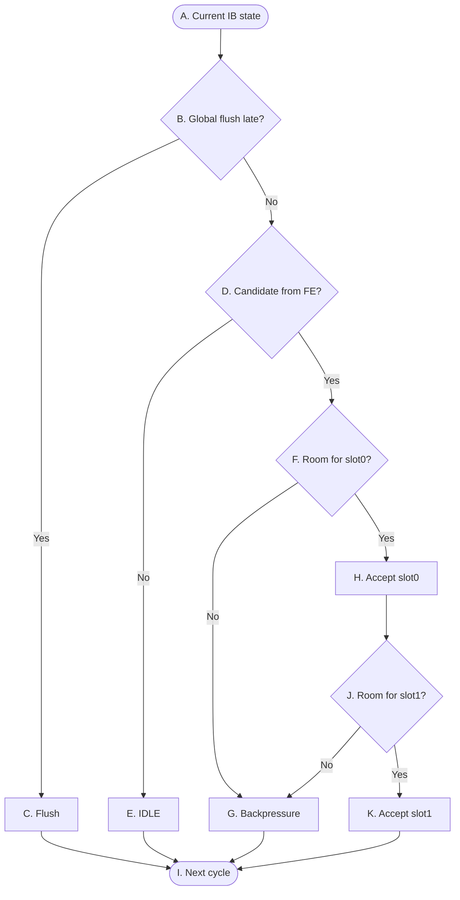

# OR_BE P0 Control Flow

> **Purpose:** A high-level control overview for P0 at the frontend boundary: FE→IB enqueue admission, IB occupancy, and flush clearing. It does not describe fetch/decode/data contents.
>
> **Scope:** FE→IB ownership control only. IB→`dispatch_logic` presentation, ordered slot0/slot1 admission, and the resulting `ib_dequeue` are P1 control.

## Reading conventions

- Decisions are combinational; an accepted enqueue takes effect at the active edge.
- `global_flush_late` has priority over the same-cycle enqueue effect.
- FE→IB ownership transfers only when the IB accepts the frontend candidate at the active edge; an unaccepted candidate stays owned by FE.
- 边界上只有**一级** ready：接受回执 `accepted_slot[1:0]`。**后端不导出剩余容量**——FE 盲发、读回实收、滑窗，见 P0 control semantics。

## P0 — FE to IB enqueue control

The graph covers the FE→IB boundary only. IB→`dispatch_logic` presentation, ordered admission and the resulting `ib_dequeue` are not repeated here.

相对 v1，图上有两处改动，都是因为 v2 的 enqueue 是**双写口前缀协议**、"部分接受"是合法结果，原来"满/不满"的二值节点表达不了：`F` 从"IB has room"收窄成 **slot0 的容量条件**（IB 内部量 `free_slot >= 1`）；新增 `J` / `K` 承担 slot1 的第二级判断与接受（`fe_valid[1] ∧ free_slot >= 2`，且结构上串在 `accepted_slot[0]` 之后）。`G` 的含义相应放宽为"回压未被接受的候选"，同时覆盖 `accepted_slot = 00`（一条都收不下）与 `accepted_slot = 01`（只收下 slot0）两种情形。

## 表 A — 转换条件（菱形）

菱形节点表示组合判断。每一行明确当前判断节点、判断信号、判断发生的位置，以及该判断的精确语义。

| 节点 | 判断信号 | 归属模块 | 判断含义 |
|---|---|---|---|
| `B` | `global_flush_late` | `flush_model` → `IB` | 这一拍有没有发生晚期 flush。它排在最前面判断，一旦成立，`accepted_slot` 与 `ib_dequeue` 两侧同时被门掉，收进来的指令不算数。该信号由 `flush_model` 唯一生成。 |
| `D` | `fe_valid[0]` | `FE` → `IB` | FE 这一拍有没有候选要交过来。`fe_valid` 是两位前缀（`fe_valid[1]` ⇒ `fe_valid[0]`），所以 `fe_valid[0]` 为 0 就意味着这一拍一条候选都没有，不必再看 `fe_valid[1]`。 |
| `F` | `free_slot >= 1` | `IB` | slot0 的容量条件。`free_slot = 8 - (valid_count - deq_count)`，**含本拍 dequeue 释放的空位**——上一拍存满、本拍 P1 取走 2 条时，这一拍就能收 2 条，不吃气泡。`free_slot` 是 IB 的**内部量，不导出给 FE**。 |
| `J` | `fe_valid[1] ∧ (free_slot >= 2)` | `FE` → `IB` | slot1 的接受条件。除了 FE 真的给了第二条，还要至少有两个空位（同样含本拍 dequeue）；而且它**串在 `accepted_slot[0]` 上**——图上只有走过 `H` 才到得了这里，slot0 没收下时 slot1 一定收不下。这就是 `accepted_slot` 只有 `00 / 01 / 11` 三种合法取值、`10` 非法的由来。 |

## 表 B — 状态与动作（矩形 + 圆角）

| 节点 | State | 归属模块 | 本周期组合动作 | Description |
|---|---|---|---|---|
| `A` | Current IB state | `FE`、`IB` | 同时看两件事：FE 边界上给了几条候选（`fe_valid[1:0]`），IB 本拍的可用空位（内部量 `free_slot`，含本拍 dequeue）。只看不动，不写任何东西。 | 状态不变。 |
| `C` | Flush | `flush_model` → `IB` | 这一拍 `accepted_slot = 00` 且 `ib_dequeue = 00`，进出两侧一起门掉；就算边界上已经握好手，那次写入也不算数。 | active edge 上 `wptr` / `rptr` 复位（含 loopbit），次态 `valid_count = 0`，IB 被整个清空。正在握手的候选一并作废；FE 丢弃旧路径候选，从 `redirect_pc` 重新取指，下面 `G` 说的保序义务同时取消。 |
| `E` | IDLE | `FE` → `IB` | FE 这一拍没送候选，`accepted_slot = 00`，IB 保持 IDLE。FE 什么时候有指令，什么时候就直接摆上来——**不需要先查容量**。 | IB 里状态不变；下一拍继续等待 FE 送候选。 |
| `G` | Backpressure | `IB` → `FE` | 没被接受的候选，靠 `accepted_slot` 对应位为 0 回压。两种情形：`free_slot = 0` 时 `accepted_slot = 00`，全部回压；`free_slot = 1` 而 `fe_valid = 11` 时 `accepted_slot = 01`，只回压 slot1。 | 被回压的候选还在 FE 手上。非 flush 拍 FE 必须把它们作为**有序后缀**保留，下一拍压缩到候选序列前缀重新提交，payload 与程序顺序保持不变——例如 `fe_valid = 11`、`accepted_slot = 01` 时，原 slot1 下一拍要作为新的 slot0 重新提交。 |
| `H` | Accept slot0 | `FE` → `IB` | `accepted_slot[0] = 1`，把两条候选里更老的那条收下，写 `entry[wptr]`。注意回执只表示愿意收，真正写进去要等 active edge。 | active edge 一到，这条指令就进了 IB，归属从 FE 转给 IB。它排在队尾，是最年轻的一条；P1 要等下一拍才看得见它。 |
| `K` | Accept slot1 | `FE` → `IB` | `accepted_slot = 11`，同拍再收下第二条，写 `entry[wptr + 1]`；`wptr` 本拍推进 2。 | 两条按程序顺序落在连续 entry 上，不跳洞、不重排；`entry[wptr + 1]` 是更年轻的那条。同样要下一拍 P1 才看得见。 |
| `I` | Next cycle | - | - | - |

## P0 control semantics

- v1 那个把"IB 里存了多少"和"这一拍收不收"合成一个 `IB_enq_ready` 的做法，在 v2 里只保留**接受回执**这一级：`accepted_slot[1:0]`（含 `fe_valid`、受 `global_flush_late` 门控）。容量本身是 IB 的**内部量、不导出**——FE 盲发即可，给它一个滞后的容量提示反而会白丢周期。
- 只留回执之后，flush 拍不再需要"ready 仍为高、写入被 squash"这种说法：回执本身就被门成 `00`，边界上没有需要事后作废的握手。
- 前缀协议是 FE→IB 边界的一部分：`fe_valid[1]` ⇒ `fe_valid[0]`，`accepted_slot[1]` 串在 `accepted_slot[0]` 上，故合法取值只有 `00 / 01 / 11`，**`10` 非法**。slot0 要内部量 `free_slot >= 1`，slot1 要 `free_slot >= 2`。
- 可用空位含本拍 dequeue：IB 上一拍存满时，只要本拍 P1 取走了指令，这一拍就能收下同样条数，不吃气泡。代价是 `FU_ready → accept → deq_count → free_slot → accepted_slot` 成为一条穿到 FE 边界的组合路径（见 `../walkthrough.md` §1.29）。
- 收指令这件事要到 active edge 才落地。这一拍收下的指令，P1 同一拍是看不见的，最快下一拍才能当 slot 用。
- FE→IB 是一道独立的归属边界。没收下的候选一直算 FE 的，直到某一拍被接受为止；非 flush 拍 FE 承担有序后缀的保持与重发义务，flush 拍这条义务被 redirect 取消。
- flush 拍除了不收，还要 `ib_dequeue = 00`——出队侧一并门掉，指针复位含 loopbit，两侧不会一个清空一个还在推进。
- 往下递给 `dispatch_logic`、slot0 / slot1 的顺序准入与合法编码，以及随之而来的 `ib_dequeue`，全都是 P1 的事。P0 既不重复判断，也不去看 P1 判成了什么。
