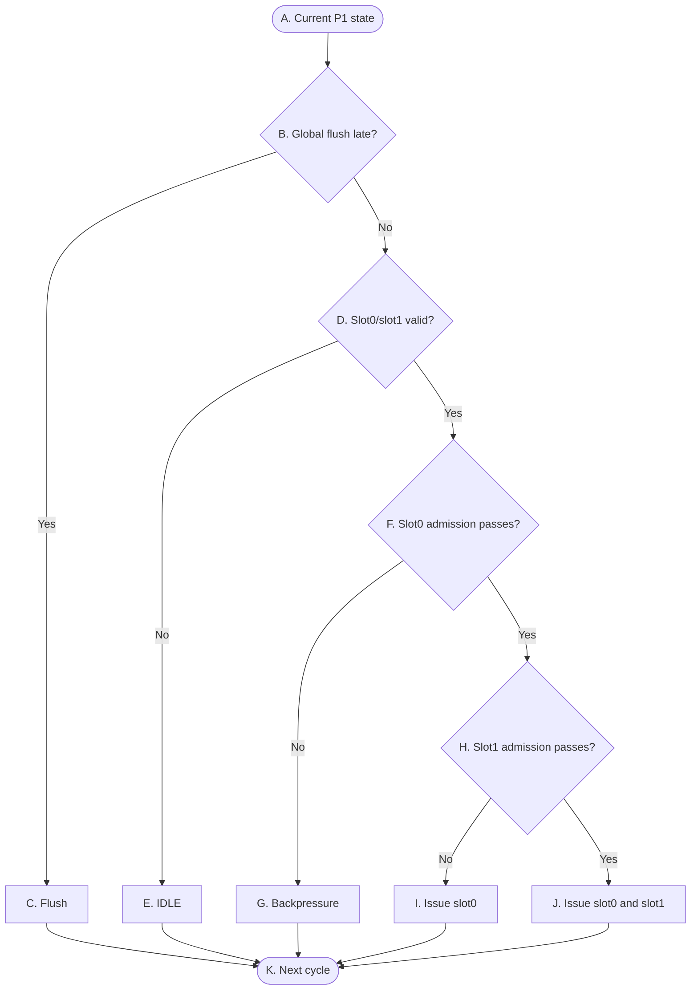

# OR_BE P1 Control Flow

> **Purpose:** A high-level control overview for stage P1: ordered two-slot admission, source resolution, group selection, serialization, FP pairing, and atomic allocation.
>
> **Scope:** This document is a control-state view of the P1 boundary, including the IB→P1 presentation and the resulting IB dequeue. It omits operand values, result data, payload layouts, and FU-internal timing.

## Reading conventions

- `slot0` is older than `slot1`; accepted instructions always form an age-ordered prefix.
- Decisions are combinational; accepted allocation state is written at the active edge.
- `global_flush_late` cancels the entire same-cycle P1 allocation transaction.
- P1 has no storage of its own. Its control is split between `dispatch_logic` (group selection plus the admission guards, producing `accept`/`ib_dequeue`/`isq_wr_en`/`serial_set`) and `dependency_check` (presence, serial and FP flags, six-way source resolution, `self_tag`, `rd_write_enable`, `slot_missed_wakeup`). Both are pure combinational.

## P1 — Ordered dispatch control

The graph shows the control skeleton only; every branch is a plain yes/no, and the encodings behind them are defined in the tables. The node set and the edges are unchanged from v1 — the v2 rewrite touches ownership and the contents of the conditions, not the skeleton; only the label of `A` changed, because `DSP` no longer exists as a module. `D` checks both slots in one step, and `H` covers both the presence and the admission of slot1. Source resolution, group selection, resource qualification, serialization and FP-pair restrictions are represented by the admission conditions in Table A and the control semantics below. They do not form separate datapath or FU-timing flows here.

## 表 A — 转换条件（菱形）

菱形节点表示组合判断。每一行明确当前判断节点、判断信号、判断发生的位置，以及该判断的精确语义。

| 节点 | 判断信号 | 归属模块 | 判断含义 |
|---|---|---|---|
| `B` | `global_flush_late` | `flush_model` → `dispatch_logic` | 这一拍有没有发生 late flush。这根线由 `flush_model` 唯一生成，上游 `CompletionScoreboard` 的判定链只给 `{flush_valid, flush_tag, recovery_kind}` 三元组。它排在所有准入判断前面，一旦成立，`accept[0]` 与 `accept[1]` 同时清零，整笔分配连同 `ib_dequeue` 全部作废，后面的判断不用再做。`dispatch_logic` 不保存 flush 状态，这根线只屏蔽当拍新 fire。 |
| `D` | `slot0_present` / `slot1_present` | `IB` → `dependency_check` → `dispatch_logic` | 一次把 IB 递上来的两个位置都看一遍。IB 的 `inst_valid[1:0]` 是**两位前缀 valid**（`inst_valid[1] ⇒ inst_valid[0]`），`dependency_check` 原样转成 `slot0_present` / `slot1_present`。所以 present 编码 `{slot1, slot0}` 只有 `00 / 01 / 11` 三种，`01` 或 `11` 这里就算成立；v1 还要额外兜住"队头空着后面那条却在"的 `10`，v2 由 IB 的前缀契约从源头排除了这种编码。至于成立的是 `01` 还是 `11`，不在这里分，留到 `H`。 |
| `F` | `slot0_present ∧ slot0_guard_ok` | `dispatch_logic`（准入公式与选组）、`dependency_check`（present / serial / fp / missed-wakeup 标志）、`CompletionScoreboard`、`ISQ_Group_g`、`SerialInstructionTracker` | slot0 这一拍是否permit issue，七项全过才成立：`subop_supported_now[0]`（本条的 `exe_subop` 落在当前实现的 subop 集合内，见下方语义）；`can_alloc_1`（SCB 窗口拍初还有 ≥1 格）；`isq_free_for_dispatch[slot_ISQGroup[0]]`（按 `dispatch_route_class[0]` 选出的目标组还收得下，**含同拍 issue**）；`!serial_inflight_valid`（没有在飞的串行指令挡着）；`serial0_ok = !serial0 ∨ buffer_empty`（它自己若是串行指令，得等窗口排空）；`!slot_missed_wakeup[0]`；`!global_flush_late`。**源操作数解析不出出处并不阻止派发**——六选一里 `WAIT_PRODUCER` 是合法结果，记下 `wait_tag` 进 ISQ 等唤醒即可；源解析唯一能挡住派发的是 `slot_missed_wakeup`。成立即 `slot0_fire_candidate = accept[0]`，它占掉的组（`slot0_takes_G0`）与它分到的 `self_tag[0]` 一并作为 `H` 的输入。 |
| `H` | `accept[0] ∧ slot1_present ∧ slot1_guard_ok` | `dispatch_logic`、`dependency_check`、`CompletionScoreboard`、`ISQ_Group_g` | 后面那条这一拍能不能跟着一起收。不成立包含两种情况：present 是 `01`，后面根本没指令；或者指令在但过不了准入。要成立的话，把 slot0 已经占掉的资源扣掉之后，slot1 还得满足 `subop_supported_now[1]`（同上，逐 slot 各判一份）、`can_alloc_2`（SCB 窗口拍初有 ≥2 格）、`isq_free_for_dispatch[slot_ISQGroup[1]]`、`groups_distinct`（两条不撞同一组）、`!(fp0 ∧ fp1)`（双FP指令阻塞）、`!serial_inst`（两条里任何一条是串行指令都不许双发）、`!slot_missed_wakeup[1]`、`!global_flush_late`。关键在于它面对的是 slot0 挑剩下的——ALU 的动态选组要先扣掉 `slot0_takes_G0` 才轮到它；撞组不由选组回避，而是算出确定编号后由 `groups_distinct` 拦下；SCB 窗口只剩一格时 `can_alloc_2` 直接不成立。此刻 slot0 还没真的出队，它只是在组合逻辑上算通过，两条指令是在同一拍里一前一后各过一遍。 |

## 表 B — 状态与动作（矩形 + 圆角）

| 节点 | State | 归属模块 | 本周期组合动作 | Description |
|---|---|---|---|---|
| `A` | Current P1 state | `IB` → `dependency_check`、`dispatch_logic`、`FP_read_address_mux` | 看 IB 递上来的队头 2 slot，以及判准入要用到的各种资源状态：SCB 的 `can_alloc_1` / `can_alloc_2` / `buffer_empty` 与 `scoreboard_valid_bits` / `scoreboard_exec_done_bits`（拍初值），四组 `isq_free_for_dispatch`（含同拍 issue），`serial_inflight_valid`，INT/FP_tag_mapping 的 `busy` / `tag`，两条 commit lane 与四条 bypass lane 的 `valid` / `tag`。只看不动。 | 状态不变。 |
| `C` | Flush | `flush_model` → P1 的全部落点 | 这一拍一条都不收：`accept[0] = accept[1] = 0`，六个落点一个都不动——`CompletionScoreboard` 不 alloc（`tail` 不推进）、`isq_wr_en[g]` 全零、`PC_File` 不 `pc_write`、INT/FP_tag_mapping 不 alloc、`serial_set` 不置、`ib_dequeue = 00`。同一拍这些模块各自还要响应 flush 本身：IB 指针复位（含 loopbit）、两张 tag_mapping 全表 `busy ← 0`、SerialInstructionTracker `valid ← 0`。 | active edge 上受影响的投机状态被清掉，这一拍正在评估的 slot 无效；下一拍从恢复后的状态重启。 |
| `E` | IDLE | `dispatch_logic` → `IB` | 队头没有指令，present 是 `00`。这一拍什么都不收。 | 接受集合是 `00`。IB 里一条没少，顺序也没动；下一拍重新看这两个位置。 |
| `G` | Backpressure | `dispatch_logic` → `IB` | 队头有指令但 `slot0_guard_ok` 没过。这一拍不收它，也不允许跳过它去收后面那条——`accept[1] = accept[0] ∧ …` 这个写法本身就把跳过排除了，不需要另加检查。 | 接受集合同样是 `00`，`ib_dequeue = 00`。slot0 还在队头，slot1 还在它后面，谁也没动；下一拍还是从 slot0 开始，按老顺序再试一次。唯一的例外是 `subop_supported_now[0] = 0` 这条来路——它是 `exe_subop` 的纯函数，不随任何状态变化，故这一路回压**不会自行解除**，详见下方语义。 |
| `I` | Issue slot0 | 装配侧：`INT_ARF`、`FP_ARF`、commit lane、bypass lane → 集成层 §2.1 装配 → `p1_ISQ_input_mux_g` ; 落点侧：`dispatch_logic` → `CompletionScoreboard`、`ISQ_Group_g`、`PC_File`、`INT_tag_mapping` / `FP_tag_mapping`、`SerialInstructionTracker`、`IB` | 只发队头这一条。两条来路：后面根本没指令，或者有但没过准入。串行指令走的必然是这一条路。 | 接受集合是 `01`。active edge 上六个落点一起落地：SCB alloc（`tail += 1`）、目标 ISQ 写 payload、`PC_File` 记 PC、目的寄存器所在的那张 tag_mapping 更新映射、必要时 `serial_set`、IB 队头前移一格。写进 ISQ 的那条要下一拍才算驻留内容，P2 这一拍看不见——`isq_free_for_dispatch` 含同拍 issue 是另一回事，那说的是"这一格本拍会腾出来"，不是"这一格本拍已经有内容"。后面那条如果存在却没被收下，它还归 IB，挪上来变成新队头，下一拍以最老的身份再试。 |
| `J` | Issue slot0 and slot1 | 同 `I` | 两条一起发。各自的资源、顺序、`groups_distinct` 与双FP指令阻塞都过了。 | 接受集合是 `11`。active edge 上一起落地：SCB alloc 两笔（`tail += 2`，`self_tag[1] = self_tag[0] + 1`）、两个**不同**目标组的 ISQ、`PC_File` 两个写口、tag_mapping（INT 侧 2 写口，同拍 WAW 留 slot1 的 `tag`；FP 侧只有 1 写口，靠双FP指令阻塞保证一拍至多一笔）、IB 队头一次前移两格。这一拍不会有 `serial_set`——`!serial_inst` 已经把串行指令排除在双发之外。两条写进 ISQ 的 entry 都要下一拍才算驻留内容。 |
| `K` | Next cycle | - | - | - |

## P1 control semantics

- 接受集合写成两位 `{accept[1], accept[0]}`，哪一位是 1 就表示那条被收下。三种合法编码：`00` 一条不收，`01` 只收队头，`11` 两条都收。`10` 意思是"收了后面那条、没收队头"，年轻的越过了年长的——v2 不靠额外检查排除它，而是由 `accept[1] = accept[0] ∧ slot1_present ∧ slot1_guard_ok` 直接蕴含 `accept[1] ⇒ accept[0]`，`10` 在结构上就不可能出现。`accept[0] = 0` 时 slot1 的选组、源解析与 payload 即使有组合值，也不形成任何状态更新。
- IB 递上来的 present 编码用同一套位序，且是两位前缀 valid，`10` 不存在。IB 另一侧的入队回压 `accepted_slot[1:0]` 遵守同一条规矩：合法取值 `00 / 01 / 11`，`10` 非法。入队用的可用空位**含本拍 dequeue**（`free_slot` 是 IB 的内部量、**不导出给 FE**），slot0 需 `free_slot >= 1`、slot1 需 `free_slot >= 2` 且串在 `accepted_slot[0]` 上；非 flush 拍 FE 必须保留未接受候选的有序后缀，下一拍压缩成前缀重新提交；flush 拍 `accepted_slot = 00`、`ib_dequeue = 00`，指针复位。
- `00` 有两条来路：present 是 `00`，本来就没活干；或者队头有指令但没过准入。对 IB 来说结果一样——`ib_dequeue = 00`，整串原样留到下一拍。
- 每条被收下的指令都要在 `CompletionScoreboard` 的按序退休窗口里占一格，这一格要等它提交（`head` 前移）才还回来。窗口容量由 SCB 的 `head` / `tail` 单独承担，`can_alloc_1` / `can_alloc_2` / `buffer_empty` 都是**拍初值**。窗口只剩一格时，这一拍最多收到 `01`；一格不剩就只能是 `00`，跟指令本身合不合法无关。v2 的 `Buffer` 已经退化成纯结果 RAM，只有 `result_data`，没有指针也没有占格，**不参与准入，也不挂 flush 门**。
- 派遣的第一步不是选组，而是 `dispatch_logic` 拿 IB 送来的 `exe_subop` 与 `full_decode.illegal` 在本地分类，同拍生成两个内部量：`subop_supported_now[s]` 与 `dispatch_route_class[s]`。两者都**不进 payload**，只活在 `dispatch_logic` 内部。次序上 `full_decode.illegal = 1` **优先**——这条直接按可发射可完成的 ILLEGAL 归 BRU/G0，不再看 subop 集合；只有 `illegal = 0` 时，`SUBOP_INVALID` 或未被当前集合覆盖的 `exe_subop` 才令 `subop_supported_now = 0`，此时**不分配 group、也不 `accept`**。bring-up 期另有两类被强制压成 0：AMO（`is_g3_atomic_subop`）与 FENCE / FENCE.I（`is_g3_fence_subop`），解除前须先补齐 `full_decode`、LSU/FU 与提交语义。
- `subop_supported_now = 0` 造成的是**永久堵头，不是可恢复回压**：它是 `exe_subop` 的纯函数，没有任何状态能让它翻成 1，所以这条指令会一直停在 IB 队头，既不退休也不 trap。它与 `illegal = 1` 那条路（走 ILLEGAL、照常派发照常完成、退休时才 EXCEPTION flush）是两种完全不同的处置。**此处置是否即最终口径待裁定**——若要改成也走 ILLEGAL，改动落在 `dispatch_logic` 第一步而非本级控制骨架。
- 选组由 `dispatch_logic` 承担，不再是独立模块。`ALU` 是唯一的动态类：slot0 优先 G0、G0 收不下才退到 G1；slot1 在 slot0 已经占了 G0（`slot0_takes_G0`）时让位到 G1。`BRU` / `CSR` / `DIV` 固定 G0，`MUL` 固定 G1，`FPU` 固定 G2，`LSU` 固定 G3。选组永远给出确定编号——ALU 在 G0/G1 都满时照样报 G1，撞不撞组由 `groups_distinct` 事后拦，不由选组回避。不会为了照顾后面的 slot1 而特意把 G0 空着。
- `MRET` 与 `ILLEGAL` 都不是独立的 `dispatch_route_class`：两者都取 `dispatch_route_class = BRU`（固定 G0）再加各自的子码，与 ALU0/BRU 共用组内 requester 0，不新增第四个 requester。取 `ALU` 是不行的——那是唯一的动态类，会被派到 G1，而 G1 的完成事件字段恒 0、发不出异常也发不出 redirect。
- `isq_free_for_dispatch[g]` 说的是目标 ISQ 还收不收得下（`!isq_valid ∨ issue`，**含同拍 issue**），跟对应的 FU 这一拍能不能接收是两回事。后者是 `FU_ready`（正逻辑，"FU 本拍能否接收"），由 P2 的发射判据管。含同拍 issue 的代价是把 `FU_ready` 拉进了 P1 准入的同拍组合路径，`accept[s]` 要等它稳定后才成立。
- 被收下的指令，每个源操作数在这一拍就要定下值从哪来。`dependency_check` 对每个 `(slot, source)` 做**六选一**，自上而下**首个命中者胜**：`WAIT_OVERLAY`（slot1 同拍依赖 slot0）、`NONE`（`!use_rsX`）、`ARF`（重命名表里那格不 busy，直接读架构寄存器）、`COMMIT`（生产者这一拍正在提交，命中某条 commit lane）、`BYPASS`（生产者这一拍正在 P3 发布结果，命中某条 bypass lane）、`WAIT_PRODUCER`（其余，记下 `wait_tag` 进 ISQ 等唤醒）。前三行与第四、五行给出 `rsX_ready = 1`，第一、六行给 0。整数 `x0` 不设特例——`INT_tag_mapping` 的 entry 0 硬连 `{busy:0, tag:0}`，它走的就是普通的 `ARF` 那一行；FP 侧的 `f0` 是普通格，照常重命名。
- 上面的 `COMMIT` 那一行是必须的，不是优化。提交要到 active edge 才落进 ARF，所以同一拍派发的消费者读 pre-edge 的 ARF 根本看不到它。这时候如果不当场从 commit lane 抓走，这个源就只能记下 `wait_tag` 等下去，可它的生产者已经退休了——ISQ 里驻留的 entry 只认四条 bypass lane，**commit lane 不参与 ISQ 驻留 entry 的唤醒**，这个 entry 会永远等不到。所以 P1 是全流水线唯一能看到 commit lane 的地方，这条分界在 v2 依然是正确性要求。
- slot0 一旦过了准入，slot1 找源操作数要先查同拍 RAW（`slot1_dep_hit`：slot0 确实要写目的寄存器、寄存器号与整数/浮点侧都相同）。命中就落到 `WAIT_OVERLAY`，等的是 slot0 这一拍才分配到的 `self_tag[0]`；不能再回头去读 edge 之前的 tag_mapping / ARF 映射，也不能拿这一拍的 commit / bypass 命中来顶替这层依赖。这一步**只覆盖 RAW**，WAR / WAW 不进入，目的寄存器既有的写口覆盖规则不变。
- `slot_missed_wakeup[s]` 是唯一由源解析产生的准入 guard：某个源落在第 6 行 `WAIT_PRODUCER`，而 `scoreboard_valid_bits[wait_tag] ∧ scoreboard_exec_done_bits[wait_tag]` 同时成立。它的含义是——生产者已经执行完了，但这条消费者错过了唤醒窗口：bypass 是一次性的组合脉冲、不重播，进了 ISQ 也等不到第二次广播。所以这条 slot 必须挡在派发之外，等生产者退休、`busy` 被清掉之后走 `ARF` 那一行重试。它只查第 6 行：第 1 行等的是本拍才分配的 tag，Scoreboard 里还没有它；第 3–5 行已经 ready。要注意 slot1 没过不会牵连 slot0——编码是从 `11` 退到 `01`，不是退到 `00`。
- v1 的 `data_select_mux1` 在 v2 没有对应模块，它的两半被拆开了：**tag 比较与选择码**（`rs_data_sel_t`，7 bit onehot0，`{sel_arf, sel_commit[2], sel_bypass[4]}`）归 `dependency_check`——它只比 tag，不取任何源数据；**按选择码从 ARF / commit lane / bypass lane 取数、装配成 `rsX_data` 与整条 `ISQ_Payload`** 归集成层 §2.1 的胶水逻辑，这段组合没有模块宿主（它的输出不是任何子模块的 out-event）。这条通路没有状态也没有 flush 输入——flush 那一拍它照算，输出被丢掉是因为 `isq_wr_en` 被 squash。再下游的 `p1_ISQ_input_mux` 按组实例化 4 份，只按 `select_payload[g][0/1]` 做 slot 二选一，不做任何字段加工。
- FP 侧只有 3 个读口，而两个候选 slot 有 6 个可能的 FP 源地址，`FP_read_address_mux` 做这个收缩，选通位**只有 `is_fp_instruction[0]` 一个**，slot1 那一位不参与。自洽性靠双FP指令阻塞：被接受的那个 FP slot 必然就是被选中的那个——slot0 是 FP 时选通位为 1 直接选中它；slot1 是 FP 时 `!(fp0 ∧ fp1)` 保证 slot0 不是 FP，选通位为 0 也选中它。该输出同时驱动 `FP_ARF` 与 `FP_tag_mapping` 的读地址口。
- 双FP指令阻塞只看 decode 给出的指令级 `is_fp_instruction`：slot0 已经收了、slot1 又是 FP 指令，slot1 就留在 IB 等下一拍——判断依据就是这一个标志位，不去数两条指令加起来用了几个 FP 源。它同时是 `FP_tag_mapping` 单写口的依据。
- 串行化取代了 v1 的 CSR/MRET quiesce，`is_serial` 当前覆盖 **CSR 指令与 MRET** 两类。串行指令只能从队头收，而且要等退休窗口排空：`serial0_ok = !serial0 ∨ buffer_empty`；同时全局不能有在飞的串行指令：`!serial_inflight_valid`。收下之后 `serial_set = accept[0] ∧ serial0` 把 `SerialInstructionTracker` 置成 `{valid:1, tag: self_tag[0]}`，而 slot1 那边的 `!serial_inst` 把同拍双发挡掉，所以这类指令的接受集合永远是 `01`。解除只有两条路：commit lane 的 `tag` 与 `serial_inflight_tag` 比对命中而自清，或者 `global_flush_late`；没有独立的 `serial_clear` 事件。置位那一拍要求 `buffer_empty` 成立，故 set 与 clear 不可能同拍。
- 真正非法的指令走 **ILLEGAL 子码**这条可发射、可完成的路：`dispatch_route_class = BRU`（固定 G0）、与 ALU0/BRU 共用 requester 0、`use_rs1/2/3 = 0`（无源操作数，进 ISQ 立刻可发射）、`use_rd = 0`（不进任何 tag_mapping）、`is_serial = 0`（不占派遣期独占），异常由 lane 0 在完成时发出、`cause` 由子码硬编码、`tval` 取 `inst_bits`。**只在译码期 trap 是不可实现的**——这条指令已经占了一个 tag，而 `exec_done` 只能由完成 lane 置位，没有 FU 为它发 `Result_valid` 的话队头就永远等不到，按序退休直接卡死。在 P1 这一层，它就是一条普通的 G0 指令。**被 `ENABLE_A`/`ENABLE_C` 关掉的扩展也走这里**（decode 置 `illegal = 1`；若改置 `subop_supported_now = 0`，该 slot 永不 accept，是挂死不是陷入）。
- `ECALL` / `EBREAK` / `WFI` 是 `dispatch_route_class = SYS`（固定 G0），形状与 ILLEGAL 完全相同、只是 cause 不同（11 / 3 / 无）；`FENCE` / `FENCE.I` 是 `dispatch_route_class = FENCE`（G3），与 22 条原子指令一样 `is_serial = 1`，在 P1 这一层表现为「窗口非空就不派遣」。
- 收下一条指令要在同一个 active edge 上动**六个落点**：`CompletionScoreboard` 的 alloc（写 alloc 批并推进 `tail`）、目标组的 `isq_wr_en[g]` 写 payload、`PC_File` 的 `pc_write` 记 PC、`INT_tag_mapping` / `FP_tag_mapping` 的 alloc 更新重命名映射、必要时 `SerialInstructionTracker` 的 `serial_set`、最后 `IB` 的 `ib_dequeue`。v1 数的是七个，v2 少一个是因为 Buffer 的占格已经并入 SCB alloc 的 `tail` 推进——`Buffer` / `PC_File` / SCB 三个 16 格阵列共用同一套 tag 地址算术，分配位置天然一致。这六个写使能全部由同一个 `accept[s]` 驱动（tag_mapping 那一路再按 `rd_write_enable[s]` 与 `rd_is_fp[s]` 分流到 INT 或 FP 侧，但触发仍是同一个 `accept[s]`），不允许只发生一部分——IB 出队了而 ISQ 没写，这条指令就凭空消失；ISQ 写了而 IB 没出队，下一拍同一条会被再派发一次；tag_mapping 更新了而 SCB 没 alloc，后面依赖它的指令会去等一个根本不存在的 tag。真正逼出这条要求的是 flush：`global_flush_late` 来得晚，必须能一次把整笔杀干净，如果六个写各由各的条件控制，漏掉任何一个都会留下不一致的状态。
