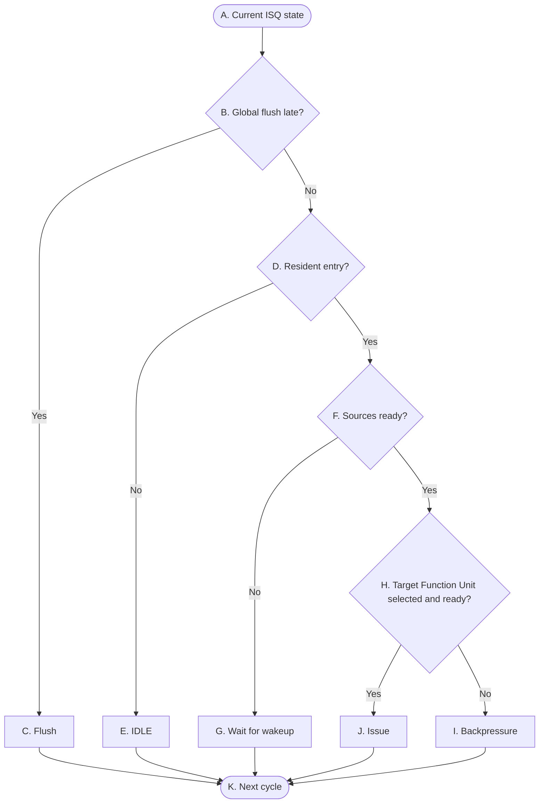

# OR_BE P2 Control Flow

## Reading conventions

- The diagram shows only the control-state skeleton. Signal meaning and state transitions are defined in the tables below.
- Each ISQ group holds exactly one entry (`isq_valid`: 0 = FREE, 1 = RESIDENT). The four groups are evaluated independently; the diagram describes one generic group and applies to `ISQ_Group0..3`.
- Decisions are combinational; resident-state changes take effect at the active edge and are visible in the next cycle.
- `FU_ready` is positive logic: asserted means the target FU can accept one new instruction this cycle. The v1 `FU busy` polarity is no longer used.
- `global_flush_late` has priority over all P2 issue, capture, release, and refill behavior.

## P2 — Group-local issue control

The graph intentionally does not create separate branches for every wakeup-capture case. A bypass lane hit is part of the source-readiness and resident-state controls described in the tables below. It may make a source ready for the current evaluation, or be captured at the active edge while the entry remains resident.

## 表 A — 转换条件（菱形）

菱形节点表示组合判断。每一行明确当前判断节点、判断信号及其两条状态转换路径。

| 节点 | 判断信号 | 归属模块 | 判断含义 |
|---|---|---|---|
| `B` | `global_flush_late` | `flush_model` → `ISQ_Group0..3` | 本周期是否存在晚期 flush；优先级高于所有 P2 行为，flush 拍不 dispatch、不 issue、不 `bypass_capture`。 |
| `D` | `isq_valid` | `ISQ_Group_g` | 本组唯一 entry 是否处于 RESIDENT，即是否持有此前 active edge 写入且仍驻留的 entry。 |
| `F` | `operand_ready` | `ISQ_Group_g` | resident entry 的全部 source 本周期是否可用：`operand_ready` = 各源的 (`rsX_ready` ∨ `fast_ready_rsX`) 取与，包括本周期 bypass 命中。G0/G1/G3 只取 `rs1`/`rs2`，G2 是唯一三源全参与的一组。 |
| `H` | `FU_ready[FU_Group]` | 组内 FU → `ISQ_Group_g` | 由 entry 的 `FU_Group` 选中的那个组内 FU，本拍能否接收一条新指令（正逻辑）。位数按组内成员数：G0 三位（ALU0/BRU、CSR、DIV）、G1 两位（ALU1、MUL）、G2/G3 各一位且无索引。 各组语义差异：G0 的 CSR 与 DIV 在执行中保持 0；G1 的 ALU1 恒 ready，MUL 是流水 FU、output hold 被占满时才拉低；G3 的 LSU 把地址队列、store buffer 余量、执行段占用等一切内部反压折进这一位，不另设第二条反压通路。 此外任一 FU 在 P3 组内仲裁输掉、须 hold 住整条 completion request 时，`FU_ready` 同样拉低。 |

## 表 B — 状态与动作（矩形 + 圆角）
| 节点 | State | 归属模块 | 本周期组合动作 | Description |
|---|---|---|---|---|
| `A` | Current State | `ISQ_Group_g` | 无；本节点只是入口。 | 状态不变。 |
| `C` | Flush | `flush_model` → `ISQ_Group_g` | 本周期不产生 issue、`bypass_capture`、release，也不接收 dispatch 写入。 | `isq_valid ← 0`，下一周期该组 ISQ 从 FREE 重新开始。同一拍 `dispatch_logic` 的 `accept[s]` 被同一根 `global_flush_late` 压掉，不会有新 entry 挤进来。 |
| `E` | IDLE | `ISQ_Group_g` → `dispatch_logic` | 向 `dispatch_logic` 报 `isq_free_for_dispatch` = `!isq_valid` ∨ `issue`，本组可作为 P1 dispatch 的目标。 | 若 P1 在本周期给出 `isq_wr_en[g]` = 1，该 entry 在 active edge 写入 ISQ，下一周期成为 resident entry；若没有接受新的 entry，slot 下一周期继续保持空闲。 |
| `G` | Wait for wakeup | `p3_bypass_CDB`（`bypass_valid[b]` / `bypass_tag[b]` / `bypass_data[b]`）→ `ISQ_Group_g` | 不发起 issue。ISQ 对四条 bypass lane 做 tag 比较（`fast_ready_rsX` = `!rsX_ready` ∧ 存在 b 使 `bypass_valid[b]` ∧ `rsX_wait_tag` == `bypass_tag[b]`），命中的源本周期即视为可用。bypass 是全局广播，四条 lane 全监听。 | 若本周期 entry 因 source 不 ready 不能 issue，则 `bypass_capture` = `isq_valid` ∧ `!global_flush_late` ∧ `!issue` ∧ 任一 `fast_ready_rsX` 成立：命中的 `bypass_data[b]` 在 active edge 被捕获写进 entry 的 `rsX_data` 并置 `rsX_ready`，`rsX_wait_tag` 不改（改了下一拍会拿新 tag 重新匹配）。当前 entry 继续驻留，下一周期重新检查 source readiness。bypass 是一次性组合脉冲、不重播；派发拍就已经错过唤醒窗口的情况由 P1 的 `slot_missed_wakeup` 挡在派发外，不会落进本组 entry。 |
| `I` | Backpressure | 组内 FU → `ISQ_Group_g` | 本周期不发起 issue：`operand_ready` 已成立但 `FU_ready[FU_Group]` = 0，目标 FU 不接收当前 entry。 | 当前 entry 继续由 ISQ 持有，slot 不释放，ownership 不变；`isq_free_for_dispatch` 本拍为 0，P1 不能往本组派发。下一周期重新检查目标是否可以接收。 |
| `J` | Issue | `ISQ_Group_g` → 组内被选中的 FU、`ISQ_Group_g` → `dispatch_logic` （`FU_input_mux` 是 `ISQ_Group` issue 端口的内部子块，9 份实例分住四组——G0/G1/G3 各 `rs1`/`rs2`，G2 因三源有 3——不是 ISQ 与 FU 之间的独立模块，集成层不登记它） | `issue` = `isq_valid` ∧ `operand_ready` ∧ `FU_ready[FU_Group]` ∧ `!global_flush_late`；目标 FU 在本周期接收当前 entry。源数据在 ISQ 的 issue 端口上由 `FU_input_mux` 二选一装配：`rsX_ready` 的源取 entry 里的 `rsX_data`，本拍 `fast_ready_rsX` 命中的源取对应 lane 的 `bypass_data[b]` 直接前递、不落 entry；两条对同一个 `rsX` 互斥，多个源可同拍并行。**四条 lane 的命中至多一位**——依据不在本级：`CompletionScoreboard` 的 writeback 约束已给出"四条有效 `tag_out` 属四个不同在飞 tag、地址正交"，而 `bypass_tag[b]` 就是对应的 `tag_out[b]`，故 ISQ 与 mux 只消费这条既有约束，不另造不变量。G2 的 issue 另带 `full_decode.rm`（本组是 `rm` 的唯一消费者）：`rm = 111`(DYN) 时 FPU 在同一拍向 `system_instruction_handler` 组合读 `frm` 取动态舍入模式，其余取值直接用 `rm` 本身。同拍 issue 时不做 `bypass_capture`。ISQ issue 与 ISQ release 在同一控制动作中同步完成。 | active edge 释放当前 resident entry；`isq_free_for_dispatch` 含同拍 `issue`，故本拍即向 `dispatch_logic` 报空。如果 P1 同周期也给出 `isq_wr_en[g]` = 1，则新 entry 在同一 edge 写入该 slot，并在下一周期成为 resident entry；否则该 slot 下一周期为空闲。代价是 `FU_ready` 被拉进 P1 准入的同拍组合路径，`accept[s]` 要等它稳定后才成立。 |
| `K` | Next Cycle | - | - | - |
