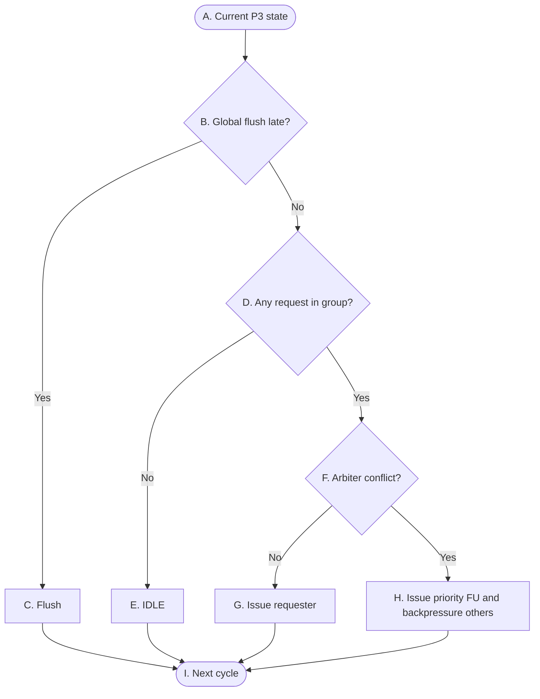

# OR_BE P3 Control Flow

> **Purpose:** A control overview for P3 completion publication: independent group-local selection, combinational bypass visibility, active-edge completion persistence, loser retry, and flush cancellation. It does not describe result data contents, completion payload widths, or FU execution timing.

## Reading conventions

- G0, G1, G2, and G3 are evaluated independently; a non-flush cycle may publish at most one result per group. There are four completion lanes, numbered `b = g`; they are never reordered or compacted.
- `p3_arbiter_G0` and `p3_arbiter_G1` are the P3 owners for G0 and G1 — two separate, purely combinational, stateless modules with their own documents. G2 and G3 have no arbiter: the single FPU / LSU requester drives lane 2 / lane 3 directly (an out-of-library edge, wired by the integration layer). Where a table cell says `lane 驱动方`, read it as the arbiter for lanes 0/1 and as the FU itself for lanes 2/3. P3 is a pipeline stage, not a module.
- Winner selection, combinational publication, and active-edge persistence are still distinct phases. In the tables they are the combinational-action column and the Description column of one row, not separate nodes.
- The writeback has two different destinations, not one: `result_data` goes to `Buffer`, while `exec_done` and the event batch go to `CompletionScoreboard`. Lane 0 additionally carries `csr_sideband`, which goes straight to `system_instruction_handler`.
- `global_flush_late` is generated solely by `flush_model`. The arbiters neither receive nor forward it; the gate is mounted by each consumer. `Buffer` is the one deliberate exception — it has no flush gate at all.

## P3 — Group completion publication

节点字母与图结构沿用 v1，未增删节点。v2 把 v1 "写 Buffer 和 Completion Scoreboard" 这一句并列动作拆成两个不同落点，拆分体现在表 B 的动作列里，不引入新节点。图描述的是一份通用的组内契约，独立套用到四个组。组的拓扑是：

- G0: `ALU0/BRU (requester 0) > CSR (1) > DIV (2)`，由 `p3_arbiter_G0` 仲裁，驱动 lane 0。`ALU0/BRU` 共用一个 requester 接口。
- G1: `ALU1 (0) > MUL (1)`，由 `p3_arbiter_G1` 仲裁，驱动 lane 1。
- G2: FPU 单 requester，无组内仲裁器，completion 直连 lane 2。
- G3: LSU 单 requester，无组内仲裁器，completion 直连 lane 3。

## 表 A — 转换条件（菱形）

菱形节点表示组合判断。每一行明确当前判断节点、判断信号、判断发生的位置，以及该判断的精确语义。

| 节点 | 判断信号 | 归属模块 | 判断含义 |
|---|---|---|---|
| `B` | `global_flush_late` | `flush_model` → `CompletionScoreboard`、`ISQ_Group0..3`、各 FU | 这一拍有没有发生 late flush。它排在所有落地判断前面，一旦成立，四个组这一拍都不落地。注意它**不进仲裁器**——`p3_arbiter_G0/G1` 无状态，既不接收也不转发这根线，门挂在各消费者身上。 |
| `D` | `request_valid[k]` | 各 FU → `p3_arbiter_G0/G1`（G2/G3 为 lane 直连） | 本组这一拍有没有 FU 举手。G0 有三个 requester、G1 有两个；G2 和 G3 只有一条直通路径，`request_valid` 退化成那条 lane 的 `Result_valid`。 |
| `F` | 本组是否多个 requester 同拍竞争 | 各 FU → `p3_arbiter_G0/G1` | 这一拍是否有多个 `request_valid[k]` 同时为 1。G2 和 G3 单 requester，这里恒不成立；G0 和 G1 才可能成立。不成立就不用仲裁，唯一那个直接转发；成立才要按组内静态优先级挑一个。 |

## 表 B — 状态与动作（矩形 + 圆角）

| 节点 | State | 归属模块 | 本周期组合动作 | Description |
|---|---|---|---|---|
| `A` | Current P3 state | 各 FU → `p3_arbiter_G0/G1` | 看本组这一拍有哪些 `request_valid[k]` 在举手。只看不动，不消费任何请求。 | 状态不变。两个仲裁器都是纯组合、无 per-entry state，本身不留存任何 completion。 |
| `C` | Flush | `flush_model` → `CompletionScoreboard`、`ISQ_Group0..3`、各 FU | `CompletionScoreboard` 的 writeback 被 `!global_flush_late` 门掉，`exec_done` 与事件批这一拍不落；`ISQ_Group_g` 不做 `bypass_capture`；各 FU 的本地 `winner_ack[k] = winner_grant[k] ∧ !global_flush_late` 无语义，所以没有请求被消费。仲裁器不知情，winner payload 仍可以出现在组合线上。 | **`Buffer` 是全库唯一不挂 flush 门的模块**：这一拍的 `result_data` 可能真被写进 `entry[tag_out[g]]`。这不产生危害——那一格随指针回滚立即失效，不改变任何架构状态；该格被重新分配后，新指令的 writeback 必定先于它的提交发生（提交要求 `exec_done`，而 `exec_done` 与 Buffer 写来自同一次 writeback），读出值恒与被提交的那条指令对应。安全前提是 **FU flush 契约**：flush 拍作废在飞指令与被 hold 的 completion request，此后不得对旧 tag 再发 `Result_valid`（含直连 lane 2/3 的 FPU 与 LSU）。这条契约、以及 FU 内部怎么清干净投机态与 hold 状态，**规格归 FU 微架构文档（待建）**；`p3_arbiter_G0/G1` 只做仲裁与转发，不描述任何 FU 内部行为。 |
| `E` | IDLE | `p3_arbiter_G0/G1`（G2/G3 为 lane 直连） | 本组这一拍没人举手，`winner_valid = 0`，故 `Result_valid = 0`、`bypass_valid[b] = 0`，不发布也不落地。 | `Buffer` 和 `CompletionScoreboard` 这一拍都没被本组写。之前留在各 FU 手里、还没轮到发的结果原地不动，下一拍继续举手。 |
| `G` | Issue requester | 各 FU → `p3_arbiter_G0/G1` `lane 驱动方` → `Buffer`、`CompletionScoreboard` `lane 驱动方` → `ISQ_Group0..3`、`dependency_check` | 只有一个请求者，不用仲裁，直接转发：`Result_valid`、`tag_out` 与 `bypass_valid[b]` / `bypass_tag[b]` / `bypass_data[b]` 这一拍就组合发布，P1（`dependency_check` 源解析的第 5 行 BYPASS）和 P2（ISQ 的 `fast_ready_rsX`）当拍就能看见。 | active edge 上落两处，分工不同：`result_data` 写进 `Buffer` 的 `entry[tag_out[g]]`（纯结果 RAM，按 `tag_out` 寻址）；`exec_done ← 1` 连同事件批（`mispredict_flag` / `mispredict_target_pc`、`exception_flag` / `exception_cause` / `exception_tval`、`is_mret`）与 `fpu_fflags` 写进 `CompletionScoreboard` 的同一个 tag。lane 0 另有 `csr_sideband`（`is_csr` / `csr_write_enable` / `csr_addr` / `csr_wdata`）直连 `system_instruction_handler` 的 `csr_stage`，**不经 SCB**——这是全库唯一一条绕过 SCB 的 completion 侧连接。bypass 不一样，它只在这一拍的线上有值，边沿一过就没了；P1 和 P2 这一拍没抓走的话，之后只能靠 `wait_tag` 等，P3 不会再广播第二次。 |
| `H` | Issue priority FU and backpressure others | 各 FU → `p3_arbiter_G0/G1` `lane 驱动方` → `Buffer`、`CompletionScoreboard` `lane 驱动方` → `ISQ_Group0..3`、`dependency_check` | 按组内静态优先级挑一个——G0 是 `ALU0/BRU > CSR > DIV`，G1 是 `ALU1 > MUL`。挑中的拿 `winner_grant[k]`，其结果与 bypass 当拍发布；其余举手的落 `loser_hold[k] = request_valid[k] ∧ !winner_grant[k]`，不入 winner data path。 | 挑中那条的写回落点与只有一个请求者时完全一样（`result_data` 进 `Buffer`、`exec_done` 与事件批进 `CompletionScoreboard`，bypass 边沿一过就没）。没挑中的那几个，结果还稳稳留在自己的 FU-local hold state 里，一条都没丢——没拿到 grant 就等于没交出去，FU 不能当它已经收下。loser 必须**冻结整条 completion request**、下拍重试，并在 hold 期间保持 `FU_ready[FU_Group] = 0` 反压输入端（`FU_ready` 契约见 p2 表 A 的 `H` 行），不得覆盖或丢失 result。优先级低的那个可能要连等好几拍。 |
| `I` | Next cycle | - | - | - |

## P3 control semantics

- 非 flush 的一拍里，每个组最多发出一个结果，但四个组可以同时各发一个。P3 不限制全局只能有一个结果，四条 lane 编号 `b = g`，消费者不重排、不压缩。
- G0 和 G1 的 ack 是 grant 语义：拿到 `winner_grant[k]` 的那个才算发出去了，没拿到的仍然攥着自己的 completion。各 FU 自己再与 flush 与门成本地 `winner_ack[k] = winner_grant[k] ∧ !global_flush_late`。G2 和 G3 是直连路径，没有组内仲裁器也就没有 grant——但这不等于 FPU / LSU 容量无限。
- completion 分两层：`completion_common` 四条 lane 共用（`Result_valid`、`tag_out`、`result_data`、`exception_flag`、`exception_cause`、`exception_tval`、`mispredict_flag`、`mispredict_target_pc`、`is_mret`、`fpu_fflags`）；`csr_sideband`（`is_csr`、`csr_write_enable`、`csr_addr`、`csr_wdata`）**只在 lane 0 存在**——CSR 固定路由 G0，其余 lane 不携带、也不必伪造。G2/G3 虽然直连、不经任何仲裁器，也必须按 `completion_common` 驱动，产生不了的字段恒 0。
- 各 lane 的字段权限不同：G0 可驱动全部事件字段、`fpu_fflags` 恒 0；G1 的事件字段全部恒 0；**G2 的 `exception` / `mispredict` / `is_mret` 恒 0，但它是唯一驱动 `fpu_fflags` 非零的 lane**（IEEE 标志，不是判定链谓词，与事件字段分开算）；G3 只产生访存同步异常，且必须在收下这条 store 之前判完，`mispredict_flag` / `is_mret` / `fpu_fflags` 恒 0。
- 写回目的地是两个，不是并列的一处。`Buffer` 在 v2 是纯结果 RAM——4 个写口按 `tag_out` 寻址、2 个队头读口，无指针、无状态；`CompletionScoreboard` 才是裁决中枢，`exec_done` 与事件批进的是它。P3 只负责把这两半送对地方，退休判定不在这一级。
- v2 里**没有 `group_publish_valid[g]` 这个信号**。`Result_valid` 与 `bypass_valid[b]` 都直接等于 `winner_valid`，两者同进同退，但**都不含 flush 项**；flush 门由各消费者自己挂（SCB 的 writeback、ISQ 的 `bypass_capture`、FU 的 `winner_ack`），唯独 `Buffer` 不挂。
- bypass 只在当拍有效，是组合可见性，不是存下来的状态，**也不重播**。这正是 P1 侧 `slot_missed_wakeup[s]` 存在的理由：producer 已经 `exec_done`、但消费者错过了这一拍的唤醒窗口，那个 slot 只能被挡在派发外，等 producer 退休后走 ARF 路径。Commit CDB 不参与 ISQ 驻留 entry 的唤醒。
- 只有非 flush 的那次 writeback 才在 active edge 置 `exec_done` 并写入事件批。P3 的 completion 不是 P4 的 architectural commit。
- P3 这一级**不做 live-tag 检查**：v2 的 `scoreboard_valid_bits[t]` 是 `[head, tail)` 的解码投影，writeback 按 `tag_out[g]` 随机寻址、不带 valid 门控。生命周期一致性属于断言，不要把它变成功能上的写回门控。
- store 在 P3 的 `exec_done` 只表示 store buffer 收下了、执行这一段算完了，不表示它已经做完 P4 的 drain，更不表示已经退休。
- 组内静态优先级**无 anti-starvation**，正确性靠按序退休论证：loser 堵住按序退休 → 退休窗口满（`occupancy == 16`）→ 高优先级 FU 拿不到新的有效指令 → loser 必然获胜。此保证仅在按序退休下成立。
- 非法指令也必须走完 P3：取 `route_class = BRU`（固定 G0）加 ILLEGAL 子码、与 ALU0/BRU 共用 requester 0，由 lane 0 发 `exception_flag`、`cause = 2`、`tval` 取 `inst_bits`。`ECALL` / `EBREAK` 走同一条完成路径但 `route_class = SYS`、cause 各为 11 / 3；被 `ENABLE_A`/`ENABLE_C` 关掉的扩展由 decode 置 `illegal = 1`，也走这里。只在译码期 trap 是不可实现的——指令一旦被接受就占住一个 tag，而 `exec_done` 只能由完成 lane 置位；没有 FU 为它发 `Result_valid`，队头就永远卡死。
