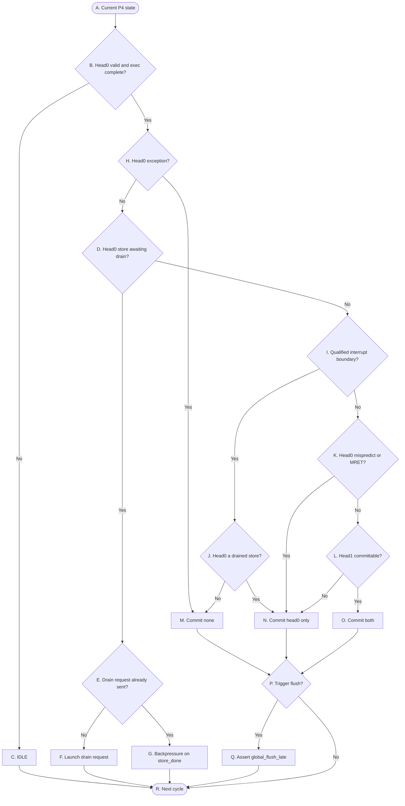
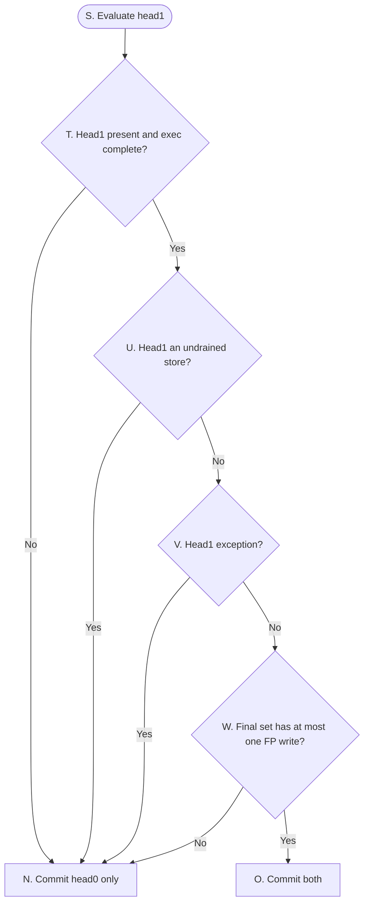

# OR_BE P4 Control Flow

> **Purpose:** A precise control overview for P4: head qualification, store drain, the final commit set, architectural commit, and the flush decision. It omits data values and redirect arithmetic.

## Reading conventions

- `head0` is older than `head1`; retirement is always an ordered prefix.
- `CompletionScoreboard`（下称 SCB）是 P4 的唯一权威：它持有环指针与 per-tag 生命周期、给队头定资格、驱动 store drain 协议、定出最终提交集合、发出架构写的提交事件，**并拥有 flush 判定**。v2 把 v1 的三样东西——`Buffer` 的控制侧（指针/占格/元数据/事件位）、独立的 `Completion Scoreboard`、`Commit_unit`——合并进这一个模块，所以下文表里凡 v1 写作 "`Buffer`、`Completion Scoreboard` → `Commit_unit`" 的归属，在 v2 一律是 SCB **自产自校**的模块内判定。`flush_model` 是独立模块、**只做翻译与广播**：它消费 `{flush_valid, flush_tag, recovery_kind}` 三元组，从不自己重推队头资格。P4 是流水级不是模块——下面每个归属格填的都是 `CompletionScoreboard`、`flush_model`、`system_instruction_handler`，或一个真实存储块（`Buffer` / `INT_ARF` / `FP_ARF` / `INT_tag_mapping` / `FP_tag_mapping` / `PC_File`）。
- **（0727 更正，v2 沿用）** v1 原写 "`Flush_model` … decides whether a flush is required"，与判定链的口径冲突，已更正。理由：`P. Trigger flush?` 的判据**就是** head0 优先级链（exception > store drain > interrupt > mispredict/MRET）——而定集合的那一方不做这条链就选不出提交集合。让 `flush_model` 再推一遍等于把整条链实现两份，两份一旦漂移就是不可调的 bug。∴ `P` 的**判定**在 SCB（输出 `flush_valid` / `flush_tag` / `recovery_kind`），`Q` 的**执行**在 `flush_model`。v2 正是按这条落的：判定链自产 flush 三元组，`flush_model` 无 state、无判定。
- `Buffer` 在 v2 退化成**纯结果 RAM**：只有 `result_data`，4 个写口按 `tag_out[g]` 寻址、2 个读口按 SCB 给的 `head0_tag` / `head1_tag` 输出 `commit_data[k]`。它没有指针、没有生命周期位，**也不接 `global_flush_late`**（全库唯一有意不挂 flush 门的模块）。P4 图里凡涉及"队头顺序、占用、生命周期"的判断，读的都是 SCB，不是 `Buffer`。
- 判定链的分支一律**自上而下首个命中者胜**：head0 六分支（无效或未完成 > exception > store drain > 外部中断 > FENCE.I/mispredict/MRET > 正常提交），head1 五分支（无效或未完成 > store > exception > mispredict > 正常）。图 1、图 2 就是这两条链的展开，图上的菱形次序**不可重排**。
- Decisions are combinational; commit, drain-state, and recovery updates take effect at the active edge.
- **commit 与 flush 分层**：SCB 先决定 retire 几条（最终提交集合，取值只有空集、`{head0}`、`{head0, head1}`）；集合定下来后，同一条链再判这次退休边界是不是非顺序的，把 `flush_valid` 交给 `flush_model` 去拉 `global_flush_late`。图上 `Trigger flush?` 就是这一步。
- **store drain 是多周期协议**：只有 head0 能发 drain request；一个 store 从 head0 出发要经过 发请求 → 等 `store_done_valid` → drain 完成 三态才够格退休；store 的退休只做 SCB 的 `head` 前移（投影 valid 随之归零），**不写 ARF**（它没有目的寄存器，内存写在 drain 时已经发生）。
- 两个 head 同拍求值，最终集合在同一个 active edge 上原子写入；不存在 head0 已退休而 head1 还在判的中间态。
- The flow is drawn as two graphs: 图 1 是 head0 结算（readiness → commit set → flush），图 2 展开图 1 里的 `L. Head1 committable?`。字母 A–W 跨两图连续编号；`N`、`O` 是两图共用的终态。

## P4 — 图 1：head0 结算

图结构与 v1 一致（判定链的分支次序在 v2 未变），只有两个菱形按 v2 口径重写了标注：`K` 从 "misprediction or system inst" 改成 `FENCE.I / mispredict / MRET`（`ECALL`/`EBREAK` 是真异常，已在 `H` 拦下；`WFI` 是 NOP，落正常提交），`W`（图 2）从"装不装得下 FP_ARF 写口"改成判定链第三步的**双FP提交阻塞**。

分四段读：
- **readiness + exception（`B`,`H`）**：head0 无效或没执行完 → `C. IDLE`；否则**先判 head0 自身 exception（`H`）**——有则 `M`（不提交、flush）。exception 排在 drain 之前，保证 faulting store 绝不 drain。
- **store drain（`D`–`G`）**：head0 是还没 drain 完的 store → `E`/`F`/`G` 的 drain 子机；否则往下进入事件判断。
- **commit set（`I`–`O`）**：SCB 按 外部中断 → FENCE.I/mispredict/MRET → 正常提交的次序定出最终集合，落到 `M`（count 0）/`N`（count 1）/`O`（count 2）之一。head1 够不够格进集合在图 2 展开。
- **flush（`P`–`Q`）**：三个 commit 动作都汇到 `P. Trigger flush?`。判定在 SCB（它在 `H`/`I`/`K` 上已经算出了事件，`P` 只是把结果编码成 `flush_valid` + `flush_tag` + `recovery_kind`）；`Q` 的执行在 `flush_model`，`global_flush_late = flush_valid`。

## P4 — 图 2：`L. Head1 committable?` 的展开

图 1 里 `L` 是概括菱形；这张图展开它查什么。`L`-No 对应落到 `N`（commit head0 only），`L`-Yes 对应落到 `O`（commit both）；`N`、`O` 与图 1 共用。

一条 AND 链：head1 四关全过才 count 2，任一关不过就 count 1（只提交 head0）。这里**故意不查 head1 的 mispredict**——head1 带 redirect 时两条照样都提交（count 2），redirect 只决定要不要 flush，那个判断留给图 1 的 `P`，所以它走 `W`-Yes → `O`，和 head1 正常同一条路。**head1 不可能是串行指令**：串行指令要求派遣时窗口空、被接受后又挡死全部更年轻的派发，必然独占退休窗口（`occupancy == 1`）⇒ `head1_valid = 0`，`T`-No 直接把它挡在图 2 门口。

## 表 A — 转换条件（菱形）

菱形节点表示组合判断。每一行明确当前判断节点、判断信号、判断发生的位置，以及该判断的精确语义。

| 节点 | 判断信号 | 归属模块 | 判断含义 |
|---|---|---|---|
| `B` | `head0_valid ∧ head0_done` | `CompletionScoreboard` | 队头这一拍有没有一条动得了的指令。不成立含两种：窗口空（`occupancy == 0`），或 head0 还在执行、`exec_done` 未置。v2 的 per-entry valid **不逐格存**，是 `[head, tail)` 的解码投影（`head`/`tail` 是 5-bit `{loopbit, index}`，跨回绕时投影须按 5-bit 求，不得退化成 4-bit 数值比较）；`exec_done` 才是逐格存的位。v1 "队头 present 与 valid 位双重互检"随之消失。本步不成立时**不评估 head1**。 |
| `D` | `is_store ∧ !store_drain_done` | `CompletionScoreboard` | head0 是 store（`is_store` 来自 alloc 批，写入即定）且 drain 未完成。No 边同时含"非 store"和"store 已 drain 完"两种——前者本来就不用 drain，后者已经够格提交。 |
| `E` | `store_drain_requested` | `CompletionScoreboard` | 读 per-tag 的已请求位。No→还没发，去 `F` 发；Yes→发过了，去 `G` 等 `store_done_valid`。 |
| `H` | `exception_flag` | `CompletionScoreboard` | head0 自己出错了（事件批由 writeback 拍写入，只在 `exec_done = 1` 时有效，陈旧值靠 `B` 的 done 门挡住）。它排在事件链最前，因为 faulting 指令不能提交；而且这一步先于 drain 判断——faulting store 绝不能 drain，否则把错的写打进内存。能走到 drain 的 store 一定无 exception。 |
| `I` | `interrupt_pending` 且落在合格边界 | `system_instruction_handler`（产信号）→ `CompletionScoreboard`（判定链第一步分支 4） | `interrupt_pending` 是 SIH **已综合完的一根线**（`mstatus.MIE ∧ \|(mie & mip)`，含顶层电平直驱的 `mip` 外部中断位），SCB **直接用、不再自行组合** `mie`/`mip`/`mstatus.MIE`——v1 让提交侧读 CSR 三样再自己拼的写法在 v2 作废。"合格边界"是这一步的第二个条件：head0 是**可作废**的，或 head0 不可作废但 `head1_valid`。**不可作废**＝已 drain 的 store，或已 `exec_done` 的原子指令（LR/SC/AMO）——它们已产生不可回滚的存储器副作用，作废会让 handler 返回后重执行、内存改两次。`!head1_valid` 的不可作废 head0 上**本步不命中**，落到分支 5/6 按普通指令处理，interrupt 留到下一拍（电平敏感，推迟无损）。**外部中断压过 head0 的 mispredict/MRET**。 |
| `J` | head0 是已 drain 的 store 吗 | `CompletionScoreboard` | 承接 `I`-Yes（中断可取）后再分：head0 不可作废（已 drain 的 store，或已 `exec_done` 的 LR/SC/AMO）→只提交它，count 1、`flush_tag = head1`（内存写已出，不能不提交）；否则 head0 是可作废的普通指令，count 0、`flush_tag = head0`，从它前面切断。 |
| `K` | `mispredict_flag ∨ is_mret` | `CompletionScoreboard` | head0 是分支预测错，或是 MRET。这类指令本身没错，先提交它再改取指方向（**MRET 不是 exception**；`FENCE.I` 也走这一支——它本身没错，先提交再重取，只是 `recovery_kind` 取 `FENCE_I`。`ECALL`/`EBREAK` 是真异常，已在 `H` 拦下；`WFI` 是 NOP，落正常提交）。成立→只提交 head0（head1 在错路径上，随后 flush）；不成立→进 `L` 看 head1。 |
| `L` | head1 够不够格进集合 | `CompletionScoreboard` | head1 能不能和 head0 一起退休的汇总判断，展开见图 2 的 `T`–`W`。四关全过→count 2；任一不过→只提交 head0。 |
| `P` | 这次退休边界是否非顺序 | `CompletionScoreboard`（判定）→ `flush_model`（执行） | 这次 commit 是不是带了控制事件——head0 exception、当拍取的 interrupt、head0 的 mispredict/MRET、head1 的 exception 或 mispredict。带任一即非顺序边界，younger 必须被清；都不带就是普通顺序退休，下条 PC 顺着走，不 flush。**判定归 SCB**：它在 `H`/`I`/`K` 已经算出事件，`P` 只是把结果编码成 `flush_valid`(1) + `flush_tag`(4) + `recovery_kind`(3)=`{0:MISPREDICT, 1:EXCEPTION, 2:MRET, 3:INTERRUPT, 4:FENCE_I}` 交给 `flush_model`；同一分支内事件位并存时按 exception > MRET > FENCE_I > mispredict 取。**三元组里没有 `commit_count`**——它只进 SCB 自己的指针落位，不经 flush 侧。`flush_tag` 只是恢复上下文的读地址（SCB 恢复读口与 `PC_File` 都按它索引），**回滚边界由 `commit_count` 承担**：MISPREDICT/MRET 下 `flush_tag` 指的是本拍**已退休**的那条，拿它落位会把已退休的条目也丢掉。 |
| `T` | `head1_valid ∧ head1_done` | `CompletionScoreboard` | head1 在不在、执行完没有。不成立就这拍只提交 head0，且**不读它的任何字段**。 |
| `U` | `is_store` | `CompletionScoreboard` | head1 是 store 就一定还没 drain——drain 只在 head0 位置发起，落在 head1 的 store 这拍不能提交。要等它下一拍变 head0 再自己发 drain。 |
| `V` | `exception_flag` | `CompletionScoreboard` | head1 自己出错了。这拍不提交它，产生 EXCEPTION flush、`flush_tag = head1_tag`、`commit_count = 1`；head0 已够格，不受牵连。 |
| `W` | 最终集合是否只产生一笔 FP 写 | `CompletionScoreboard`（判定链第三步） | 把 head1 也算进集合后，看会不会产生**两笔** `rd_write_enable ∧ rd_is_fp` 的写；会则**缩到 1 条**，head1 留到下一拍。**阻塞只能减提交条数，不许丢掉一笔写、也不许提前 flush 来绕开它**。判定在 SCB 而不在 `FP_ARF`：FP 侧的单写口与 `FP_tag_mapping` 的单清除口是这条阻塞的**结果**，不是它的判定方。INT 侧双写口/双清除口，不受此限。 |

## 表 B — 状态与动作（矩形 + 圆角）

| 节点 | State | 归属模块 | 本周期组合动作 | Description |
|---|---|---|---|---|
| `A` | Current P4 state | `CompletionScoreboard` | 读拍初的 `head`/`tail`（推出 `occupancy`、`head0_tag`/`head1_tag`、投影 valid）与队头两格的 `exec_done`、drain 两位、alloc 批与事件批。只看不动。 | 状态不变。`head0_tag`/`head1_tag` 同拍送 `Buffer` 作队头读地址，读出 `commit_data[k]`；读出值是裸 RAM 值，消费者必须先看 `commit_valid[k]`。 |
| `C` | IDLE | `CompletionScoreboard` | head0 无效或没执行完，这拍无事可做。 | `commit_count = 0`，架构状态无更新，指针不动。下一拍重新看队头——等的是 alloc 补进指令，或 head0 的 writeback 置 `exec_done`。 |
| `F` | Launch drain request | `CompletionScoreboard` → `g3_lsu_iface`（库外） | 发 `store_drain_req_valid` 1 拍脉冲，带 `store_drain_tag = head0_tag`；对端无条件收下，无 ready 回送。每拍至多一条，且只对队头最老那条发。 | `commit_count = 0`。active edge 置 `entry[head0_tag].store_drain_requested`；下一拍走到 `E` 落 Yes，不再重发。head0 位置不变，其后指令继续阻塞。`store_done_valid` 最早下一拍才可能回来。 |
| `G` | Backpressure on store_done | `CompletionScoreboard` | drain 请求已在飞，纯等待，不重发。 | `commit_count = 0`，架构状态无更新。等 `g3_lsu_iface` 回 `store_done_valid` / `store_done_tag`；命中判据（对应 tag 仍在 `[head, tail)` 内、已请求、未完成）后置 `store_drain_done`，下一拍 `D` 落 No，这个 store 才够格提交。等待期间 head1、更年轻的退休、interrupt 全被它挡着。`store_done_exception` / `store_done_cause` 保留未实现、预期恒 0。 |
| `M` | Commit none | `CompletionScoreboard` | 最终集合为空，一条不退休。两条来路：head0 exception（faulting 指令不提交，`recovery_kind = EXCEPTION`），或当拍取的 interrupt 落在可作废的 head0 前面（`recovery_kind = INTERRUPT`）。 | `commit_count = 0`，不写任何架构状态。head0 连同其后全部作废。这条恒是非顺序边界，随后 `P` 必然拉 flush；指针落位退化为 `head_new = head`、`tail_new = head_new`。 |
| `N` | Commit head0 only | `CompletionScoreboard` → `INT_ARF`、`FP_ARF`、`INT_tag_mapping`、`FP_tag_mapping` `CompletionScoreboard` → `SerialInstructionTracker`、`system_instruction_handler`、`dependency_check` `Buffer` → `INT_ARF`、`FP_ARF`（`commit_data[0]`） | 最终集合只有 head0，退休它。多条来路：已 drain 的 store 当拍取中断、head0 mispredict/MRET、head1 不够格（含双FP阻塞缩 1）、head1 exception、无 head1 的正常提交。 | `commit_count = 1`。active edge 上 head0 落进架构状态：按 alloc 批的 `rd_write_enable`/`rd_is_fp` 选 INT/FP ARF 写口（写地址 `rd_idx[0]`、写数据来自 `Buffer` 的队头读口），并清对应 tag_mapping 的 `busy`——**要求该格 `tag == commit_tag[0]`**，否则那格已被更年轻的指令重命名，清了就会放行一个还在飞的依赖；若是 store 则只推指针、不写 ARF。`head += 1`，投影 valid 随之归零。同拍还驱动：`SerialInstructionTracker` 的 tag 比对自清、`system_instruction_handler` 的 `csr_stage` apply 与 `minstret += 1`、FP 退休累加，`dependency_check` 的 COMMIT 源解析（只给 `commit_valid`/`commit_tag`，data 走 `Buffer` 读口）。没进集合的 head1 仍在窗口里，下一拍上移为新 head0 重判。是否 flush 由 `P` 定。 |
| `O` | Commit both | 同 `N`（两条 lane 齐发） | 最终集合是两条，一起退休。head1 四关全过（图 2）。 | `commit_count = 2`，是一拍的退休上限。active edge 上两条在同一次写入里落进架构状态：**lane 0 恒为 head0、lane 1 恒为 head1，不做压缩**，`commit_valid[1] ⇒ commit_valid[0]`，消费者按前缀 valid 处理；各自按 `rd_write_enable`/`rd_is_fp` 决定写不写 ARF，`head += 2`。FP 侧同拍至多一笔写（判定链第三步已保证）。是否 flush 由 `P` 定（head1 若是 mispredict 则 flush，`flush_tag = head1_tag`）。 |
| `Q` | Assert global_flush_late | `flush_model` → `IB`、`dispatch_logic`、`ISQ_Group0..3`、`CompletionScoreboard`、`INT_tag_mapping`、`FP_tag_mapping`、`SerialInstructionTracker`、`system_instruction_handler`、各 `FU`、`g3_lsu_iface`（`FE` 不在本名单，它收的是 `redirect_*`） | `flush_model` 把 SCB 送来的 `flush_valid` 直接驱动成 `global_flush_late`（**不重新判定**），并按 `recovery_kind` 选恢复数据：`redirect_valid`/`redirect_pc`/`redirect_kind` 给 FE，`trap_state_write{valid, kind, epc, cause, tval}` 给 `system_instruction_handler`（`valid = flush_valid ∧ kind != MISPREDICT`）。`redirect_pc` 来源：MISPREDICT→`SCB[flush_tag].mispredict_target_pc`、MRET→`mepc`、EXCEPTION/INTERRUPT→`trap_vector(cause, is_interrupt)`；`epc` 来自 `PC_File[flush_tag].inst_pc`。**四种 kind 都产生前端 redirect，只有 MISPREDICT 不更新架构特权态。** `global_flush_late` 全库只允许一个网络，不为任何消费者起别名。 | active edge 上按该边界做恢复。**SCB 的指针落位严格按此次序**：`head_new = head + commit_count`（先落当拍提交——清除不是取消提交）→ `tail_new = head_new`（再回滚）；**per-tag 的 `exec_done` 与 drain 两位不清**——复用格由 alloc 拍清零，投影 valid 随指针落位自动归零。其余各家：`INT/FP_tag_mapping` 全表 `busy ← 0`；`SerialInstructionTracker` `valid ← 0`（承担一切不提交路径的解除）；`system_instruction_handler` 只清 `csr_stage.valid`，架构 CSR 与 `current_priv` 不动；`IB` 禁 enqueue/dequeue、指针复位（含 loopbit）；`dispatch_logic` `accept = 00`；`ISQ_Group0..3` `isq_valid ← 0`；各 FU 与 `g3_lsu_iface` 清投机执行态与未 drain 的投机 store buffer 项（已 drain 完成的 store 不回滚）。**`Buffer` 不在广播名单里**——flush 拍写进去的 `result_data` 落在随即失效的格里，复用后新指令的 writeback 必先于其提交发生，故读出值恒对应被提交的那条；安全前提是 FU 的 flush 契约（此后不得对旧 tag 再发 `Result_valid`）。`PC_File` 也不清：它按 tag 索引、格被重新分配时整格覆盖，且 `flush_model` 本拍正要按 `flush_tag` 读它取 trap epc。下一拍 P0–P3 干净，从 `redirect_pc` 重开。 |
| `S` | Evaluate head1 | `CompletionScoreboard` | 图 2 入口：head0 已够格正常提交，开始看 head1 能否一起进集合。只看不动。 | 状态不变；这是图 1 `L` 的展开入口，本身不产生任何架构更新。**head1 永不越过 head0**——本入口只在 head0 正常提交后到达。 |
| `R` | Next cycle | - | - | - |

## P4 control semantics

- SCB 每拍决定的是**退休哪几条**：把窗口最前端的若干条从投机状态转为架构状态。最终集合取值只有空集、`{head0}`、`{head0, head1}` 三种，集合基数即 `commit_count`，合法值只有 0、1、2，且必须是从 head0 起始的连续 prefix。提交 head1 而不提交 head0 属于 non-prefix 编码，任何路径都不得产生（`commit_valid[1] ⇒ commit_valid[0]` 是结构保证）。
- **commit 与 flush 分两层，但两层的判定都在 SCB。** 它同时定出集合（图 1 的 `M`/`N`/`O`）和边界性质（`P`），因为二者出自同一条 head0 优先级链；`flush_model` 只做翻译与广播。同一个 `commit_count`，flush 与否是分开的：`N`（count 1）里，head0 正常且 head1 只是推迟 → 不 flush；head0 mispredict/MRET、当拍取中断、head1 exception → flush。`O`（count 2）里，两条都正常 → 不 flush；head1 mispredict → flush。`M`（count 0）恒 flush（exception/interrupt）。
- **`flush_tag` 是读地址，`commit_count` 是回滚边界，两者通路不同。** `commit_count` 只进 SCB 自己的指针落位，**不经 `flush_model`**；`flush_model` 不得转发它、也不得另造任何落位目标值。`flush_tag` 送出去只用来读恢复上下文（SCB 的 `mispredict_target_pc`/`exception_cause`/`exception_tval` 恢复读口、`PC_File` 的 `inst_pc`），**绝不参与指针计算**——MISPREDICT/MRET 下它指向的是本拍已退休的条目。
- **flush 清除不取消同拍已完成的提交。** 落位次序在同一时钟边界上固定为 `head_new = head + commit_count` 先落、`tail_new = head_new` 后滚。per-tag 三位不随 flush 清除，靠 alloc 拍清零来保证复用格干净——这是把清零义务放在 alloc 侧的直接代价，两者互为条件，不可只改一边。
- **recovery_kind 有四种**：`0 MISPREDICT` / `1 EXCEPTION` / `2 MRET` / `3 INTERRUPT`。四种都产生一个前端 redirect；**只有 MISPREDICT 不更新架构特权态**（`trap_state_write.valid = 0`）。EXCEPTION/INTERRUPT 走 `trap_entry`（写 `mepc`/`mcause`/`mtval`，`MPIE ← MIE`、`MIE ← 0`、`MPP ← current_priv`），MRET 走 `mret_update`（`MIE ← MPIE`、`MPIE ← 1`、`current_priv ← MPP`）且**只消费 `kind`**——它正要读 `mepc` 作恢复 PC，不写 `mepc`。EXCEPTION 时 `is_interrupt = 0`，故不走 vectored；INTERRUPT 传 1，才可能走。
- **store drain 是 head0 独占的多周期协议。** 只有 head0 能发 drain request。一个 store 的生命周期：走到 head0、`exec_done`、无 exception → 发一次 drain request（`F`，单脉冲，置 `store_drain_requested`）→ 等 `store_done_valid`（`G`）→ 置 `store_drain_done` 后才够格退休。退休时只推指针、不写 ARF。落在 head1 的 store 永远还没 drain（`U`），必须等它变 head0 才开始；两个连续 store 是两趟独立握手，绝不并行，一个 store 也不可能在它刚变 head0 那拍就退休。注意 **store 的 `exec_done` 只表示 store buffer 收下了**，既不代表已 drain、更不代表已退休。
- **exception 闸在 drain 前。** `H`（exception）排在 `D`（drain）之前不是随意排列：faulting store 绝不能 drain，否则把错误的写打进内存。store 的 fault 在执行期（地址翻译/权限检查）就定了，且 G3 必须在收下这条 store **之前**判完，所以能走到 drain 子机的 store 一定无 exception。**但 drain 之后仍可能产生访存故障**（`store_done_exception`，cause 7 的第二个上报时机）——这条不走新分支：它把 cause/tval 写进该 tag 的事件批，下一拍由 `H` 自己抓住。`H` 排在 `D` 之前恰好保证不会重发 drain（事件批一有异常，`D` 永远到不了）。LSU 侧的对应义务是报故障时**不写内存**，于是这条 store 也不会被置已 drain 位、不进「不可作废」类。
- **exception 与 redirect 的分界在于错误归属。** exception 是 head0 自身的 fault，faulting 指令不提交（`M`，count 0）；mispredict 与 MRET 情况下 head0 本身正确，错的是它之后的取指路径，因此先提交 head0（`N`，count 1）再由 `flush_model` 建立 redirect boundary。
- **interrupt 是电平敏感的异步事件**，与具体指令无关，请求持续有效直到被服务，所以 SCB 无需当拍抢它，可推迟到有干净边界时再取。`I` 的 "qualified" 就把这层折进去了：只有 head0 可作废，或 head0 不可作废但 `head1_valid`，才当拍取中断。**不可作废**＝已 drain 的 store，或已 `exec_done` 的原子指令（LR/SC/AMO）——两者的内存写都已经发出，任何路径都必须让它提交，绝不能 count 0 flush 掉：作废它等于让 handler 返回后重执行、内存改两次。无 head1 时取不到干净边界，于是这拍让它沿正常路径 count 1 提交、interrupt 留到下一拍。判据本身不在 P4 拼：`interrupt_pending` 由 `system_instruction_handler` 综合成单线送来。
- **提交拍的架构效应有五处落点**，全部由同一组 commit lane 驱动：① ARF 写（`commit_valid[k] ∧ rd_write_enable[k]`，按 `rd_is_fp[k]` 分 INT/FP，写数据是 `Buffer` 队头读口的 `commit_data[k]`）；② tag_mapping 清 `busy`，**要求 `entry[rd_idx[k]].tag == commit_tag[k]`**（该格可能已被更年轻的指令重命名，tag 不等就不能清）；③ `SerialInstructionTracker` 以 `commit_tag[k] == serial_inflight_tag` 自清；④ `system_instruction_handler` 的 `csr_stage` 在 `commit_tag[k] == csr_stage.tag` 时 apply 落笔——**架构状态只在提交拍更新**，执行期的 csr_fu 绝不当场写；⑤ `minstret += commit_count`。这与 P1 侧的 COMMIT 源解析是两条独立路径——后者只用 `commit_valid`/`commit_tag`/`commit_data` 三样给本拍派发的 payload 做同拍捕获，不参与 ISQ 内驻留 entry 的 wakeup。
- **FP 退休累加也在提交拍**：`fflags` 按位或两条 lane 的 `commit_fflags[k]`（sticky OR、可交换，两条 lane 直接或、无需仲裁），`mstatus.FS` 的脏判据是 `rd_is_fp[k] ∨ commit_fflags[k] != 0`——写了 FP 寄存器，或产生了非零标志（`FMV.X.W`/`FCLASS` 两者皆无，不置脏）。软件写 `fcsr`/`fflags`/`frm` 与这条累加不会撞同拍：CSR 指令串行，其提交拍不可能有 FP 指令同拍退休，所以单写口够用。
- **双FP提交阻塞是提交侧的判定，不是 FP_ARF 的回压。** 最终集合若会产生两笔 FP 写就缩到 1 条（`W`-No → `N`），head1 留到下一拍；阻塞**只减条数**，不丢写、不许提前 flush 绕开。FP 侧单写口/单清除口、`FP_tag_mapping` 无同拍竞争，都是这条的下游结论。INT 侧双写口，同拍两条写同一格（WAW）时次态留更年轻那条。
- **非法指令必须有完成路径。** 走 ILLEGAL 子码：`route_class = BRU`（固定 G0）、与 ALU0/BRU 共用 requester 0、无源操作数、`use_rd = 0`、`is_serial = 0`，由 lane 0 发 `exception_flag`、cause = 2（子码硬编码、不进 payload）、`tval` 取 `inst_bits`（压缩指令取 `{48'b0, inst_bits[15:0]}`）。**只在译码期 trap 而不给完成是不可实现的**——这条指令占了一个 tag，而 `exec_done` 只能由完成 lane 置位，没有 FU 为它发 `Result_valid`，它就永远停在 `B`-No，队头死锁。所以它照常派发、照常完成，只是完成时带异常，由判定链第二步（`H`）拦成 EXCEPTION flush。**被 `ENABLE_A`/`ENABLE_C` 关掉的扩展也走这条路**——decode 置 `illegal = 1`，而不是置 `subop_supported_now = 0`（后者的后果是永不 accept，是挂死不是陷入）。`ECALL`/`EBREAK` 现在有各自的 cause（11 / 3），走同一条完成路径但 `route_class = SYS`；`WFI` 是 NOP；`FENCE`/`FENCE.I` 落 G3，根本不是异常。号段全表见 `../异常与trap语义.md`。
- `global_flush_late` 由 `flush_model` 在 SCB 定出边界的当拍组合产生（`= flush_valid`，无再判定），广播至 `IB`、`dispatch_logic`、`ISQ_Group0..3`、`CompletionScoreboard`、`INT/FP_tag_mapping`、`SerialInstructionTracker`、`system_instruction_handler`、各 FU 与 `g3_lsu_iface`（`FE` 收的是 `redirect_*`）。信号同拍到达，各级屏蔽本拍中比该边界更年轻的投机工作；状态恢复在 active edge 完成，下一拍可见。**`Buffer` 是名单里唯一有意缺席的模块**，理由见 `Q` 行。
