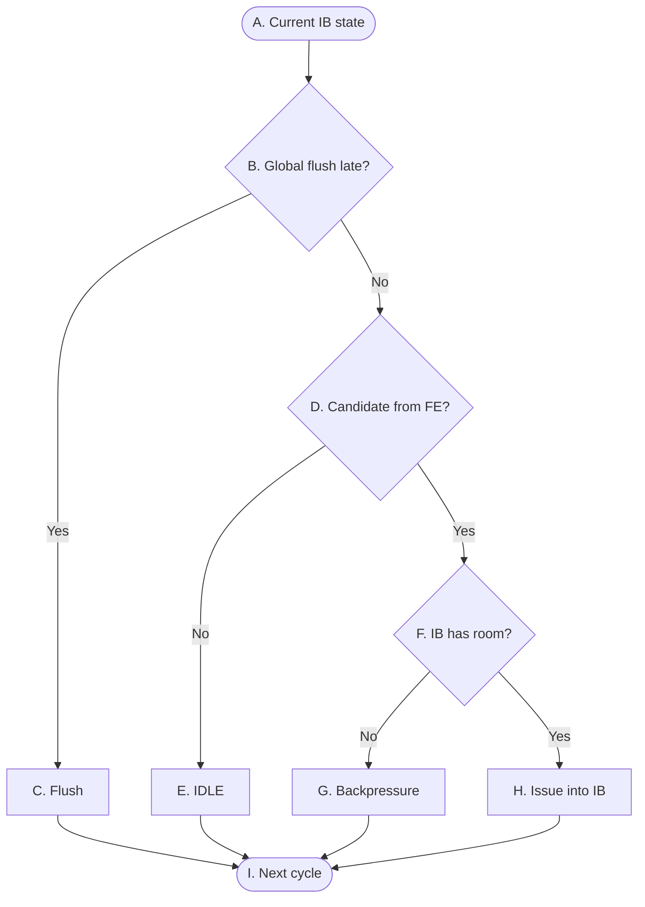

# OR_BE P0 Control Flow

> **Purpose:** A high-level control overview for P0 at the frontend boundary: FE→IB enqueue admission, IB occupancy, and flush clearing. It does not describe fetch/decode/data contents.
>
> **Scope:** FE→IB ownership control only. IB→DSP presentation, ordered slot0/slot1 admission, and the resulting IB dequeue are P1 control.

## Reading conventions

- Decisions are combinational; an accepted enqueue takes effect at the active edge.
- `global_flush_late` has priority over the same-cycle enqueue effect.
- FE→IB ownership transfers only when the IB accepts the frontend candidate at the active edge; an unaccepted candidate stays owned by FE.

## P0 — FE to IB enqueue control

The graph covers the FE→IB boundary only. IB→DSP presentation, ordered admission and the resulting IB dequeue are not repeated here. The graph does not define an unconfirmed frontend lane width or enqueue prefix protocol.

## 表 A — 转换条件（菱形）

菱形节点表示组合判断。每一行明确当前判断节点、判断信号、判断发生的位置，以及该判断的精确语义。

| 节点 | 判断信号 | 归属模块 | 判断含义 |
|---|---|---|---|
| `B` | `global_flush_late` | `Flush_model` → `IB` | 这一拍有没有发生晚期 flush。它排在最前面判断，一旦成立，收进来的指令会在同一个 edge 上被清掉。 |
| `D` | `FE是否提供candidate` | `FE` → `IB` | FE 这一拍有没有指令要交过来。这里只问 FE 里有没有有效指令。|
| `F` | `IB是否有接收余量` | `IB` | IB 里已经存了几条，没满 8 条就还有位置。这里数的是上一个 active edge 之后就已经躺在里面的指令；P1 这一拍要取走的那一两条虽然马上就走，但腾出来的位置要等下一拍才算数。所以 IB 一旦存满，这一拍必然收不进来，哪怕 P1 正在同时往外取。 |

## 表 B — 状态与动作（矩形 + 圆角）

| 节点 | State | 归属模块 | 本周期组合动作 | Description |
|---|---|---|---|---|
| `A` | Current IB state | `FE`、`IB` | 同时看两件事：FE 边界上有没有候选指令，IB 现在存了多少。只看不动，不写任何东西。 | 状态不变。 |
| `C` | Flush | `Flush_model` → `IB` | 这一拍一条都不收；就算边界上已经握好手，那次写入也不算数。 | active edge 上 IB 被整个清空，下一拍从零开始。正在握手的那条指令一并作废，等 redirect 之后由 FE 重新送。 |
| `E` | IDLE | `FE` → `IB` | FE 这一拍没送指令，IB 保持IDLE。ready 继续为1，FE 什么时候有指令，什么时候就能收。 | IB 里状态不变；下一拍继续等待 FE送指令。 |
| `G` | Backpressure | `IB` → `FE` | IB 满了，这一拍把 ready 为0，FE 送过来的指令不收。 | IB 不接收FE发来的指令；那条指令还在 FE 手上，等有空位再送。 |
| `H` | Issue into IB | `FE` → `IB` | 握手成功，把这条指令收下。注意 ready 只表示愿意收，真正写进去要等 active edge。 | active edge 一到，这条指令就进了 IB，归属从 FE 转给 IB。它排在队尾，是最年轻的一条；P1 要等下一拍才看得见它。 |
| `I` | Next cycle | - | - | - |

## P0 control semantics

- `IB_enq_ready` 只看 IB 里存了多少，它不受 flush 影响，也不依赖 P1 判没判过——两道边界互不牵扯。所以 flush 那一拍 ready 可能仍然是高的，但对应的写入必须被 squash，不能真的落进 IB。
- 收指令这件事要到 active edge 才落地。这一拍收下的指令，P1 同一拍是看不见的，最快下一拍才能当 slot 用。
- FE→IB 是一道独立的归属边界。没收下的指令一直算 FE 的，直到某一拍握手成功为止。
- 往下递给 DSP、slot0入/slot1 的顺序准、合法编码，以及随之而来的出队，全都是 P1 的事。P0 既不重复判断，也不去看 P1 判成了什么。
