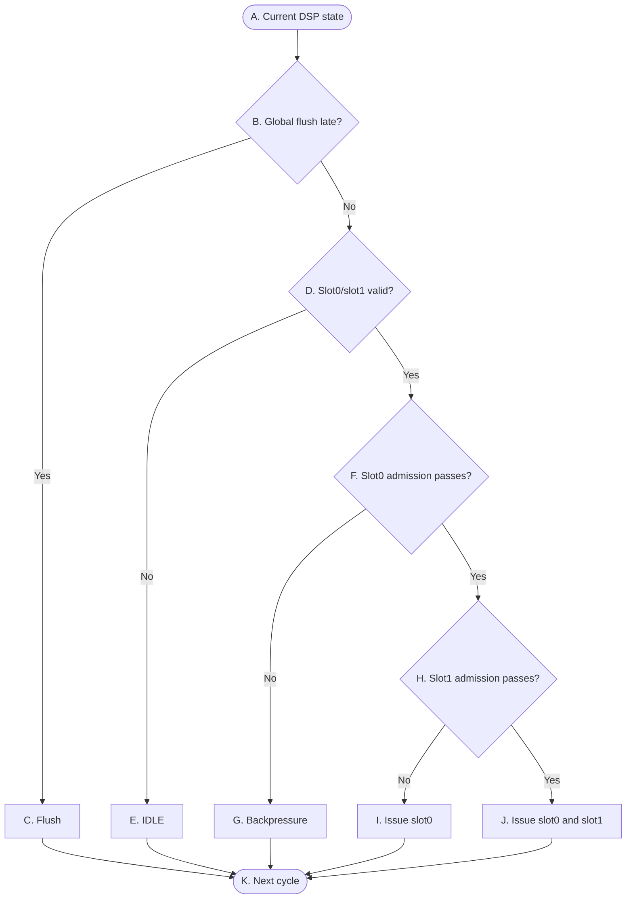

# OR_BE P1 Control Flow

> **Purpose:** A high-level control overview for DSP at stage P1: ordered two-slot admission, source dispatchability, operation routing, CSR/MRET quiesce, FP pairing, and atomic allocation.
>
> **Scope:** This document is a control-state view of the P1/DSP boundary, including the IB→DSP presentation and the resulting IB dequeue. It omits operand values, result data, payload layouts, and FU-internal timing.

## Reading conventions

- `slot0` is older than `slot1`; accepted instructions always form an age-ordered prefix.
- Decisions are combinational; accepted allocation state is written at the active edge.
- `global_flush_late` cancels the entire same-cycle P1 allocation transaction.
- `DSP` is the P1 rename and dispatch owner; P1 is not a separate storage module.

## P1 — Ordered dispatch control

The graph shows the control skeleton only; every branch is a plain yes/no, and the encodings behind them are defined in the tables. `D` checks both slots in one step, and `H` covers both the presence and the admission of slot1. Source resolution, operation-class routing, resource qualification, and CSR/MRET or FP-pair restrictions are represented by the admission conditions in Table A and the control semantics below. They do not form separate datapath or FU-timing flows here.

## 表 A — 转换条件（菱形）

菱形节点表示组合判断。每一行明确当前判断节点、判断信号、判断发生的位置，以及该判断的精确语义。

| 节点 | 判断信号 | 归属模块 | 判断含义 |
|---|---|---|---|
| `B` | `global_flush_late` | `Flush_model` → `DSP` | 这一拍有没有发生late flush。它排在所有准入判断前面，一旦成立，整笔分配连同 IB 出队全部作废，后面的判断不用再做|
| `D` | `slot0/slot1是否valid` | `IB` → `DSP` | 一次把 IB 递上来的两个位置都看一遍，结果是两位 present 编码 `{slot1, slot0}`。队头有指令，也就是 `01` 或 `11`，这里就算成立；`00` 两个位置都空、`10` 是队头空着后面那条却在——slot1 不能越过空队头单独走，这两种都算不成立。至于成立的是 `01` 还是 `11`，不在这里分，留到 `H`。 |
| `F` | `slot0 admission是否通过` | `DSP`、`Buffer`、`ISQ`、`Completion Scoreboard`、`P3`、`P4` | slot0 这一拍是否permit issue：每个源操作数都找得到出处（已经存在 ARF 里、这一拍能从 P3 Bypass 或 P4 Commit CDB 抓到、或者根据DST_Reg记下wait_tag）；按 op class 分到了目标组检查对应目标组的 ISQ 是否可接收；Buffer 有free slot；没有 CSR/MRET quiesce 挡着；Condition A(依赖的data是否还存在buffer里未被commit)。如果permit,把 slot0 的dst_reg、Buffer free slot、目标 ISQ 提供给slot1进行后续判断|
| `H` | `slot1 admission是否通过` | `DSP`、`Buffer`、`ISQ`、`Completion Scoreboard`、`P3`、`P4` | 后面那条这一拍能不能跟着一起收。不成立包含两种情况：present 是 `01`，后面根本没指令；或者指令在但过不了准入。要成立的话，把 slot0 已经占掉的资源扣掉之后，slot1 还得满足 Buffer 里有free slot、目标组的 ISQ 还有空位、源操作数找得到出处、Condition A 没拦、FP pairing 允许，顺序和 quiesce 约束也都满足。关键在于它面对的是 slot0 挑剩下的——某个只有一格的 ISQ 已经被 slot0 要走，slot1 就不能再要同一个；Buffer 只剩一格时，slot1 也拿不到第二格。此刻 slot0 还没真的出队，它只是在组合逻辑上算通过，两条指令是在同一拍里一前一后各过一遍。 |

## 表 B — 状态与动作（矩形 + 圆角）

| 节点 | State | 归属模块 | 本周期组合动作 | Description |
|---|---|---|---|---|
| `A` | Current DSP state | `IB` → `DSP` | 看 IB 递上来的 slot0、slot1，以及判准入要用到的各种资源状态。只看不动。 | 状态不变。 |
| `C` | Flush | `Flush_model` → `DSP` | 这一拍一条都不收：不分配 Buffer，不写目标 ISQ，不动 Completion Scoreboard、PC File、DST_REG 和 CSR tracker，也不让 IB 出队。 | active edge 上受影响的投机状态被清掉，这一拍正在评估的 slot 无效；下一拍从恢复后的状态重启。 |
| `E` | IDLE | `DSP` → `IB` | 两个位置都没有能派发的指令——要么本来就空，要么只有后面那条在而队头空着，后者不允许越过。这一拍什么都不收。 | 接受集合是 `00`。IB 里一条没少，顺序也没动；下一拍重新看这两个位置。 |
| `G` | Backpressure | `DSP` → `IB` | 队头有指令但没过准入。这一拍不收它，也不允许跳过它去收后面那条——顺序不能乱。 | 接受集合同样是 `00`。slot0 还在队头，slot1 还在它后面，谁也没动；下一拍还是从 slot0 开始，按老顺序再试一次。 |
| `I` | Issue slot0 | `P3`、`P4`、`INT_ARF`、`FP_ARF` → `data_select_mux1` ; `DSP` → `Buffer`、`ISQ`、`IB` ; `DSP` → `Completion Scoreboard`、`PC File`、`DST_REG`、`CSR` | 只发队头这一条。两条来路：后面根本没指令，或者有但没过准入。| 接受集合是 `01`。active edge 上一起落地：Buffer、目标 ISQ、Completion Scoreboard、PC File、DST_REG、CSR/MRET tracker，IB 队头前移一格。写进 ISQ 的那条要下一拍才算驻留内容，P2 这一拍看不见。后面那条如果存在却没被收下，它还归 IB，挪上来变成新队头，下一拍以最老的身份再试。 |
| `J` | Issue slot0 and slot1 | `P3`、`P4`、`INT_ARF`、`FP_ARF` → `data_select_mux1` ; `DSP` → `Buffer`、`ISQ`、`IB` ; `DSP` → `Completion Scoreboard`、`PC File`、`DST_REG`、`CSR` | 两条一起发。各自的资源、顺序、pairing 约束都过了。 | 接受集合是 `11`。active edge 上一起落地：Buffer、两个目标 ISQ、Completion Scoreboard、PC File、DST_REG、CSR/MRET tracker，IB 队头一次前移两格。两条写进 ISQ 的 entry 都要下一拍才算驻留内容，P2 这一拍看不见。 |
| `K` | Next cycle | - | - | - |

## P1 control semantics

- 接受集合写成两位 `{slot1, slot0}`，哪一位是 1 就表示那条被收下。四种组合里只有三种合法：`00` 一条不收，`01` 只收队头，`11` 两条都收。剩下的 `10` 意思是"收了后面那条、没收队头"，年轻的越过了年长的，破坏年龄顺序，任何路径都不允许出现这种编码。
- IB 递上来的 present 编码用同一套位序 `{slot1, slot0}`。它的 `10` 表示队头空着、后面那条却在——IB 是按序队列，正常不会出现；就算出现也不允许 slot1 越过空队头，所以按 `00` 处理。两个向量的 `10` 都非法，理由是同一个：年轻的不能越过年长的。
- `00` 有两条来路：present 是 `00` 或 `10`，本来就没活干；或者队头有指令但没过准入。对 IB 来说结果一样——不出队，整串原样留到下一拍。
- Buffer 是按序退休的队列，每条被收下的指令都要在里面占一格，这一格要等 P4 把它提交掉才还回来。双发这一拍要两格，slot0 拿第一格、slot1 拿第二格。所以 Buffer 只剩一格时，这一拍最多收到 `01`；一格不剩就只能是 `00`，跟指令本身合不合法无关。
- 分组是固定的：BRU/DIV/CSR/MRET 去 G0，MUL 去 G1，FPU 去 G2，load/store 去 G3。只有普通 INT ALU 有选择余地——优先 G0，只有在扣掉 slot0 之后 G0 收不下时才退到 G1。不会为了照顾后面的 slot1 而特意把 G0 空着。
- `isq_free_for_dispatch[k]` 说的是目标 ISQ 还收不收得下，跟对应的 FU 这一拍能不能发射是两回事。FU 收不收由 P2 管。
- 被收下的指令，每个源操作数在这一拍就要定下值从哪来，选中的东西直接进 ISQ payload，跟着 active edge 一起写进去。四种来路：生产者早就提交了，直接读 ARF；生产者这一拍正在 P3 发布结果，走 Bypass 当场抓；生产者这一拍正在 P4 提交，走 Commit CDB 当场抓；都不是就说明生产者还在飞，payload 里放 wait_tag，进了 ISQ 之后交给 P2 去等。另外源根本没用到、整数 `x0` 这两种填 `const0`，不产生 wait；slot1 命中 `slot0_overlay` 归第四种——生产者就是同拍的 slot0，等的是它刚分配到的 tag。这个选择由 `data_select_mux1` 完成，它没有状态也没有 flush 输入——flush 那一拍它照算，输出被丢掉是因为 `isq_wr_en` 被 squash。
- 上面第三条来路是必须的，不是优化。P4 的提交要到 active edge 才落进 ARF，所以同一拍派发的消费者读 pre-edge 的 ARF 根本看不到它。这时候如果不当场从 Commit CDB 抓走，这个源就只能记下 wait_tag 等下去，可它的生产者已经退休了——P2 只认 P3 Bypass，Commit CDB 不参与 ISQ 里驻留 entry 的唤醒，这个 entry 会永远等不到。所以 `data_select_mux1` 是全流水线唯一能看到 Commit CDB 的地方，这条分界是正确性要求。
- slot0 一旦过了准入，slot1 找源操作数要先查 `slot0_overlay`。命中就说明它依赖前面那条，等 slot0 的新 producer tag 就行；不能再回头去读 edge 之前的 DST_REG/ARF 映射，也不能拿旧的 P3/P4 capture 结果来顶替这层依赖。
- CSR/MRET 只能从队头收，而且要等 Buffer 排空（`Buffer_empty`）、没有在飞的 CSR（`csr_inflight_valid`）。收下之后立起 CSR/MRET quiesce tracker 把 slot1 挡住，所以这类指令的接受集合永远是 `01`。tracker 要等到它 commit、redirect 或被 flush 才撤。
- FP 配对看的是 decode 给出的指令级 `is_fp_instruction`。slot0 已经收了、slot1 又是 FP 指令，那 slot1 就留在 IB 等下一拍——判断依据就是这一个标志位，不去数两条指令加起来用了几个 FP 源。
- Condition A 问的是这条指令依赖的数据还在不在 Buffer 里、有没有被 commit。它拦住这条的 ISQ 分配和 IB 出队，把它留到下一拍重试。要注意 slot1 没过不会牵连 slot0——编码是从 `11` 退到 `01`，不是退到 `00`。
- 收下一条指令要在同一个 active edge 上动七个地方：Buffer 占一格、目标 ISQ 写 payload、Completion Scoreboard 建生命周期记录、PC File 记 PC、DST_REG 更新重命名映射、必要时立 CSR/MRET tracker、最后允许IB Issue。这七个写使能全部由同一个"接受"信号驱动，不允许只发生一部分——IB Issue 了而 ISQ 没写，这条指令就凭空消失；ISQ 写了而 IB 没 Issue，下一拍同一条会被再派发一次；DST_REG 更新了而 Buffer 没占，后面依赖它的指令会去等一个根本不存在的 tag。真正逼出这条要求的是 flush：`global_flush_late` 来得晚，必须能一次把整笔杀干净，如果七个写各由各的条件控制，漏掉任何一个都会留下不一致的状态。
