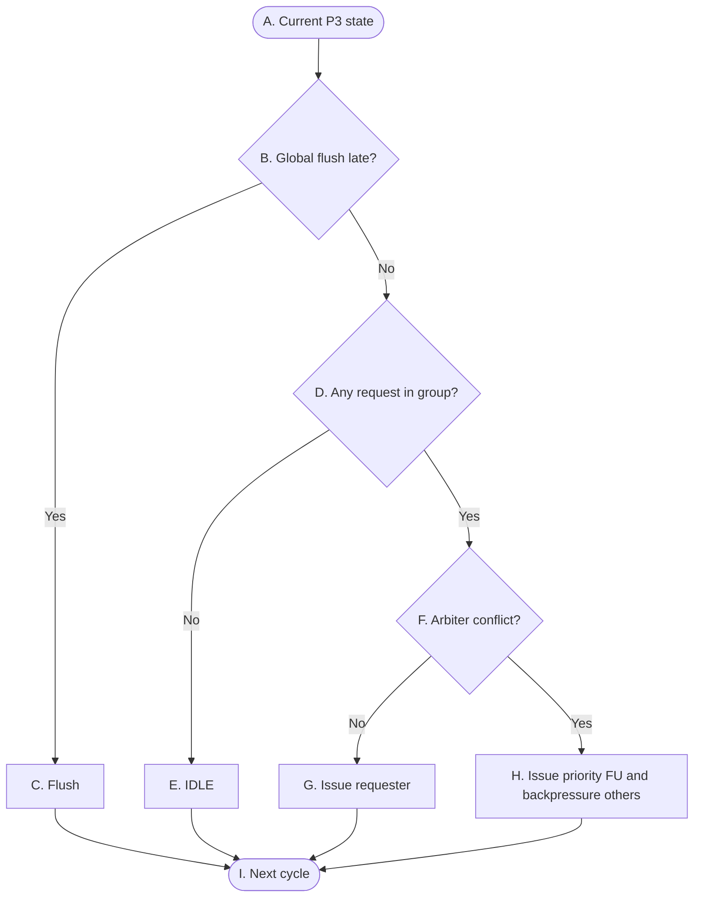

# OR_BE P3 Control Flow

> **Purpose:** A control overview for P3 completion publication: independent group-local selection, combinational Bypass visibility, active-edge completion persistence, loser retry, and flush cancellation. It does not describe result data contents or FU execution timing.

## Reading conventions

- G0, G1, G2, and G3 are evaluated independently; a non-flush cycle may publish at most one result per group.
- `arbiter Mux` is the P3 owner for G0 and G1: it takes the per-FU done requests, grants one by fixed priority, and drives the writeback into Buffer and Completion Scoreboard. G2 and G3 have no `arbiter Mux` — their single FU drives that writeback path directly. Where a module cell below names `arbiter Mux`, read it as that direct path for those two groups. P3 is a pipeline stage, not a module.
- Winner selection, combinational publication, and active-edge persistence are still distinct phases. In the tables they are the combinational-action column and the Description column of one row, not separate nodes.
- `global_flush_late` suppresses same-cycle publication and persistence and kills speculative hold state at the active edge.

## P3 — Group completion publication

The graph describes one generic group contract applied independently to all four groups. The group topology is:

- G0: `ALU0/BRU > CSR > DIV`.
- G1: `ALU1 > MUL`.
- G2: direct FPU path without an intra-group arbiter.
- G3: direct LSU path without an intra-group arbiter.

## 表 A — 转换条件（菱形）

菱形节点表示组合判断。每一行明确当前判断节点、判断信号、判断发生的位置，以及该判断的精确语义。

| 节点 | 判断信号 | 归属模块 | 判断含义 |
|---|---|---|---|
| `B` | `global_flush_late` | `Flush_model` → `arbiter Mux` | 这一拍有没有发生 late flush。它排在所有判断前面，一旦成立，四个组这一拍都不发布也不落地，后面的判断不用再做。 |
| `D` | `本组是否有completion request` | `FU` → `arbiter Mux` | 本组这一拍有没有 FU 标 done。G0 和 G1 的arbiter Mux 连接多个FU；G2 和 G3 各自只有一条直通路径写入Buffer没有arbiter Mux。 |
| `F` | `本组是否多个FU同时请求` | `FU` → `arbiter Mux` | 这一拍是否有多个request。G2 和 G3 只有一个来源，这里恒不成立；G0 和 G1 有多个 FU，同一拍两个以上一起标 done 才成立。不成立就不用仲裁，唯一那个直接发；成立才要按组内优先级挑一个出来。 |

## 表 B — 状态与动作（矩形 + 圆角）

| 节点 | State | 归属模块 | 本周期组合动作 | Description |
|---|---|---|---|---|
| `A` | Current P3 state | `FU` → `arbiter Mux` | 看本组这一拍有哪些 FU 在举手。只看不动，不碰任何 FU 手上的东西。 | 状态不变。 |
| `C` | Flush | `Flush_model` → `arbiter Mux` | 这一拍不发布任何结果，不拉 `Bypass[g].valid`，不写 Buffer 和 Completion Scoreboard，也不拿 ack 去消费任何请求。 | active edge 上，凡是属于被 flush 掉那批指令的东西全部清干净(FU里暂存还没发出去的结果、流水线里正在跑的)。这些结果不会在 redirect 之后补发——对应的指令已经不存在了，再发出去就是往 Buffer 里写一条不该有的记录。 |
| `E` | IDLE | `arbiter Mux` | 本组这一拍没人举手，不发布也不落地。 | Buffer 和 Completion Scoreboard 这一拍什么都没写进去。之前就存在各个 FU 手里、还没轮到发的结果原地不动，下一拍继续等。 |
| `G` | Issue requester | `FU` → `arbiter Mux` `arbiter Mux` → `DSP`、`ISQ` `arbiter Mux` → `Buffer`、`Completion Scoreboard` | 只有一个请求者，不用仲裁，直接发。结果和 `Bypass[g].valid` 这一拍就组合发布出去，P1 和 P2 当拍就能看见。 | active edge 上落两件事：把值写入 Buffer 里对应的Reg_ID entry，Completion Scoreboard 里同一个 Reg_ID 翻成执行完成。Bypass 不一样——它只在这一拍的线上有值，边沿一过就没了；P1 和 P2 这一拍没抓走的话，之后只能靠 wait_tag 慢慢等，P3 不会再广播第二次。 |
| `H` | Issue priority FU and backpressure others | `FU` → `arbiter Mux` `arbiter Mux` → `DSP`、`ISQ` `arbiter Mux` → `Buffer`、`Completion Scoreboard` | 按组内优先级挑一个——G0 是 `ALU0/BRU > CSR > DIV`，G1 是 `ALU1 > MUL`。挑中的拿到 grant，结果和 `Bypass[g].valid` 当拍发布；其余举手的拿不到 grant。 | 根据priority挑中写回的情况和只有一个请求者时一样：把值写入 Buffer 里对应的Reg_ID entry，Completion Scoreboard 里同一个 Reg_ID 翻成执行完成，Bypass 边沿一过就没了。没挑中的那几个，结果还稳稳在自己的 FU 里，一条都没丢——P3 没给 grant 就等于没收下，FU 不能当它已经交出去了。下一拍它们重新排队，优先级低的那个可能要连等好几拍。 |
| `I` | Next cycle | - | - | - |

## P3 control semantics

- 非 flush 的一拍里，每个组最多发出一个结果，但四个组可以同时各发一个。P3 不限制全局只能有一个结果。
- G0 和 G1 的 ack 是 grant 语义：拿到 ack 的那个才算发出去了，没拿到的仍然攥着自己的 completion。G2 和 G3 是直通路径，没有组内仲裁器也就没有这个 ack——但这不等于对应的 FU 容量无限。
- `Bypass[g].valid` 只在当拍有效，是组合可见性，不是存下来的状态。P1 拿它做 exact-tag capture，P2 拿它判断驻留 entry 的源就绪和唤醒。Commit CDB 不参与 ISQ 驻留 entry 的唤醒。
- 只有非 flush 的那次发布才能在 active edge 更新 Buffer 的 completion metadata 和对应 Completion Scoreboard 的 `exec_done`。P3 的 completion 不是 P4 的 architectural commit。
- Completion Scoreboard 的 live-tag 条件是用来检查生命周期一致没一致的，属于断言。不要把它变成功能上的写回门控。
- store 在 P3 的 `exec_done` 只表示 store buffer 收下了、执行这一段算完了，不表示它已经做完 P4 的 drain，更不表示已经退休。
- `group_publish_valid[g]` 要本组有合法请求、并且这一拍没有 `global_flush_late` 才成立，`Bypass[g].valid` 跟它同进同退。flush 在同一拍里同时屏蔽 ack 的消费、结果的发布和 active edge 的落地。
