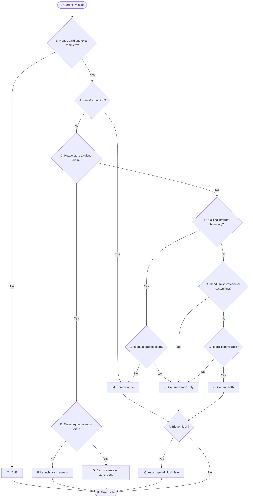
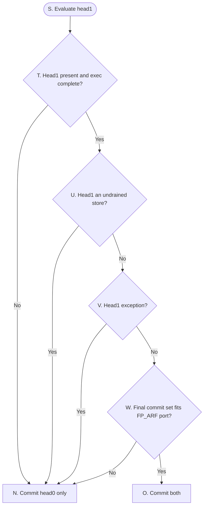

# OR_BE P4 Control Flow

> **Purpose:** A precise control overview for P4: head qualification, store drain, the final commit set, architectural commit, and the flush decision. It omits data values and redirect arithmetic.

## Reading conventions

- `head0` is older than `head1`; retirement is always an ordered prefix.
- `Commit_unit` is the P4 owner: it qualifies the Buffer heads, drives the store drain protocol, decides the final commit set, performs the architectural writes, **and owns the flush decision**. `Flush_model` is a separate module and is a **recovery engine only** — it consumes `{flush_valid, flush_tag, flush_kind, commit_count}` and never re-derives head qualification. P4 is a pipeline stage, not a module — every module cell below names `Commit_unit`, `Flush_model`, or a real storage block.
- **（0727 更正）** 本文原写"`Flush_model` … decides whether a flush is required"，与 `New_SPEC.md` §2.5.2 与契约 §5.17/§5.18 冲突，已按后者更正。理由：`P. Trigger flush?` 的判据**就是** head0 优先级链（exception > store-drain > interrupt > mispredict/MRET）——而 `Commit_unit` 不做这条链就选不出提交集合。让 `Flush_model` 再推一遍等于把整条链实现两份，两份一旦漂移就是不可调的 bug。∴ `P` 的**判定**在 `Commit_unit`（输出 `flush_valid`），`Q` 的**执行**在 `Flush_model`。
- Completion Scoreboard is the lifecycle authority for valid, live, execution-complete, and store-drain (`requested` / `done`) state.
- Decisions are combinational; commit, drain-state, and recovery updates take effect at the active edge.
- **commit 与 flush 分层**：`Commit_unit` 先决定 retire 几条（最终提交集合，取值只有空集、`{head0}`、`{head0, head1}`）；集合定下来后，`Flush_model` 再看这次退休边界是不是非顺序的，决定要不要拉 `global_flush_late`。图上 `Trigger flush?` 就是这一步。
- **store drain 是多周期协议**：只有 head0 能发 drain request；一个 store 从 head0 出发要经过 发请求 → 等 `store_done` → drain 完成 三态才够格退休；store 的退休只做 Buffer pop + Completion Scoreboard 弹出，**不写 ARF**（它没有目的寄存器，内存写在 drain 时已经发生）。
- 两个 head 同拍求值，最终集合在同一个 active edge 上原子写入；不存在 head0 已退休而 head1 还在判的中间态。
- The flow is drawn as two graphs: 图 1 是 head0 结算（readiness → commit set → flush），图 2 展开图 1 里的 `L. Head1 committable?`。字母 A–W 跨两图连续编号；`N`、`O` 是两图共用的终态。

## P4 — 图 1：head0 结算

分四段读：
- **readiness + exception（`B`,`H`）**：head0 无效或没执行完 → `C. IDLE`；否则**先判 head0 自身 exception（`H`）**——有则 `M`（不提交、flush）。exception 排在 drain 之前,保证 faulting store 绝不 drain。
- **store drain（`D`–`G`）**：head0 是还没 drain 完的 store → `E`/`F`/`G` 的 drain 子机；否则往下进入事件判断。
- **commit set（`I`–`O`）**：`Commit_unit` 按 interrupt → misprediction/system → 正常提交的次序定出最终集合，落到 `M`（count 0）/`N`（count 1）/`O`（count 2）之一。head1 够不够格进集合在图 2 展开。
- **flush（`P`–`Q`）**：三个 commit 动作都汇到 `P. Trigger flush?`。判定在 `Commit_unit`（它已经在 `H`/`I`/`K` 上算出了事件，`P` 只是把结果编码成 `flush_valid` + `flush_kind`）；`Q` 的执行在 `Flush_model`，`global_flush_late = flush_valid`。

## P4 — 图 2：`L. Head1 committable?` 的展开

图 1 里 `L` 是概括菱形；这张图展开它查什么。`L`-No 对应落到 `N`（commit head0 only），`L`-Yes 对应落到 `O`（commit both）；`N`、`O` 与图 1 共用。

一条 AND 链：head1 四关全过才 count 2，任一关不过就 count 1（只提交 head0）。这里**故意不查 head1 的 misprediction/system**——head1 带 redirect 时两条照样都提交（count 2），redirect 只决定要不要 flush，那个判断留给图 1 的 `P`，所以它走 `W`-Yes → `O`，和 head1 正常同一条路。

## 表 A — 转换条件（菱形）

菱形节点表示组合判断。每一行明确当前判断节点、判断信号、判断发生的位置，以及该判断的精确语义。

| 节点 | 判断信号 | 归属模块 | 判断含义 |
|---|---|---|---|
| `B` | `head0是否valid且执行完` | `Buffer`、`Completion Scoreboard` → `Commit_unit` | 队头这一拍有没有一条动得了的指令。不成立含两种：Buffer 空，没东西；或 head0 还在执行没算完。生命周期以 Completion Scoreboard 为准，Buffer 只给顺序和占用。 |
| `D` | `head0是待drain的store吗` | `Completion Scoreboard` → `Commit_unit` | 读 CompletionScoreboard：head0 是 store 且 drain 未完成（`done=0`）。No 边同时含"非 store"和"store 已 drain 完"两种——前者本来就不用 drain，后者已经够格提交。 |
| `E` | `drain请求是否已发` | `Completion Scoreboard` → `Commit_unit` | 读 CompletionScoreboard 的 `requested` 位。No→还没发，去 `F` 发；Yes→发过了，去 `G` 等 `store_done`。 |
| `H` | `head0是否有exception` | `Buffer` → `Commit_unit` | head0 自己出错了。它排在事件链最前，因为 faulting 指令不能提交；而且这一步先于 drain 判断——faulting store 绝不能 drain，否则把错的写打进内存。能走到 drain 的 store 一定无 exception。 |
| `I` | `是否存在可当拍取的interrupt边界` | `CSR` → `Commit_unit` | interrupt 挂起、CSR 使能条件满足，**并且**当拍能落在一个干净边界上——head0 是非 store，或 head0 是 drained store 且 head1 有效。这个"且"很关键：drained store 无 head1 时取不到干净边界，本条不成立，让它走正常提交、interrupt 留到下一拍（interrupt 电平敏感，推迟无损）。 |
| `J` | `head0是drained的store吗` | `Buffer`、`Completion Scoreboard` → `Commit_unit` | 承接 `I`-Yes（中断可取）后再分：head0 是 drained store→提交这个 store 取 count 1（它的内存写已出，不能不提交）；否则 head0 是普通指令，取 count 0 从它前面切断。 |
| `K` | `head0是misprediction或system inst吗` | `Buffer` → `Commit_unit` | head0 是分支预测错，或是会改取指方向的 system 指令（如 MRET）。这类指令本身没错，先提交它再改取指方向（ECALL/EBREAK 这种是 exception，已在 `H` 拦下）。成立→只提交 head0（head1 在错路径上，随后 flush）；不成立→进 `L` 看 head1。 |
| `L` | `head1够不够格进集合` | `Buffer`、`Completion Scoreboard` → `Commit_unit` | head1 能不能和 head0 一起退休的汇总判断，展开见图 2 的 `T`–`W`。四关全过→count 2；任一不过→只提交 head0。 |
| `P` | `这次退休边界是否非顺序` | `Commit_unit`（判定）→ `Flush_model`（执行） | 这次 commit 是不是带了控制事件——head0 exception、当拍取的 interrupt、head0 或 head1 的 misprediction/system、head1 exception。带任一即非顺序边界，younger 必须被清；都不带就是普通顺序退休，下条 PC 顺着走，不 flush。**判定归 `Commit_unit`**：它在 `H`/`I`/`K` 已经算出事件，`P` 只是把结果编码成 `flush_valid`(1) + `flush_tag`(4) + `flush_kind`(2)=`{0:MISPREDICT,1:EXCEPTION,2:MRET,3:INTERRUPT}` + `commit_count`(2) 交给 `Flush_model`。 |
| `T` | `head1是否valid且执行完` | `Buffer`、`Completion Scoreboard` → `Commit_unit` | head1 在不在、执行完没有。不成立就这拍只提交 head0。 |
| `U` | `head1是没drain的store吗` | `Completion Scoreboard` → `Commit_unit` | head1 是 store 就一定还没 drain——drain 只在 head0 位置发起，落在 head1 的 store 这拍不能提交。要等它下一拍变 head0 再自己发 drain。 |
| `V` | `head1是否有exception` | `Buffer` → `Commit_unit` | head1 自己出错了。这拍不提交它，younger 随后 flush；head0 已够格，不受牵连。 |
| `W` | `最终集合是否装得下FP_ARF写口` | `FP_ARF` → `Commit_unit` | 把 head1 也算进集合后，要写 FP 寄存器的有几条。FP_ARF 单写口，最多容一条；两条都写 FP 就装不下，这拍只提交 head0，head1 留到下一拍。INT_ARF 双写口，不受此限。 |

## 表 B — 状态与动作（矩形 + 圆角）

| 节点 | State | 归属模块 | 本周期组合动作 | Description |
|---|---|---|---|---|
| `A` | Current P4 state | `Buffer`、`Completion Scoreboard` → `Commit_unit` | 看 Buffer 队头这两条的顺序和占用，以及它们在 Completion Scoreboard 里的生命周期状态。只看不动。 | 状态不变。 |
| `C` | IDLE | `Commit_unit` | head0 无效或没执行完，这拍无事可做。 | commit count 0，架构状态无更新，Buffer 不变。下一拍重新看队头——等的是 Buffer 补进指令，或 head0 执行完成。 |
| `F` | Launch drain request | `Commit_unit` → `LSU` `Commit_unit` → `Completion Scoreboard` | 向 LSU 发一次 drain request（单脉冲），只发不收。 | commit count 0。active edge 置 CompletionScoreboard 的 `requested` 位；下一拍走到 `E` 落 Yes，不再重发。head0 位置不变，其后指令继续阻塞。`store_done` 最早下一拍才可能回来。 |
| `G` | Backpressure on store_done | `Completion Scoreboard` → `Commit_unit` | drain 请求已在飞，纯等待，不重发。 | commit count 0，架构状态无更新。等 LSU 把 `store_done` 写进 CompletionScoreboard；收到（且对应 `Reg_ID` 仍 live、请求已发、尚未完成，排除 tag 复用错配）后下一拍 `D` 落 No，这个 store 才够格提交。等待期间 head1、更年轻的退休、interrupt 全被它挡着。 |
| `M` | Commit none | `Commit_unit` | 最终集合为空，一条不退休。两条来路：head0 exception（faulting 指令不提交），或当拍取的 interrupt 落在非 store head0 前面（count 0 边界）。 | commit count 0，不写任何架构状态。head0 连同其后全部作废。这条恒是非顺序边界，随后 `P` 必然拉 flush。 |
| `N` | Commit head0 only | `Commit_unit` → `INT_ARF`、`FP_ARF`、`DST_REG` `Commit_unit` → `Completion Scoreboard`、`PC File`、`CSR`、`Buffer` | 最终集合只有 head0，退休它。多条来路：drained store 当拍取中断（count 1）、head0 misprediction/system、head1 不够格、drained store 无 head1 的正常提交。 | commit count 1。active edge 上 head0 落进架构状态；若 head0 有目的寄存器则写 ARF 并按 pre-edge mapping 清 DST_REG busy，若是 store 则只 Buffer pop + CompletionScoreboard 弹出、不写 ARF。Buffer head 前移一格。没进集合的 head1 仍归 Buffer，下一拍上移为新 head0 重判。是否 flush 由 `P` 定。 |
| `O` | Commit both | `Commit_unit` → `INT_ARF`、`FP_ARF`、`DST_REG` `Commit_unit` → `Completion Scoreboard`、`PC File`、`CSR`、`Buffer` | 最终集合是两条，一起退休。head1 四关全过（图 2）。 | commit count 2，是一拍的退休上限。active edge 上两条在同一次写入里落进架构状态，各自按有无目的寄存器决定写不写 ARF，Buffer head 一次前移两格。是否 flush 由 `P` 定（head1 若是 redirect 则 flush）。 |
| `Q` | Assert global_flush_late | `Flush_model` → `IB`、`DSP`、`ISQ`、`arbiter Mux` | `Flush_model` 把 `Commit_unit` 送来的 `flush_valid` 直接驱动成 `global_flush_late`（**不重新判定**），把这次退休边界广播给前面四级。信号当拍就到，各级撤掉本拍比该边界更年轻的投机工作。 | active edge 上按该边界做恢复：Buffer 指针退到已退休那几条之后，Completion Scoreboard 里没保留的生命周期与 drain 状态、DST_REG busy、CSR tracker，以及 IB/ISQ/FU/LSU 的投机状态全部清掉；PC File 不清（其表项按 Buffer 索引组织，指针退回后落在有效范围外的记录不再被读，由后续 dispatch 覆盖）。下一拍 P0–P3 干净，从恢复后的取指点重开。 |
| `S` | Evaluate head1 | `Buffer`、`Completion Scoreboard` → `Commit_unit` | 图 2 入口：head0 已够格正常提交，开始看 head1 能否一起进集合。只看不动。 | 状态不变；这是图 1 `L` 的展开入口，本身不产生任何架构更新。 |
| `R` | Next cycle | - | - | - |

## P4 control semantics

- `Commit_unit` 每拍决定的是**退休哪几条**：把 Buffer 最前端的若干条从投机状态转为架构状态。最终集合取值只有空集、`{head0}`、`{head0, head1}` 三种，集合基数即 commit count，合法值只有 0、1、2，且必须是从 head0 起始的连续 prefix。提交 head1 而不提交 head0 属于 non-prefix 编码，任何路径都不得产生。
- **commit 与 flush 分两层，但两层的判定都在 `Commit_unit`。** 它同时定出集合（图 1 的 `M`/`N`/`O`）和边界性质（`P`），因为二者出自同一条 head0 优先级链；`Flush_model` 只做恢复。同一个 commit count，flush 与否是分开的：`N`（count 1）里，head0 正常且 head1 只是推迟 → 不 flush；head0 misprediction/system、当拍取中断、head1 exception → flush。`O`（count 2）里，两条都正常 → 不 flush；head1 misprediction/system → flush。`M`（count 0）恒 flush（exception/interrupt）。
- **store drain 是 head0 独占的多周期协议。** 只有 head0 能发 drain request。一个 store 的生命周期：走到 head0、exec_done、无 exception → 发一次 drain request（`F`，单脉冲，CompletionScoreboard 置 `requested`）→ 等 `store_done`（`G`）→ CompletionScoreboard 标 `done` 后才够格退休。退休时只做 Buffer pop + CompletionScoreboard 弹出，不写 ARF。落在 head1 的 store 永远还没 drain（`U`），必须等它变 head0 才开始；两个连续 store 是两趟独立握手，绝不并行，一个 store 也不可能在它刚变 head0 那拍就退休。
- **exception 闸在 drain 前。** `H`（exception）排在 `D`（drain）之前不是随意排列：faulting store 绝不能 drain，否则把错误的写打进内存。store 的 fault 在执行期（地址翻译/权限检查）就定了，所以能走到 drain 子机的 store 一定无 exception。
- **exception 与 redirect 的分界在于错误归属。** exception 是 head0 自身的 fault，faulting 指令不提交（`M`，count 0）；misprediction 与 system inst（MRET 等）情况下 head0 本身正确，错的是它之后的取指路径，因此先提交 head0（`N`，count 1）再由 `Flush_model` 建立 redirect boundary。
- **interrupt 是电平敏感的异步事件**，与具体指令无关，请求持续有效直到被服务。所以 `Commit_unit` 无需当拍抢它，可推迟到有干净边界时再取。`I` 的"qualified"就把这层折进去了：只有 head0 非 store，或 head0 是 drained store 且 head1 有效，才当拍取中断。drained store 无 head1 时取不到干净边界（没有可指的 resumption 点又不想在此算 PC+4），于是这拍让 store 沿正常路径 count 1 提交、interrupt 留到下一拍。**注意**：drained store 的内存写已经发出，任何路径都必须让它提交，绝不能 count 0 flush 掉它——这正是 `I` 折入 head1 有效性、把无 head1 的 drained store 挡在中断特例之外的原因。
- `store_done` 最早在后续周期返回，且必须对应 `Reg_ID` 仍 live、请求已发、尚未完成——三个条件排除 tag 复用造成的错配。drain 请求是单脉冲，重复发起会被下游当成第二笔写事务，所以以 CompletionScoreboard 的 `requested` 位锁存，发过只等不重发。
- head1 只在 head0 够格正常提交后评估（图 2）。四关：present 且 exec_done（`T`）、不是没 drain 的 store（`U`）、自身无 exception（`V`）、最终集合的 FP 写口装得下（`W`）。任一不过只提交 head0；全过则 count 2。head1 的 misprediction/system 不在这四关里——它不改变 count（两条照提），只在 `P` 决定 flush。
- 进入集合的每条指令在 active edge 上，若有目的寄存器则写 ARF、按 pre-edge mapping 清 DST_REG busy，并让 Completion Scoreboard 弹出其生命周期记录、必要时更新 CSR；store 只做 Buffer pop + CompletionScoreboard 弹出。这与 Commit CDB 是两条独立路径——Commit CDB 只供 P1 本拍派发的 payload 做同拍捕获，不参与 ISQ 内驻留 entry 的 wakeup。
- FP_ARF 单写口、INT_ARF 双写口，所以一拍最多退休一条写 FP 目的寄存器的指令。该约束作用于最终集合整体：两条都写 FP 则集合退回 count 1；集合本身只有一条时不受此限。
- `global_flush_late` 由 `Flush_model` 在 `Commit_unit` 定出边界的当拍组合产生（`= flush_valid`，无再判定），广播至 `IB`、`DSP`、`ISQ`、`arbiter Mux`。信号同拍到达，各级屏蔽本拍中比该边界更年轻的投机工作；状态恢复在 active edge 完成，下一拍可见。
