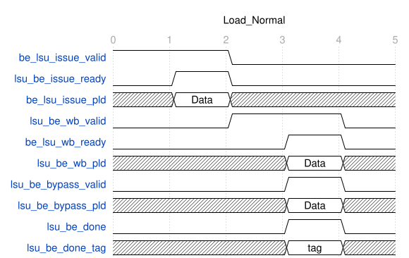
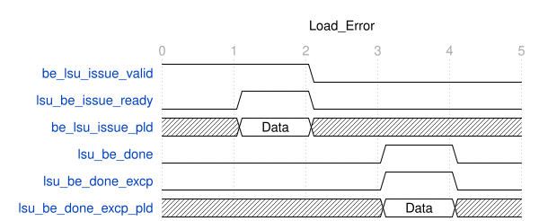
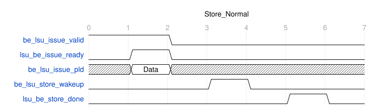
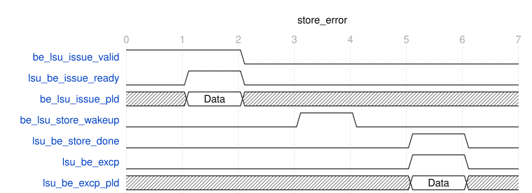

# BE ↔ LSU 接口规范

## 1. 信号表

```text
be_lsu_*   由 BE 驱动、LSU 采样      前缀 = 该线自身方向，与 RTL 端口 input/output 一致
lsu_be_*   由 LSU 驱动、BE 采样
```

### 1.1 Issue 通道

| 方向     | 信号                 | 说明 |
|----------|----------------------|------|
| BE → LSU | `be_lsu_issue_valid` | 访存指令交付 |
| LSU → BE | `lsu_be_issue_ready` | 本拍可接收一条 issue；与 `be_lsu_issue_valid` 构成握手 |
| BE → LSU | `be_lsu_issue_pld`   | 仅在 issue 握手成功时采样，见 §2 |

### 1.2 Writeback 通道

| 方向     | 信号                | 说明 |
|----------|---------------------|------|
| LSU → BE | `lsu_be_wb_valid`   | 交回执行结果 |
| BE → LSU | `be_lsu_wb_ready`   | 与 `lsu_be_wb_valid` 构成握手。复位解除后 BE 驱动 1 并保持，不产生 backpressure |
| LSU → BE | `lsu_be_wb_pld`     | 仅在 wb 握手成功时采样，见 §3 |

### 1.3 Bypass 通道

| 方向     | 信号                   | 说明 |
|----------|------------------------|------|
| LSU → BE | `lsu_be_bypass_valid` | `= lsu_be_wb_valid` |
| LSU → BE | `lsu_be_bypass_pld` | `tag = wb_pld.tag`、`data = wb_pld.data` |

### 1.4 Store 落内存通道

| 方向     | 信号                    | 说明 |
|----------|-------------------------|------|
| BE → LSU | `be_lsu_store_wakeup`   | 一拍脉冲，允许该 store 写内存 |
| LSU → BE | `lsu_be_store_done`     | 一拍脉冲，该 store 已落内存 |

### 1.5 执行完成通道

| 方向     | 信号              | 说明 |
|----------|-------------------|------|
| LSU → BE | `lsu_be_done`     | 一拍脉冲，该指令执行完成 |
| LSU → BE | `lsu_be_done_tag` | 与 `lsu_be_done` 同拍有效，目标 `self_tag` |

### 1.6 完成异常通道

| 方向 | 信号 | 说明 |
|------|------|------|
| LSU → BE | `lsu_be_excp` | 一拍脉冲,访存故障 |
| LSU → BE | `lsu_be_excp_pld` | 与 `lsu_be_done_excp` 同拍有效，见 §4 |

### 1.7 Flush

| 方向     | 信号               | 说明 |
|----------|--------------------|------|
| BE → LSU | `global_flush` | 一拍脉冲，Flush |

---

## 2. `be_lsu_issue_pld`

| 字段            | 说明 |
|-----------------|------|
| `self_tag` | 关联 issue / wb / store_wakeup / done / store_done / done_excp 的唯一 tag |
| `exe_subop` | 操作类别与具体原子操作的唯一来源 |
| `rs1_data` | 基址 / 原子地址 |
| `rs2_data` | store 数据、SC 写数据或 AMO 操作数 |
| `imm_valid` | 立即数是否有效 |
| `imm_data` | 普通访存偏移;原子指令为 0 |
| `is_store` | `1` = 普通 store / FP store，走 §1.4 通道；`0` = LOAD、LR、SC、AMO、FENCE、FENCE.I |
| `mem_funct3` | 访存宽度 / 整数符号扩展 / FP 类型编码 |
| `rd_is_fp` | 区分同宽度整数与 FP load 的结果整形 |

### 2.1 `exe_subop` 类别与全部 LSU 指令

会到达 LSU 的指令共 **51 条**，按类别列全:

```text
LOAD      LB  LH  LW  LBU  LHU  LWU  LD                          7
          FLW  FLD                                          [FD] 2
          C.LW  C.LD  C.LWSP  C.LDSP                        [C]  4
          C.FLD  C.FLDSP                                  [C+FD] 2

STORE     SB  SH  SW  SD                                         4
          FSW  FSD                                         [FD] 2
          C.SW  C.SD  C.SWSP  C.SDSP                        [C]  4
          C.FSD  C.FSDSP                                  [C+FD] 2

LR        LR.W   LR.D                                       [A]  2
SC        SC.W   SC.D                                       [A]  2
AMO       AMOSWAP  AMOADD  AMOXOR  AMOAND  AMOOR
          AMOMIN   AMOMAX  AMOMINU  AMOMAXU    各 .W / .D   [A] 18

FENCE     FENCE                                                  1
FENCE_I   FENCE.I                                                1
```

```text
is_store = 1   仅 STORE 类的 12 条
is_store = 0   其余 39 条
```

标 `[A]` / `[C]` / `[FD]` 的在对应 `ENABLE_A` / `ENABLE_C` / `ENABLE_FD` 为 0 时**不会到达 LSU**——decode 侧改判非法，走 BE 内部的 ILLEGAL 路径。

RV64C 没有 `C.FLW` / `C.FLWSP` / `C.FSW` / `C.FSWSP`——那几个编码在 RV64 是 `C.LD` / `C.LDSP` / `C.SD` / `C.SDSP`。

子码常量以 `subop/exe_subop_pkg.sv` 为准。

---

## 3. `lsu_be_wb_pld`

| 字段 | 说明 |
|------|------|
| `tag` | 对应的 `self_tag` |
| `data` | 结果；已完成整数符号 / 零扩展或 FP NaN-boxing |

---

## 4. `lsu_be_excp_pld`

| 字段 | 说明 |
|------|------|
| `tag` | 出错指令的 `self_tag` |
| `cause` | cause 号,不带中断标志位 |
| `tval` | 出错有效地址 |

---

## 5. Flush 的清除范围

```text
LSU 侧   全部在飞条目丢弃；不再驱动 wb / bypass / done / store_done / done_excp
BE  侧   be_lsu_issue_valid、be_lsu_store_wakeup 拉低
```

### 5.1 flush 同拍的事务

```text
be_lsu_issue          不接收——该笔视为未发生，BE 不重发
be_lsu_store_wakeup   不接收
lsu_be_wb_valid       同上
lsu_be_done           同上
lsu_be_excp           同上
lsu_be_store_done     不可能与 flush 同拍，见上
```

---

## 6. 场景时序

### 6.1 load — 无异常



### 6.2 load — 异常



### 6.3 store — 无异常



### 6.4 store — 异常



