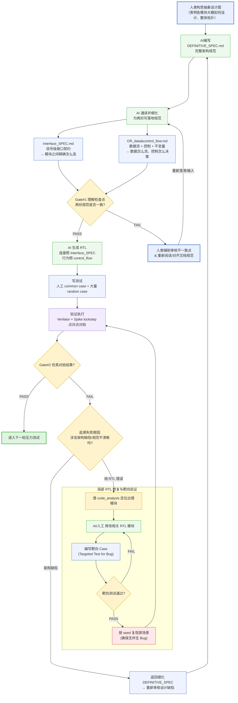
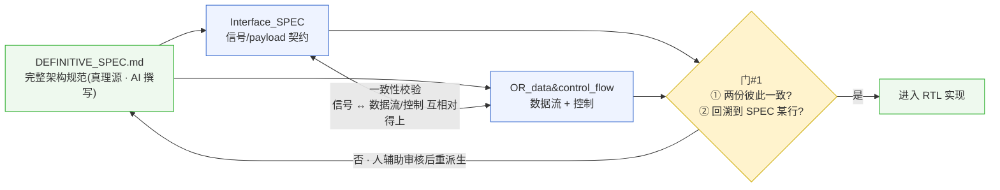

# 标准设计流程 (Standard Design Flow)

> **定位**:本项目 AI 辅助 RTL 研发的**标准方法论基线**。描述从人类规范到 RTL 实现、验证与回灌的标准流程,以及人类 / AI 在各环节的分工。
>
> **核心前提(分工)**:**人类只产出抽象设计图(整体拓扑、各模块大概设计)**;`golden/DEFINITIVE_SPEC.md`(完整架构规范、唯一真理源)由 **AI 据抽象设计图撰写**,`golden/Interface_SPEC.md` 与 `golden/OR_data&control_flow.md` 再由 **AI 通读 DEFINITIVE_SPEC 后细化生成**;三份规范均经人类评审把关。
>
> **状态**:核心骨架(人出抽象设计图 → AI 写 DEFINITIVE_SPEC → AI 细化两份规范 → 实现 → 验证/调试闭环 → 失败追根因:架构缺陷回灌细化 spec / 纯 RTL 错误就地修)已确认。标 **[暂定/演进中]** 的环节仍在共建。

---

## 0. Abstract

**人出抽象设计图 → AI 据此写完整架构规范(DEFINITIVE_SPEC) → AI 再细化成两份 RTL 可直接落地的规范(Interface_SPEC 接口契约 + control_flow 数据流/控制) → 两份彼此一致且回溯真理源(门#1) → AI 实现 RTL → 写 common + 大量 random case,用 Verilator + Spike lockstep 点对点对拍 → 通过(Gate#2 PASS)直接进下一轮压力测试;失败先追根因:属架构缺陷/规范不清就回头细化 DEFINITIVE_SPEC、同步两份派生文档再重新生成,属纯 RTL 错误就借 code_analysis 定位、按 seed 复现、改 RTL 重跑。**

---

## 1. 五条核心原则

1. **单一真理源**:`DEFINITIVE_SPEC.md` 是源头;当失败根因是**架构缺陷 / 规范不清**时,必须先回灌细化它、再重新生成派生规范与 RTL,不让真理源落后于实现(纯 RTL 错误就地修,不动真理源)。
2. **理解 = 细化**:AI"读懂"DEFINITIVE_SPEC 的可检验形式,就是产出两份 RTL 可直接落地的派生规范(Interface_SPEC + control_flow)。
3. **各管一面、合起来完备**:`Interface_SPEC` 钉死"怎么连"(信号 / payload 契约),`control_flow` 钉死"怎么动"(数据流 + 控制 + 不变量);缺任一面,RTL 都欠约束。
4. **一致性校验**:两份派生规范必须彼此对得上(Interface_SPEC 的每个信号都能在 control_flow 找到产生/消费;control_flow 的每个控制决策都作用在 Interface_SPEC 定义的信号上),这是"AI 是否真读懂"的客观判据(门#1)。
5. **按根因分流,不让文档漂移**:对拍**通过**直接进下一轮压力测试;**失败**先追根因——**架构缺陷 / 规范不清**才回头**细化 DEFINITIVE_SPEC 并同步 Interface_SPEC + control_flow**(把这次暴露的角落固化回真理源、再重新生成),**纯 RTL 错误**则借 code_analysis 就地定位修复、不动 spec。

---

## 2. 三份规范文件的分工

| 文件 | 作者 | 写了什么 | 在 RTL 里管什么 |
| :--- | :--- | :--- | :--- |
| **`DEFINITIVE_SPEC.md`** | **AI**(据人类抽象设计图) | 完整架构规范:架构拓扑 / 4 执行组 / 存储预算·参数、P0–P4 各级行为、payload 接口、异常·中断·CSR | 总意图与约束(真理源) |
| **`Interface_SPEC.md`** | **AI 生成** | 信号级接口契约:payload 逐字段位宽、寄存器读写口、同拍写优先级、控制/flush/LSU 信号 | 模块之间精确怎么连 |
| **`OR_data&control_flow.md`** | **AI 生成** | 全机数据流 + 控制逻辑 + 不变量:旁路前递路径、stall/flush/commit 条件、顺序派遣/提交等 | 数据怎么流、控制怎么决策 |

> 人类的输入在三份文件之**上游**——**抽象设计图**(整体拓扑、各模块大概设计);AI 据此撰写 DEFINITIVE_SPEC,再细化出另两份;三份均经人类评审把关。

---

## 3. 三份文件各写了什么(内容速览)

### 3.1 `DEFINITIVE_SPEC.md`(AI 据人类抽象设计图撰写)—— 完整架构规范
- **§1 架构概览**:吞吐拓扑(2 宽顺序派遣 → 4 组乱序执行 → 4 宽乱序写回 → 2 宽顺序提交)、4 个执行组(G0 ALU0/BRU/DIV/CSR、G1 ALU1/MUL、G2 FPU、G3 LSU)、存储预算与参数(ROB 16 项 / ARF / DST_REG / 每组 1 项 ISQ / Tag 宽)。
- **§2 P0–P4 逐级行为规范**。**§3 payload 接口定义**。**§4 LSU L1D 黑盒模型**。**§5 异常/中断/CSR**。**§6 参数总表**。
- 一句话:**要造什么、每级怎么行为、各边界传什么——把人类抽象设计图落成完整、可检验的架构意图。**

### 3.2 `Interface_SPEC.md`(AI 生成)—— 信号级接口契约
- P1 寻址与读接口(寄存器读写口、同周期写优先级 rename / commit / flush)。
- 流水线接口规格(ISB / ISQ / Result / Commit payload **逐字段位宽**、ROB_MetaArray、CSR 控制块、Store drain/done、global flush、LSU 唤醒)。
- 一句话:**把接口意图细化成"照着就能连线、不用猜"的 RTL 信号契约。**

### 3.3 `OR_data&control_flow.md`(AI 生成)—— 全机数据流 + 控制逻辑 + 不变量
- 核心不变量(数据只经 4 路旁路前递、ROB 不作前递源、顺序派遣/提交、PC 元数据存 ROB_MetaArray)。
- P0–P4 数据流与控制、LSU 顺序模型、异常/中断/CSR 模型。
- 一句话:**数据怎么在全机流动、控制在什么条件下决策、哪些不变量必须始终成立。**

---

## 4. 流程全景

**三个文件节点的内容**(完整细节见 §3):
- **`DEFINITIVE_SPEC.md`(AI 据人类抽象设计图写)** = 完整架构规范:架构拓扑 / 4 执行组 / 存储预算·参数、P0–P4 各级行为、payload 接口、异常·中断·CSR、参数总表。
- **`Interface_SPEC.md`(AI 生成)** = 信号级接口契约:payload 逐字段位宽、寄存器读写口、同拍写优先级、控制/flush/LSU 信号 →「模块之间精确怎么连」。
- **`OR_data&control_flow.md`(AI 生成)** = 全机数据流 + 控制逻辑 + 不变量:旁路前递、stall/flush/commit 条件、顺序派遣/提交等不变量 →「数据怎么流、控制怎么决策」。

**读图**:
- **上游**:人出抽象设计图 → AI 写 DEFINITIVE_SPEC → AI 细化两份规范 → 门#1(Gate#1)一致性检查(不一致由人辅助审核后打回 AI 重新细化) → AI 实现 RTL。
- **验证/调试闭环**:写 common + 大量 random case → Verilator + Spike lockstep 点对点对拍(Gate#2) → **PASS** 直接进入下一轮压力测试;**FAIL** 先追失败根因。
- **失败两条分支**:**架构缺陷 / 规范不清 → 返回细化 DEFINITIVE_SPEC、重新审核设计 → 回到 AI 重写/重新生成**;**纯 RTL 错误 → 借 code_analysis 定位模块、按 seed 复现、改 RTL、重跑**(不动 spec)。

---

## 5. 理解检查点(门#1)与一致性校验

两份派生规范都从**同一次对 DEFINITIVE_SPEC 的理解**而来,必须彼此对得上:

- `Interface_SPEC` 里定义的**每个信号 / payload**,都要能在 `control_flow` 的数据流里找到它的**产生方和消费方**。
- `control_flow` 里**每个控制决策**(stall / flush / commit / 前递),都要作用在 `Interface_SPEC` **定义过的信号**上。

**门#1 判据**:① 两份规范互相一致;② 每条信号 / 控制决策都能**回溯到 DEFINITIVE_SPEC 的具体行**。**意义**:把"AI 到底读懂没有"变成**可检查的客观性质**,在写第一行 RTL 之前就暴露理解错误。这就是"两份都让 AI 生成"的价值:**它们互为校验**。
**风险 + 对策**:两份同源,AI 若一开始误读可能"一致地错"(common-mode)。对策:① 每条信号/控制决策回溯标注 DEFINITIVE_SPEC 行号;② 人审只对着 DEFINITIVE_SPEC 抽查。

---

## 6. 验证 / 调试闭环(细化)

对应 §4 下半段。验证以**测试 + 点对点对拍**为主,失败时靠 `code_analysis` 定位、按 seed 复现修复。

### 6.1 测试构成
- **common case(人工)**:覆盖已知关键场景、协议边界、易错点(如旁路、跨组前递、flush、精确异常)。
- **random case(大量)**:随机程序生成 + `seed`,覆盖人想不到的指令组合;每个 `seed` 可**确定性复现**。

### 6.2 验证执行(点对点对拍)
- **Verilator** 跑 RTL;**Spike** 作独立金标准 ISS。两者**逐指令前向锁步**,在提交点对拍架构态(PC / GPR / CSR / mem)。
- 全程一致 = **PASS**;任一指令/拍不一致 = **FAIL**(记录失败 `seed` 与现场)。

### 6.3 失败定位与修复(先追根因)
- **FAIL → 先追根因**:这次不一致是 **架构缺陷 / 规范不清**(真理源本身没说清 / 说错),还是 **纯 RTL 错误**(spec 没问题、实现写错)?
  - **架构缺陷 / 规范不清** → 见 §6.4:**返回细化 `DEFINITIVE_SPEC`、重新审核设计 → 回到 AI 重新生成派生规范与 RTL**。
  - **纯 RTL 错误** → 走下面的局部修复闭环(不动 spec)。
- **纯 RTL 错误 → 借 `code_analysis` 定位**:`code_analysis/` 记录每个 RTL 模块"具体干什么",据此**迅速锁定**是哪个模块的问题(这是它在流程里的主力作用——调试定位知识库)。
- **按失败 `seed` 复现场景** → **修改相关 RTL 模块** → **重跑验证**。循环直到该场景 PASS。

### 6.4 通过出口与架构缺陷回灌(关键)
- **对拍通过(Gate#2 PASS)→ 直接进入下一轮压力测试**(更多 / 更难的 random case)。通过即推进,不在 PASS 侧做 spec 判断。
- **失败根因 = 架构缺陷 / 规范不清 → 回灌真理源**:**返回细化 `DEFINITIVE_SPEC`**(把这次暴露、原 spec 没说清 / 说错的角落补清楚)→ **据此同步更新 `Interface_SPEC` 与 `control_flow`** → **回到 AI 重新生成 RTL** → 再重跑。
- 道理:这类失败暴露的是真理源的盲点;把修正固化回 spec 再重新派生,真理源才始终领先实现、不漂移。纯 RTL 错误(§6.3)不属此类,就地修、不动 spec。

### 6.5 增强:断言 + 覆盖率 **[演进中,可选]**
- 在测试 + 锁步之上,可叠加 **SVA 断言 + `cover property`**(分别对照 `Interface_SPEC` 接口契约与 `control_flow` 数据流/控制),把"结果对"升级为"**通路被走通**"的证据,并向 **Verdi/VCS 输出覆盖率报告**。
- 该增强的落地范围与判据见 `reviews_and_plans/` 下的补证计划,不在本文展开。

---

## 7. 闭环回灌规则(按对拍结果与失败根因分流)

| 情形 | 出口 | 动作 |
| :--- | :--- | :--- |
| **对拍通过**(Gate#2 PASS) | 进入下一轮压力测试 | 不动 spec,直接推进 |
| **失败 · 架构缺陷 / 规范不清** | 回灌真理源后重新生成 | 细化 `DEFINITIVE_SPEC` → 同步 `Interface_SPEC`(若涉及接口/信号)+ `control_flow`(若涉及数据流/控制) → AI 重新生成 RTL → 重跑 |
| **失败 · 纯 RTL 错误** | 局部修复后重跑 | 借 `code_analysis` 定位 → 按 seed 复现 → 改相关 RTL 模块 → 重跑;**不动 spec** |

**不变量**:**凡失败根因落在架构 / 规范层面,必须回灌真理源再重新派生,不让 spec 落后于实现;纯 RTL 错误就地修,不污染真理源。**
**与理想顺序的关系**:理想是"先把 spec 改对再生成 RTL"。本项目据此分流——**架构缺陷**严格遵循理想顺序(先细化 DEFINITIVE_SPEC 再重新生成);**纯 RTL 错误**则就地快速修复(spec 本就正确,无需回灌)。两条路都保证 DEFINITIVE_SPEC 始终是最终权威。

---

*文档性质:方法论基线(协作演进中)|作者:Agent|日期:2026-06-18|*
