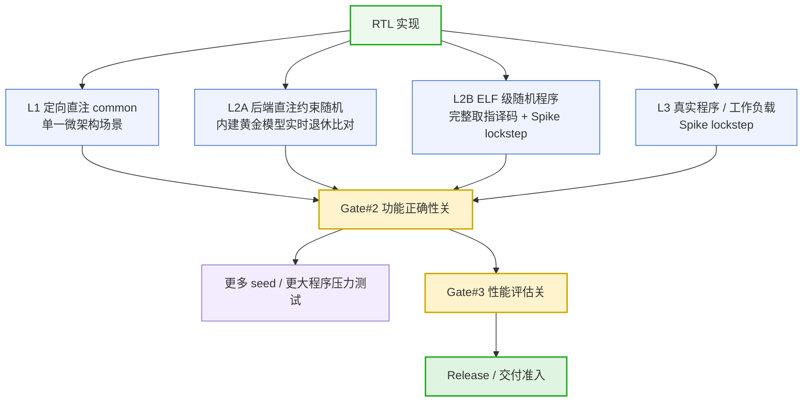
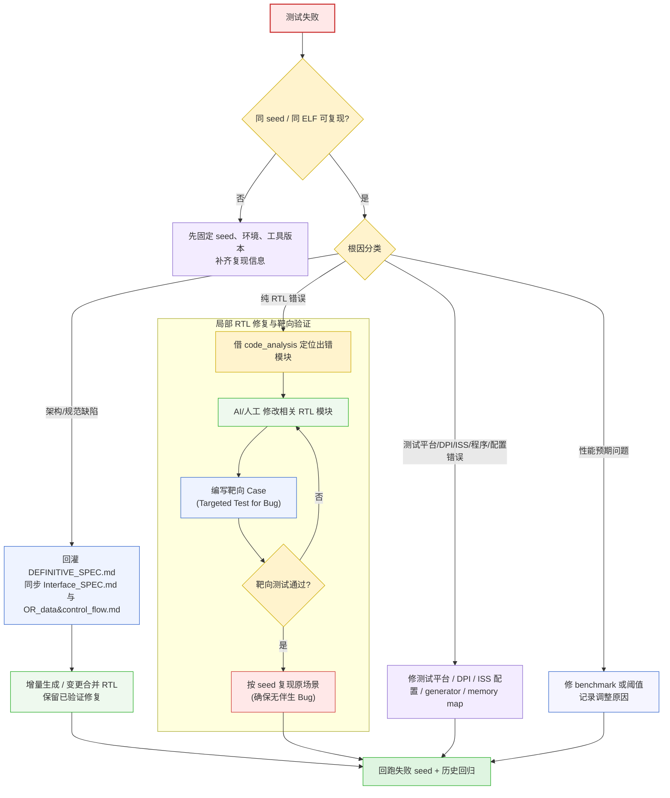

# 标准验证流程 v1 (Standard Verification Flow)

## 0. Abstract

**写测试 = 覆盖规范中的控制分支、不变量和接口契约**。人工 common case 从 `Interface_SPEC.md` 与 `OR_data&control_flow.md` 中逐条提取控制决策、信号交互和不变量反例,按"单一场景、隔离验证"原则设计定向激励;random case 分为两类:后端直注约束随机使用测试平台内建黄金模型实时退休比对,不使用 Spike;ELF 级随机程序走完整取指、译码、执行、提交链路,使用 Spike lockstep 逐指令对拍。

**验证执行 = 按测试模式选择独立黄金参考模型（直注模式下为内建黄金模型 Built-in Golden Model，全流模式下为 Spike 独立参考模型 ISS Reference Model）,但主判据必须发生在提交/退休点**。凡能逐条观测提交事件的测试,都必须在提交时即时比对 PC、指令编码、GPR 写回、CSR、内存事件和异常重定向;末尾读回只作为补充 sanity check,不能作为唯一判据。功能正确性通过 Gate#2 控制;性能评估通过 Gate#3 控制,两者分开报告、分开归因。

**术语约定**:`OR_data&control_flow.md` 是正式文件名;下文出现的 `control_flow` 仅作为该文件的简称。

---

## 1. 核心原则

### 1.1 写测试原则

1. **从规范出发设计测试**:人工 case 必须从 `Interface_SPEC.md` 的信号/接口契约和 `OR_data&control_flow.md` 的控制分支/不变量出发。每条规范约束至少应对应一个可追踪 case。
2. **单一场景、隔离验证**:每个 common case 只测一个微架构场景。若一个 case 同时覆盖多个机制,失败时必须拆分为更小 case 后再定位。
3. **不变量需要反例验证**:规范中声明的不变量,如顺序派遣、ROB 不作前递源、旁路仅限 N 路,必须有正向场景和反例场景。
4. **随机测试分层使用**:后端直注随机用于快速打后端组合交互;ELF 级随机程序用于覆盖取指、译码、执行、提交全链路。两类 random 的黄金参考模型（内建黄金模型 Built-in Golden Model 与 Spike 独立参考模型 ISS Reference Model）不相同,不能混写。
5. **seed 是复现契约**:所有随机路径必须由 seed 控制。失败日志必须记录 seed、测试模式、混合比、程序/payload 摘要、提交序号和最近 trace 窗口。
6. **覆盖要可追踪**:每个 case 应记录关联的规范条目、触发机制、参考模型类型、Gate 归属和当前状态,避免"写过测试但不知道覆盖了什么"。

### 1.2 验证执行原则

7. **提交点比对优先**:比对必须发生在架构提交/退休点。写回、发射、执行完成都是微架构事件,只能作为 debug 辅助,不能替代提交点判据。
8. **禁止只做末尾批量校验**:末尾读回 GPR/Memory/CSR 可能掩盖中间错误和状态覆盖。它只能作为二级 sanity check。
9. **黄金参考模型（内建黄金模型 Built-in Golden Model 或 Spike 独立参考模型 ISS Reference Model）独立于被测设计 (DUT)**:Spike lockstep 必须使用独立指令集模拟器 (ISS, Instruction Set Simulator);直注随机的内建黄金模型必须是独立软件模型,不能复用 RTL 的实现逻辑或内部状态。
10. **比对维度完备**:至少比对 PC、原始指令编码、GPR 写回、CSR 更新、Load/Store 事件、异常/中断重定向和关键 CSR 快照。
11. **功能与性能分离**:功能测试回答"语义是否正确";性能测试回答"调度/吞吐是否符合预期"。功能通过不等于性能通过。
12. **失败先分类再修复**:失败根因必须先归类为架构/规范缺陷、纯 RTL 错误、验证环境/配置错误或性能基准预期问题,再决定是否改 spec、RTL、测试平台或 benchmark。

---

## 2. 验证层级与 Gate



| 层级 | 激励来源 | 是否走取指/译码 | Gate |
|:---|:---|:---|:---|
| L1 定向直注 common | 手写最小 payload / 指令序列 | 通常不走 | Gate#2 |
| L2A 后端直注约束随机 | PRNG 生成已解码 payload | 不走 | Gate#2 |
| L2B ELF 级随机程序 | 随机汇编/ELF | 走完整链路 | Gate#2 |
| L3 真实程序 / 工作负载 | smoke、ISA、工作负载程序 | 走完整链路 | Gate#2 |
| L4 性能基准 | 微架构 benchmark | 依 benchmark 而定 | Gate#3 |

**Gate#2** 是功能正确性关。任一功能测试失败都必须进入根因分流,不能以"性能尚可"或"末尾状态一致"豁免。

**Gate#3** 是性能评估关。它不阻塞普通功能回归,但阻塞 release、交付或性能目标确认。

---

## 3. 定向 Common Case

### 3.1 设计方法

定向 common case 使用"规范 -> 场景 -> 激励 -> 提交点校验 -> 覆盖记录"五步法:

1. **读规范**:通读 `Interface_SPEC.md` 与 `OR_data&control_flow.md`,列出所有信号交互、控制分支、不变量和异常路径。
2. **列场景**:每个控制分支转化为一个独立微架构场景。例如 mispredict flush、store drain 期间中断延迟、双源同时旁路。
3. **写激励**:构造最小 payload 或最小汇编序列,只触发目标机制,避免无关干扰。
4. **提交点校验**:在 commit/retire 点比对预期事件。若场景需要观测内部信号,内部信号只能作为辅助断言,最终仍要有提交点或协议点判据。
5. **记录覆盖**:case 必须登记规范来源、触发条件、参考模型类型、失败复现命令和当前状态。

### 3.2 Case 分类

case 按流水线机制分类,不按指令名机械分类:

- **旁路/前递路径**:组内旁路、跨组旁路、多跳旁路、双源同时旁路
- **冲刷/重定向**:分支预测错误、投机指令消除、flush 与 commit 同拍安全
- **提交顺序**:老指令 commit 与年轻指令 flush/异常交互、双宽提交约束
- **异常精确性**:mepc/mcause、同步异常优先级、异常与中断竞争
- **反压/死锁**:队列满、多个队列同时满、无进展检测
- **存储子系统**:store-to-load 转发、store drain 隔离、投机 store 丢弃

### 3.3 覆盖台账

每个 case 至少记录以下字段:

| 字段 | 说明 |
|:---|:---|
| `case_id` | 稳定 ID,用于回归和失败引用 |
| `spec_trace` | `Interface_SPEC.md` 或 `OR_data&control_flow.md` 的来源段落/行号 |
| `scenario` | 单一微架构场景名称 |
| `stimulus_mode` | direct injection / ELF / workload / performance |
| `阻塞点` | Gate#2 或 Gate#3 |
| `status` | planned / implemented / migrated / retired |

`migrated` 表示该场景已从直注 case 迁移到真实程序或 ELF 路径覆盖;`retired` 只能用于规范删除或场景不再适用,不能用于掩盖未覆盖项。

---

## 4. 后端直注约束随机 (Direct Injection Random)

### 4.1 定义与边界

后端直注约束随机是在 RTL 仿真中运行的指令/payload 生成器。它绕过正常 Fetch/Decode,直接向 ISB/ISQ 或等价后端入口注入已解码 payload。

该模式用于验证后端调度、旁路、提交、异常、LSU 交互和反压组合。因为它不执行标准 ELF,不能直接使用 Spike 独立参考模型 (ISS Reference Model) 作为其黄金参考模型。

### 4.2 生成规则

- **PRNG**:所有随机数由 seed 派生。同一 seed、同一配置必须生成完全相同的 payload 序列。
- **混合比**:运行时配置 ALU、MUL/DIV、Load/Store、Branch、CSR、异常类 payload 的比例。
- **约束规则**:默认不写 x0;保留寄存器、地址范围、对齐规则、异常触发条件必须显式记录。
- **合法性规则**:若生成非法 payload,必须能判断它是有意测试异常路径,还是 generator bug。

### 4.3 内建黄金模型

直注随机维护独立软件黄金模型:

- **架构寄存器模型**:保存 32 个 GPR 的期望架构值。
- **CSR 模型**:保存测试涉及的 CSR 期望值和异常入口行为。
- **内存模型**:保存可测试地址范围内的 load/store 期望事件。
- **预期提交队列**:按程序顺序记录每条注入 payload 的期望提交事件,包括 rd、写回值、内存事件、异常信息和是否应被 flush。

黄金模型可以在生成阶段计算预期事件,但主判据必须在 DUT 提交时发生。

### 4.4 实时退休比对

直注随机的自验证流程:

```
DUT 提交一条指令 / payload
    │
    ├── 测试平台读取 commit event
    ├── 黄金模型取出下一条应提交事件
    ├── 比对 rd / data / CSR / memory / exception / flush 语义
    ├── 一致:黄金模型推进到下一条
    └── 不一致:立即停止,记录 seed + commit_index + trace window
```

禁止把"所有指令跑完后读回寄存器/内存"作为唯一判据。末尾读回只允许用于确认没有遗漏的最终状态污染。

### 4.5 失败日志

直注随机失败日志必须包含:

- seed、混合比、约束配置
- commit index、ROB index 或等价提交序号
- 失败 payload 的编码/字段摘要
- 期望事件与实际事件
- 最近 N 条注入事件、提交事件、flush/redirect 事件
- 一条可直接重跑的命令或脚本参数

---

## 5. ELF 级随机程序与真实程序锁步

### 5.1 ELF 级随机程序

ELF 级随机程序由脚本生成随机汇编或 C/汇编混合程序,编译为真实 ELF 后运行。它走完整取指、译码、执行、提交链路,用于覆盖直注随机绕过的路径。

生成器要求:

- seed 控制程序结构、寄存器选择、立即数、分支目标和内存访问模式
- 内存访问限制在约定 memory map 内
- 系统调用、异常、中断、非法指令等路径必须可配置打开或关闭
- 生成日志必须记录 seed、生成器版本、编译参数和 ELF 哈希

### 5.2 真实程序 / 工作负载

真实程序包括 smoke、ISA 指令覆盖、异常覆盖、微型 benchmark 和工作负载程序。只要作为功能正确性测试运行,就必须使用 Spike lockstep 或等价独立 ISS (Instruction Set Simulator) 逐指令对拍。

### 5.3 Spike lockstep 适用范围

Spike lockstep 适用于完整指令流,不适用于只注入后端 payload 且没有真实 PC/编码流的测试。若直注模式需要 ISS (Instruction Set Simulator) 参与,必须先定义从 payload 反构指令流和 PC 序列的规则,否则不得声称使用 Spike lockstep。

---

## 6. 验证执行环境 (Cosim / 协同仿真)

### 6.1 测试平台模式

| 模式 | 激励来源 | 黄金参考模型 | 适用场景 |
|:---|:---|:---|:---|
| **Direct Injection** | 已解码 payload | 内建黄金模型 / 断言 | 后端微架构边界、快速随机压力 |
| **Full Flow** | ELF / 程序内存 | Spike lockstep | ISA 语义、译码、异常、端到端正确性 |
| **Performance** | 微架构 benchmark | counter/trace + 容差 | 延迟、吞吐、调度行为 |

### 6.2 DPI 桥职责

DPI-C 桥负责 SystemVerilog 与 C++ 运行时之间的数据交换:

- **内存访问**:ELF 加载、指令读取、数据读写、地址合法性检查
- **提交事件**:PC、指令编码、rd、写回值、CSR、内存事件、异常事件
- **ISS 转发**:Full Flow 模式下将提交事件送入 Spike lockstep
- **直注黄金模型转发**:Direct Injection 模式下将提交事件送入内建黄金模型
- **环境代理**:halt、ecall、外部中断注入、系统调用代理

### 6.3 可观测性

测试平台必须提供:

- **commit trace**:每条提交的 PC/指令编码或 payload ID、rd/data、CSR、内存事件
- **redirect trace**:flush 来源、目标 PC、原因、CSR 快照
- **memory trace**:load/store 请求、响应、反压、drain、完成事件
- **watchdog**:绝对周期上限 + 无进展检测
- **mode banner**:每次运行打印测试模式、所使用的黄金参考模型 (内建黄金模型 Built-in Golden Model / Spike 独立参考模型 ISS Reference Model)、seed、ELF 哈希、ISS 配置

---

## 7. 独立 ISS (Instruction Set Simulator) 锁步对拍

### 7.1 锁步模式

| 模式 | 原理 | 优点 |
|:---|:---|:---|:---|
| **实时进程内** | Spike 嵌入仿真 C++ 进程,每条提交即时 step + compare | 失败即时停止 | 


两种模式的比对维度必须一致,差异只在执行时机。

### 7.2 逐指令流程

```
RTL 提交一条指令
    │
    ├── [预检] Spike 当前 PC == RTL PC
    ├── [预检] 该 PC 处指令编码一致
    ├── [同步] 注入确定性的外部中断/环境状态
    ├── [步进] Spike step(1)
    ├── [比对] rd + 写回值
    ├── [比对] CSR 更新
    ├── [比对] Load/Store 地址、大小、数据、访问属性
    ├── [比对] 异常/重定向目标和关键 CSR 快照
    └── [终止] halt 条件一致后停止
```

### 7.3 比对维度

| 维度 | 必须比对的内容 | 遗漏后果 |
|:---|:---|:---|
| PC | 提交 PC、下一 PC 或 redirect target | 取指/重定向错误逃逸 |
| 指令编码 | 原始 32-bit/16-bit 编码 | 译码错误逃逸 |
| GPR | rd index、写回数据、是否写回 | 执行结果错误逃逸 |
| CSR | CSR 地址、写入值、异常相关快照 | CSR/异常错误逃逸 |
| Load | 地址、大小、符号扩展后结果或事件 | 地址/数据错误逃逸 |
| Store | 地址、大小、写入数据、提交顺序 | store 错误逃逸 |
| 异常/中断 | cause、tval、mepc、mstatus、mtvec、redirect | 精确异常错误逃逸 |

---

## 8. Gate#2 功能正确性关

Gate#2 只回答功能正确性,不评价性能是否达标。

### 8.1 Gate#2 最低通过条件

| 项目 | 通过条件 |
|:---|:---|
| Direct Injection common | 关键微架构场景全部 PASS |
| Direct Injection random | 固定 seed 集合全部实时退休比对 PASS |
| ELF smoke | 最小 ELF 程序 Spike lockstep PASS |
| ISA/异常覆盖 | 已实现指令与异常类型 Spike lockstep PASS |
| ELF random | 固定 seed 集合 Spike lockstep PASS |
| 历史回归 | 所有历史失败 seed 和 common case PASS |

Gate#2 失败不能直接判定为 RTL bug。必须先进入根因分流。

### 8.2 末尾状态读回的位置

末尾读回 GPR/Memory/CSR 允许存在,但只能作为:

- 检查 commit trace 是否遗漏事件
- 检查测试平台是否正确清理状态
- 检查内建黄金模型最终状态是否与 DUT 最终状态一致

若提交点实时比对 PASS 但末尾读回 FAIL,优先怀疑 trace 漏项、清理逻辑、内存模型或未观测副作用,再判断 RTL。

---

## 9. Gate#3 性能评估

性能评估关注硬件的微架构时序行为。本节定义性能验证的执行依赖与失败处理的闭环方法论。

### 9.1 关卡依赖契约 (Gating Interdependence)

* **功能完整性前置**：Gate#3 性能测试的运行必须以 Gate#2 (功能正确性) 完全通过为前提。禁止在功能语义存在 Bug 的 RTL 上进行性能调试。
* **交付卡点契约**：性能指标的失败不回滚已经通过的功能测试基线，但在性能指标回归正常或完成豁免流程前，禁止进行 Release 交付。

### 9.2 性能失败归因与闭环分流 (Triage & Attributions)

当性能指标（时序行为）偏离预期时，验证流强制要求将失败划分为以下三类进行闭环，禁止模糊关闭：

1. **时序意图实现偏差 (Design Drift)**：
   * **现象**：仿真行为与微架构设计的时序意图不符（例如：前递通路未生效、发射仲裁不优导致不必要的气泡）。
   * **闭环动作**：定位并修改 RTL 实现，重跑 Gate#2 与 Gate#3。
2. **基准评估误差 (Spec Drift)**：
   * **现象**：RTL 实现无误，但微架构设计时的性能估算模型或测试基准（Benchmark）指标设定不合理。
   * **闭环动作**：修正性能特征预期或 Benchmark 判定指标，记录调整原因，不修改 RTL。
3. **环境配置飘移 (Env Drift)**：
   * **现象**：仿真环境参数（如存储延迟配置、测试平台采样时机）不符合预期设定，导致测量偏差。
   * **闭环动作**：对齐仿真参数与物理配置，重跑性能测试。

---

## 10. 失败处理闭环



### 10.1 根因分类

| 分类 | 判断标准 | 修改对象 |
|:---|:---|:---|
| 架构/规范缺陷 | spec 未定义、矛盾、或定义与目标架构不符 | `DEFINITIVE_SPEC.md` 及派生规范 |
| 纯 RTL 错误 | spec 明确正确,RTL 行为偏离 | RTL |
| 验证环境/配置错误 | 测试平台、DPI、ISS (Instruction Set Simulator)、generator、memory map、工具参数导致假失败 | 验证环境 |
| 性能预期问题 | 功能正确,benchmark 阈值或假设错误 | benchmark / 阈值 |

### 10.2 架构缺陷路径

架构缺陷不得直接在 RTL 中局部补丁绕过。必须:

1. 细化或修正 `DEFINITIVE_SPEC.md`
2. 同步 `Interface_SPEC.md` 和 `OR_data&control_flow.md`
3. 更新或新增对应 case
4. 对 RTL 做增量生成与变更合并,避免盲目覆盖已验证修复
5. 回跑失败 seed、相关 common case 和历史回归

### 10.3 纯 RTL 错误路径

纯 RTL 错误不改 spec。流程:

1. **借 `code_analysis/` 定位**：根据模块职责文档或代码库分析，锁定出错的候选模块。
2. **编写靶向 Case**：针对该 Bug 编写最小化、隔离的靶向测试用例（Targeted Case），专门复现该硬件缺陷，缩短调试和仿真周期。
3. **修改 RTL 模块**：AI/人工修改相关 RTL，直到靶向用例完全通过。
4. **原场景复现校验**：使用失败的原始 seed/ELF 重新运行原测试，确认原错误已解决且未产生伴生 Bug（回归校验）。
5. **合流与历史回归**：将靶向 case 合并入回归测试套件，并回跑全部历史失败 seed，确保无任何性能或功能回归。

### 10.4 验证环境错误路径

验证环境错误包括:

- 测试平台采样时机错误
- DPI-C 字段宽度、符号扩展或时序错误
- Spike ISA、特权级、扩展、CSR 初值配置不一致
- memory map、ELF 加载、endianness、对齐规则不一致
- 随机程序生成器产生了未声明的非法程序

此类错误只修验证环境,不改 RTL、不回灌 spec。修复后仍要用同一失败 seed 重跑确认。

---

## 11. 回归资产与复现记录

每个失败必须沉淀为回归资产或明确关闭原因。

### 11.1 失败记录字段

| 字段 | 说明 |
|:---|:---|
| `failure_id` | 稳定失败编号 |
| `gate` | Gate#2 / Gate#3 |
| `mode` | direct injection / ELF random / workload / performance |
| `seed` | 随机 seed,非随机测试可填 N/A |
| `program_or_payload` | ELF 路径、ELF 哈希或 payload 摘要 |
| `command` | 可复现命令 |
| `commit_index` | 失败提交序号 |
| `expected_actual` | 期望与实际差异 |
| `root_cause` | 根因分类 |
| `fix_ref` | 修复提交、文件或说明 |
| `regression_status` | added / covered / retired |

### 11.2 历史回归要求

以下动作后必须回跑历史失败集合:

- RTL 修改
- spec 回灌后派生规范更新
- 测试平台/DPI/ISS 配置修复
- 黄金模型修复
- benchmark 阈值修改

历史失败 seed 不允许因为"当前不方便跑"而删除。若确实不再适用,必须记录对应 spec 或架构变化原因。

---

## 12. 与标准设计流程的对应

本文件细化 `standard_design_flow.md` 中的验证/调试闭环:

- `standard_design_flow.md` 中的 Gate#2 应理解为**功能正确性关**,由 direct injection 自验证、ELF/program Spike lockstep 和历史回归共同支撑。
- 性能测试从 Gate#2 中拆出,定义为 Gate#3。Gate#3 不替代 Gate#2。
- random case 不再统一称为 Spike lockstep。后端直注随机使用内建黄金模型;ELF 级随机程序使用 Spike lockstep。
- 架构缺陷不再要求盲目全量重新生成 RTL,而是要求 spec 回灌后的增量生成与变更合并,并强制历史回归。
- 失败分流新增验证环境/配置错误出口,避免把测试平台/DPI/ISS/generator 问题误归因到 RTL 或 spec。

---

*文档性质:验证方法论基线 v1|基于 flow_review_report.md 修订|日期:2026-06-25|*
