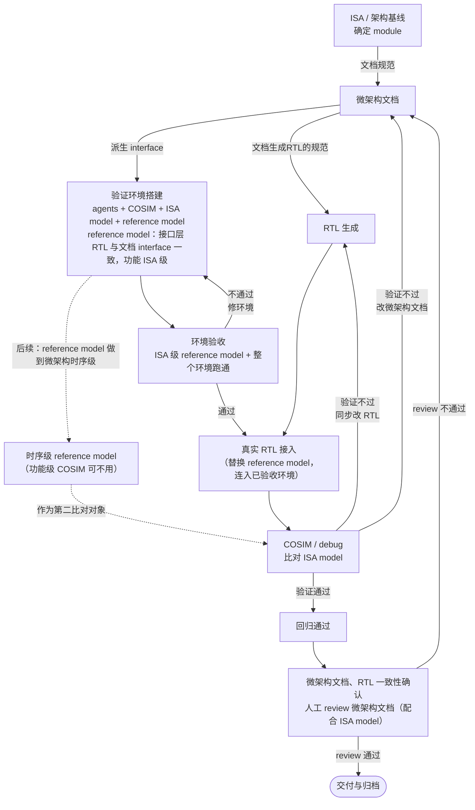
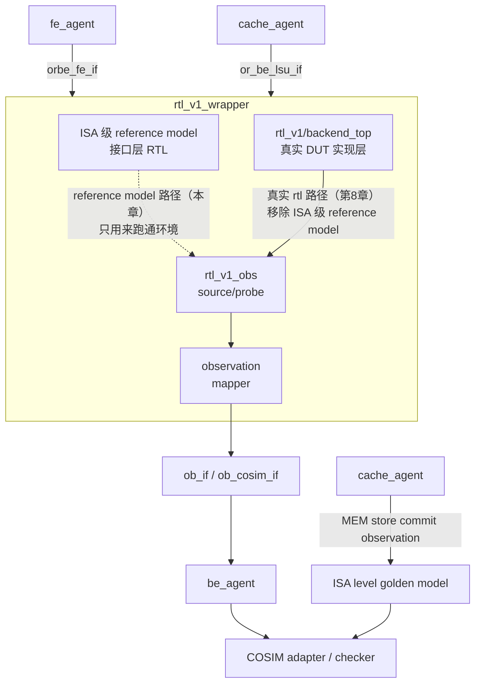

# ORBE AI co-work flow

## 1. 文档目的

本文针对如何通过与 AI 的协作，从 ISA 和微架构约束出发，逐步生成、验证、调试并交付可用的 RTL 进行流程总览。流程主线为：



## 2. 基本原则与角色

### 2.1 谁决定什么

判据是：**该细节是否可由已有约束推导出来**。

- 需要取舍、不可推导的内容，由人先确定，例如 ISA 覆盖范围、微架构设计决策、接口时序。
- 可由 ISA、上层架构、接口契约和模块已有定义推出的内容交给 AI 补全，例如字段展开、状态转移、fire 条件、组合逻辑、索引、模块间接口连线。
- AI 遇到不可推导项必须标记为“需确认”。

### 2.2 参与者

- **人**：冻结 ISA、架构边界和不可推导的设计选择；评审文档和交付结果。
- **AI co-work agent**：按 golden 规范补全文档、实现 RTL、运行测试、分析 log、debug、提出并实施可追溯的修正。

## 3. 前提：冻结 ISA 与架构基线


- 选择的指令集架构及扩展（例如 RV64I/M/A/F/D/C），明确测试用例。
- 根据 ISA 和功能目标确定 BE 所需模块与 FU，例如 Buffer、Scoreboard、依赖检查、Dispatch、ISQ、INT/FP ARF、tag mapping、ALU/BRU、MUL、DIV、FPU、CSR 和 LSU 接口。
- 冻结顶层微架构：发射/提交宽度、队列深度、tag 地址空间、资源分组、仲裁优先级、flush/recovery 和模块层次。
- 输入：ISA 手册、功能目标和设计意图。
- 产物：架构范围清单（其中 ISA 编码、枚举、分类信息 --> isa_pkg）、模块划分及 block diagram、全局参数设计取值（params registry）和接口时序约束。


## 4. 阶段 1：建立并遵守文档规范

微架构文档以 [`module_v4.md`](spec-authoring/templates/module_v4.md) 为当前 golden 骨架和规则。

- 文档章节固定为 `Submodule`、`FSM`、`Data structure`、`Internal Connections`、`Interface`。
- 文档描述可验证的契约：状态、事件、表达式、输入输出、schema、时序。
- Event fire、派生 Static Info、Out-event payload 各字段，以及存储更新中使用的派生条件和值，必须按直接依赖关系递归完整展开，直到可引用的 Data structure、本模块 Interface 或子模块公开 Interface。生产者定义输出，消费者给出本地输入需求，集成层记录两者连接。
- 所有连接需要能够通过各章节确定。

通过让 AI 严格按照规则生成微架构文档，并由人进行 review 和一致性检查，能够减少事件、逻辑、接口、schema/位宽及连接定义中的歧义和遗漏。通过检查后，文档成为指导 AI 实现底层 RTL 的文档；其正确性由后续 RTL 验证和 COSIM 确认。

## 5. 阶段 2：生成微架构文档

### 5.1 先由人写不可推导部分

人先以文档骨架为基础给出模块文档草稿，草稿包含：模块职责与边界、状态、不可推导的状态编码/容量、接口方向与时序、事件优先级、必须保持的约束。集成层模块还要明确子模块实例及其连接关系。

### 5.2 再由 AI 补全可推导部分

AI 以模块文档草稿为基础，根据文档规则进行补全。模块文档应从叶子模块逐步向集成层汇总。集成层只描述子模块公开接口之间的连线、字段拆分/汇合和对外映射，不重复子模块内部实现。通过人对文档进行 review 和 AI 对文档进行进一步修改，并迭代，最终给出冻结的文档。

### 5.3 文档完成

- 每个 RTL module 都有一份对应文档。集成层连线可沿模块树追溯到端点。
- 所有状态更新都必须有明确的触发条件、数据来源和更新规则。所有外部输入都出现在 Interface。
- 关键参数、位宽、编码、提交顺序和 flush 行为无歧义。

## 6. 阶段 3：由微架构文档实现 RTL

本章说明 [`GENERATION-PIPELINE.md`](GENERATION-PIPELINE.md) 第 4 章之后所述的**无参照 RTL** 情况。按照该文档开篇给出的前提假设，本阶段从已经完备的微架构文档集正向生成 RTL。

### 6.1 输入与生成顺序

输入：生成规范、registry、已经完备的模块微架构文档、集成层连接表和顶层模块文档。生成顺序为：

```text
isa_pkg -> schema_pkg -> params_pkg -> 各 module.sv -> 顶层连线 -> 顶层边界 -> 验证桩
```

模块按依赖关系由叶子向集成层生成；私有子模块单独生成并由父模块实例化。

### 6.2 RTL 生成阶段

以下阶段按顺序执行：

1. **生成 package**
   - **输入**：`isa_pkg`、`schema`，以及从 module 文档和 registry 收拢的 `params`。
   - **动作**：按 `isa_pkg -> schema_pkg -> params_pkg` 的顺序生成三个 package，并将顺序写入 `pkg/ORDER`。
   - **Gate**：三个 package 齐全、可编译且顺序正确；schema 中每个登记类型均有对应定义，字段顺序和总位宽一致；`isa_pkg` 中每个登记对象均已生成。
   - **失败回到**：registry 有误时，说明本章的输入前提未满足，返回上游文档与 registry 完成阶段。

2. **逐模块生成 RTL**
   - **输入**：三个 package 和一份 module 文档；生成私有块时还需其父模块文档。
   - **动作**：按模块依赖顺序，一次生成一个模块。按文档章节和生成规则生成端口、存储、时序逻辑、组合逻辑及 Submodule 连线；每个 `always`、`assign` 写入 `// doc:` 来源标记，并生成 `TRACE.md`。
   - **Gate**：本模块 lint 无 error，warning 逐条有归属和处置方案；人工审读至少一个 `always_ff`。
   - **失败回到**：生成器错误返回本阶段修正并重生成；生成规则缺口返回生成规则固化；若发现文档不完备，则说明本章的输入前提未满足，返回上游微架构文档完成阶段。

3. **端口幂等对账**
   - **输入**：每份生成的 module RTL 及其 module 文档。
   - **动作**：使用空端口映射表，从生成 RTL 反推端口，与文档 Interface 展开的叶子逐条配对。
   - **Gate**：端口级诊断为 0。
   - **失败回到**：端口生成错误返回第 2 项；若根因是文档端点冲突或遗漏，则返回上游微架构文档完成阶段。

4. **生成顶层集成**
   - **输入**：全部 module RTL、integration-layer 和顶层 module 文档。
   - **动作**：展开 integration-layer 绑定形成 wire 连接，连接子模块、私有块和顶层边界端口，并生成验证桩。
   - **Gate**：顶层 lint 无 error，且无未驱动、多驱动或悬空连接。
   - **失败回到**：模块 RTL 问题返回第 2 项；集成关系问题返回上游集成层文档完成阶段。

5. **全设计静态检查**
   - **输入**：完成顶层集成的全设计 RTL。
   - **动作**：执行全设计 lint，检查宽度、锁存器、组合环和未使用信号。
   - **Gate**：lint 为 0 error，warning 逐条有结论。
   - **失败回到**：返回产生对应 error 或 warning 的生成阶段。

### 6.3 产物

本阶段产物包括 package 及 `pkg/ORDER`、模块/私有块/顶层 RTL、`TRACE.md`、`GEN-LEDGER.md`（生成过程中发现的文档缺失、歧义、ISA 内容和生成规则问题）、逐模块及全设计 lint 报告和幂等对账报告。静态检查通过不代表语义正确，完成后需将 RTL 接入已跑通验收的 COSIM 环境，进入第 8 章（阶段 5）进行测试、COSIM 比对与 debug。

> **备注（有参照 RTL 时的区别）**：有参照 RTL 时，既有 RTL 和既有 package 是正式对账对象：模块本体生成前，先将微架构文档与既有 RTL 的端口声明对账；生成 package 后，再与既有 package 逐个类型比对。无参照 RTL 时不存在这些对账对象，因此端口对账移到模块生成后，改为生成 RTL 对文档的幂等对账；package 则检查生成结果自身是否齐全、可编译。若无参照 RTL 流程中存在仅供参考的历史 RTL，可以额外进行对照，但该结果只作为可选 oracle，不作为本流程的 Gate。具体流程差异见 [`GENERATION-PIPELINE.md`](GENERATION-PIPELINE.md) 第 5.0 节及其引用的 [`rtl-generation_v3.md`](spec/rtl-generation_v3.md) 第 5 节。


## 7. 阶段 4：搭建 COSIM 验证环境并跑通验收

验证环境的搭建以已经确认的模块边界、接口契约和时序约束为前提。总体微架构方案确定后，先划分 BE 的职责边界，明确 FE-BE、BE-cache 等边界处的交互范围；再通过微架构文档细化并确认这些边界接口的信号定义、数据含义、握手方式、时序和异常行为。微架构文档将确认后的边界、接口和时序固化为可执行的接口契约，基于此才能够在验证环境里建立各接口及其对应的 agent、驱动、监视器、ISA 级 reference model 连接和 checker。因此，验证环境搭建不是脱离微架构设计的独立工作，而是由微架构文档中已确认的边界接口和时序直接派生。

验证环境的目标不是只让 RTL“跑起来”，而是在架构可观察边界证明其行为与 ISA reference 一致。详细设计见 [`ORBE_COSIM_plan.md`](../verification/orbe_bt_env/docs/Arch/ORBE_COSIM_plan.md) 和 [`ORBE_COSIM_ob_cosim_if_signal_plan.md`](../verification/orbe_bt_env/docs/Arch/ORBE_COSIM_ob_cosim_if_signal_plan.md)。

### 7.1 连接结构

下图为 COSIM 验证环境搭建/验收阶段的连接结构，同时也画出了接入 RTL 时的连接结构方便进行对比。图中的 ISA 级 reference model 仅用于真实 RTL 接入前的环境搭建和验收；真实 DUT 接入后，该 model 将被移除，不参与第一阶段 COSIM 比对。本章只说明验证环境搭建/验收阶段。



### 7.2 接口时序先于 checker

在写 checker 前，先冻结 reset、posedge/negedge 采样点、commit 生效点、flush/redirect 生效点、同拍双通道顺序、ARF snapshot 可见时刻以及 store 真正写入 memory 的时刻。接口文档必须说明每个信号的 fire、payload、保持和取消规则，并能映射到模块微架构文档。

### 7.3 COSIM 核心观察面

- **Commit**：第 0/1 组 `commit_valid`、`commit_pc`、`commit_rob_idx`；同拍默认先消费第 0 组，再消费第 1 组。
- **INT/FP ARF**：完整架构寄存器快照；`int_arf[0]` 必须恒为 0。快照必须在当拍有效 commit 写入后稳定。
- **CSR**：先冻结要比较的 CSR 列表；列表未冻结时不得假设 trap/CSR 已被完整覆盖。
- **MEM**：至少抓取 `mem_store_commit_*`（valid、顺序、地址、数据、mask/size、PC、ROB 关联、terminal）；load done 和 memory exception 可作为诊断信息。
- `cycle`、`sequence_id` 由 COSIM adapter/checker 本地生成，不属于 DUT 观察接口。

### 7.4 COSIM 环境跑通验收

本阶段必须先于真实 RTL 接入。使用 ISA 级 reference model 打通 FE agent、Cache agent、BE agent 及其生命周期 ISA model、COSIM agent、RTL wrapper、ISA level golden model、观察接口、checker 和 log 通道。该 reference model 的接口层 RTL 与微架构文档 Interface 一致。使用 216 个 ISA case 测试程序跑通并验收整个验证环境，重点覆盖 reset、commit 顺序、flush/redirect、INT/FP ARF snapshot、store commit、terminal store，以及异常或恢复控制流引起的后续 commit PC/ARF 结果。此步骤只验收验证环境，不进行真实 DUT 的 COSIM。

验收通过后，保留已确认的 testbench、接口采样时序、checker 和 log 配置，进入真实 RTL 接入阶段。若验收不通过，则定位并修正验证环境、ISA 级 reference model、接口连接、checker 或相关配置，并重新执行本阶段；环境验收通过前不得接入真实 RTL。

### 7.5 Reference model 的两个阶段

需要注意，reference model 应分为两个递进阶段：

1. **ISA 级 reference model（当前阶段）**：此 model 内部实现只需满足 ISA 级功能，不要求遵循 BE 微架构结构，也不要求与微架构时序一致。此阶段用于在真实 RTL 接入前验收验证环境，并以 ISA level golden model 作为功能正确性的比对对象。
2. **时序级 reference model（后续阶段）**：此 model 不仅接口契约与微架构文档一致，接口时序和内部时序也与微架构文档一致，用来检查 DUT RTL 的内部时序以及 FE-BE、BE-cache 等接口时序。因此，进入此阶段后，时序级 reference model 可作为 ISA level golden model 之外的第二个比对对象。此阶段是未来计划。

## 8. 阶段 5：接入 RTL 进行测试、COSIM 比对与 debug 回馈

RTL 生成完成且 COSIM 环境验收通过后，移除环境验收时使用的 ISA 级 reference model，将真实 RTL 接入已验收的环境，方能进行真实 RTL 与 ISA level golden model 的 COSIM。此前的环境验收已经确认 FE agent、Cache agent、BE agent 及其生命周期 ISA model、COSIM agent、RTL wrapper、ISA level golden model、观察接口、checker 和 log 通道能够正常协同工作。因此，真实 RTL 接入后若运行测试程序出现错误，可优先排查 RTL 实现或其接口适配，同时保留对验证环境集成问题的检查。接入后，进行测试、COSIM 比对与 debug 迭代。

### 8.1 标准迭代环

1. AI 在 testbench 上运行测试程序。
2. BE agent 根据 ob_if 的生命周期观察，维护一份独立的 ISA model；COSIM agent 在每个有效 commit 推进另一份独立的 ISA level golden model。
3. 第一阶段真实 RTL COSIM 中，checker 比较 ISA level golden model 与 DUT 的 commit PC、INT/FP ARF、已冻结的 CSR 以及 store commit 后的 memory 状态。在后续第二阶段 COSIM 中，除上述架构结果外，还需并行运行时序级 reference model，由 COSIM adapter/checker 对齐并比较该 model 与 DUT RTL 的内部时序和接口时序。
4. AI 按 `sequence_id` 和 cycle 对齐第一处差异，结合 ob_if、ob_cosim_if、FE/Cache log 定位责任模块。
5. 若根因是 RTL 实现错误，修改 RTL 并重跑；若根因是契约缺失或错误，先修改微架构文档，并同步修改 RTL 再测试。
6. 将根因、证据、修改文件、回归结果和是否新增约束写入 debug 回馈文档，保留失败用例和修复前后 log 摘要。

### 8.2 常见定位顺序

先检查 reset/采样时序和 commit 顺序，再检查 PC/flush，再检查 ARF 写回和 tag/依赖，最后检查 memory store/load 语义。store 不能只用普通 `commit_valid` 替代 store commit 事件；否则未被后续 load 读取的错误可能漏检。

### 8.3 通过条件

以 216 个 ISA case 测试程序通过作为验收条件之一；测试集在 clean build 下重复运行通过；无未解释的 mismatch（DUT 与 ISA level golden model 结果不一致）、未知值 X / 高阻值 Z、接口时序 / 握手规则违例或 assertion；debug 回馈文档中的所有临时 workaround 均已转化为正式 RTL 和正式文档。后续第二阶段 COSIM 的通过条件还应包括：DUT 与时序级 reference model 无未解释的时序 mismatch。

- 必须人工 review 微架构文档；
- 微架构文档和 RTL 必须一致。

**若人工 review 不通过，则需要回退到微架构文档修订，同步修改或重新生成 RTL；若接口契约发生变化，还需重新验收 COSIM 环境，随后重新完成测试、回归和人工 review。**

## 9. 阶段 6：交付与归档

交付包至少包含：

- 冻结后的 ISA/架构范围与 decision log；
- `spec/or-be/` 下的模块及集成层的 golden 微架构文档；
- 终版 RTL;
- filelist/build 配置、wrapper 和必要的 observation interface；
- 可复现的 testbench、测试程序、ISA level golden model、COSIM 配置，以及已启用时的时序级 reference model 版本；
- 回归报告、debug 回馈文档。
  
只有当**人工 review 通过**、**文档和 RTL 相互一致**且**回归结果正确**时才可标记为交付。若 RTL 接口契约发生变化，则必须同步更新微架构文档和接入连接，并回到第 7 章重新验收 COSIM 环境；任何 RTL 或文档修改完成后，都必须重新完成相关测试和回归。
