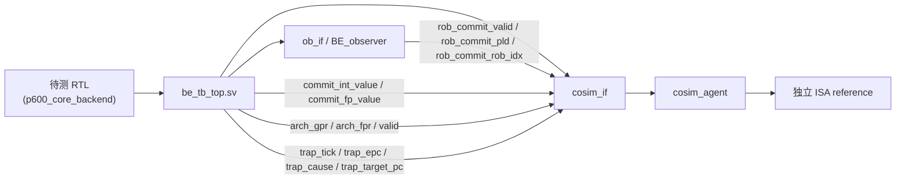
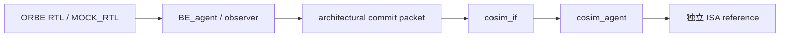

# BETA COSIM 观察信号整理

## 1. 目的

本文整理当前 BETA BE BT 环境中 COSIM 实际观察的信号、信号来源和使用方式，作为后续 ORBE BT 环境迁移 COSIM 能力时的对照表。

文中所有“已具备”或“当前状态”都应理解为“当前 `tb` 里基于 `MOCK_RTL` 的可提取能力”，不是指未来真实 ORBE RTL 已经具备同样信号。

这里的“迁移”指迁移信号语义和检查方法，不是直接搬运 BETA/P600 的类型、参数或 RTL 层级路径。ORBE 侧应该形成自己的 architectural commit packet，并由 BE_agent 或顶层 observation binding 负责填充。

参考文件：

```text
beta_be_bt_env/tb/interfaces/cosim_if.sv
beta_be_bt_env/tb/interfaces/ob_if.sv
beta_be_bt_env/tb/top/be_tb_top.sv
beta_be_bt_env/tb/pkg/cosim_pkg.sv
beta_be_bt_env/tb/agents/cosim/cosim_agent.sv

orbe_bt_env/tb/interfaces/cosim_if.sv
orbe_bt_env/tb/interfaces/ob_if.sv
orbe_bt_env/tb/top/be_tb_top.sv
orbe_bt_env/tb/agents/be/be_agent.sv
orbe_bt_env/tb/agents/be/be_getter.sv
```

## 2. BETA COSIM 接口总览

BETA 的 COSIM 入口是 `cosim_if`。它是只读 observation interface，驱动点集中在 `be_tb_top.sv`，COSIM agent 只消费这些信号，不驱动 DUT。

```systemverilog
interface cosim_if (input logic clk);
  logic rst_n;

  logic [P600_ISSUE_NUM-1:0] commit_tick;
  rob_rename_t [P600_ISSUE_NUM-1:0] commit_pld;
  logic [P600_ISSUE_NUM-1:0][63:0] commit_int_value;
  logic [P600_ISSUE_NUM-1:0][63:0] commit_fp_value;

  logic             trap_tick;
  logic [63:0]      trap_epc;
  p600_excp_cause_t trap_cause;
  logic [63:0]      trap_target_pc;

  logic [31:0][63:0] arch_gpr;
  logic [31:0][63:0] arch_fpr;
  logic [31:0] arch_gpr_valid;
  logic [31:0] arch_fpr_valid;
endinterface
```

## 2.1 数据流框图

### BETA 现有结构



### ORBE 计划结构



## 3. 正常提交观察信号

| BETA COSIM 信号 | 定义 | 提取目的 | 顶层驱动来源 | COSIM 使用方式 | 当前实现状态（MOCK_RTL/现有tb） |
| --- | --- | --- | --- | --- | --- |
| `commit_tick[lane]` | 提交 lane 的有效提交脉冲。 | 驱动 reference 按提交顺序前进一步。 | `ob_vif.rob_commit_valid[lane]` | 每个有效 lane 对应独立 reference model `step_one()` 一次。lane 递增顺序就是同周期 architectural commit order。 | 已具备。当前 ORBE/MOCK 的 `cosim_if.commit_valid` 已由 `ob_vif.rob_commit_valid` 驱动。 |
| `commit_pld[lane].pc` | 提交指令的架构 PC。 | 校验 RTL 与 reference 的 PC 对齐。 | `ob_vif.rob_commit_pld[lane].pc`，来自 BETA ROB commit payload | 与 reference step 前 PC 比较，报 `PC_MISMATCH`。 | 已具备。当前 `rob_commit_pld_t` 包含 `pc`，顶层已接入 `cosim_vif.commit_pc`。 |
| `commit_pld[lane].rob_idx` | 提交 ROB 条目的索引。 | 定位提交条目并关联 BE_agent 状态。 | `ob_vif.rob_commit_pld[lane].rob_idx` | 写入 ticket，主要用于日志、定位和关联提交条目。 | 部分具备。当前 ORBE/MOCK 有独立 `rob_commit_rob_idx`，已接入 `cosim_vif.commit_rob_idx`。 |
| `commit_pld[lane].rd` | 目的架构寄存器编号。 | 确定 GPR/FPR shadow 的更新位置。 | BETA `rob_rename_t` | 判断本次提交更新哪个 architectural register。 | 暂不具备。当前 `rob_commit_pld_t` 只有 `pc` 和 `rob_idx`，没有 architectural `rd`。 |
| `commit_pld[lane].prd` | 目的物理寄存器编号。 | 索引 PRF/FPRF 并辅助诊断。 | BETA `rob_rename_t` | 索引 PRF/FPRF，抓取本次提交的物理寄存器值；也进入 ticket 作为诊断字段。 | 暂不具备。当前 ORBE/MOCK commit payload 没有 physical destination register。 |
| `commit_pld[lane].rd_is_fp` | 目的寄存器属于 FPR 的标志。 | 选择 FP 或整数比较路径。 | BETA `rob_rename_t` | 决定写回值更新 FPR 还是 GPR shadow state。 | 部分间接具备。`be_getter` 的 LSU metadata 能从 ISA model 得到 `rd_is_fp`，但不是 commit observation packet，也不是 RTL/MOCK 提交侧信号。 |
| `commit_pld[lane].rd_is_v` | 目的寄存器属于向量寄存器的标志。 | 避免向量写回误进 GPR/FPR 比较。 | BETA `rob_rename_t` | 向量目的寄存器不进入当前 GPR/FPR 64-bit 比较。 | 暂不具备。当前 ORBE/MOCK 没有 vector commit destination 分类。 |

BETA 顶层绑定关系：

```systemverilog
assign cosim_vif.commit_tick[cosim_i] = ob_vif.rob_commit_valid[cosim_i];
assign cosim_vif.commit_pld[cosim_i]  = ob_vif.rob_commit_pld[cosim_i];
```

对 ORBE 来说，最适合直接迁移的是 `commit_tick/pc/rob_idx` 的语义，而不是 `rob_rename_t` 类型本身。ORBE 侧应该定义自己的 commit event 结构，例如 `valid, pc, rob_idx, rd_valid, rd, rd_is_fp, rd_is_v, prd, value_valid, value`。

## 4. 提交写回值观察信号

| BETA COSIM 信号 | 定义 | 提取目的 | 顶层驱动来源 | COSIM 使用方式 | 当前实现状态（MOCK_RTL/现有tb） |
| --- | --- | --- | --- | --- | --- |
| `commit_int_value[lane]` | 提交 lane 对应的整数 PRF 值。 | 重建 GPR 提交后状态。 | `u_p600_core_backend.u_data_be.u_data_prf.prf[commit_pld[lane].prd]` | 当 `rd_is_fp==0 && rd_is_v!=1 && rd!=0` 时，用该值更新 reconstructed GPR shadow。 | 暂不具备。当前 ORBE/MOCK 没有提交点整数写回值 observation。 |
| `commit_fp_value[lane]` | 提交 lane 对应的 FP PRF/FPRF 值。 | 重建 FPR 提交后状态。 | `u_p600_core_backend.u_data_be.u_data_fprf.prf[commit_pld[lane].prd]` | 当 `rd_is_fp==1` 时，用该值更新 reconstructed FPR shadow。 | 暂不具备。当前 ORBE/MOCK 没有提交点 FP 写回值 observation。 |

BETA 顶层绑定关系：

```systemverilog
assign cosim_vif.commit_int_value[cosim_i] =
    ob_vif.rob_commit_valid[cosim_i]
      ? u_p600_core_backend.u_data_be.u_data_prf.prf[
          ob_vif.rob_commit_pld[cosim_i].prd[P600_INT_PHY_REG_ADDR_W-1:0]]
      : '0;

assign cosim_vif.commit_fp_value[cosim_i] =
    ob_vif.rob_commit_valid[cosim_i]
      ? u_p600_core_backend.u_data_be.u_data_fprf.prf[
          ob_vif.rob_commit_pld[cosim_i].prd[P600_FP_PHY_REG_ADDR_W-1:0]]
      : '0;
```

这部分是 BETA COSIM 做 GPR/FPR 比对的关键，但也是最强 BETA/P600 色彩的部分。它依赖：

- commit payload 中有 `prd`。
- RTL 中存在可观察的整数 PRF 和 FP PRF/FPRF。
- 物理寄存器值在 commit 点已经稳定可读。

ORBE 当前还没有这组条件。因此现阶段不能直接迁移寄存器值比对，只能先迁移 commit PC/order 对齐。未来真实 RTL 或增强 MOCK_RTL 能提供写回 observation 后，再让 BE_agent 生成 ORBE 自己的 `rd/value` commit packet。

## 5. 提交后架构寄存器快照

| BETA COSIM 信号 | 定义 | 提取目的 | 顶层驱动来源 | COSIM 使用方式 | 当前实现状态（MOCK_RTL/现有tb） |
| --- | --- | --- | --- | --- | --- |
| `arch_gpr[0]` | 架构寄存器 x0 的值。 | 固定零值，作为 GPR 快照基准。 | 顶层固定 `64'd0` | x0 恒为 0，作为 reconstructed state 的一部分。 | 可以直接采用语义。RISC-V x0 恒 0，不依赖 RTL。 |
| `arch_gpr[1:31]` | 提交后整数架构寄存器视图。 | 延迟一拍校验完整 GPR 状态。 | `u_rename.irat_bkup_dff[arch] -> u_data_prf.prf[...]` | 提供 commit 后一拍稳定的整数 architectural register view，用于 L2 dump 和延迟比较。 | 暂不具备。当前 ORBE/MOCK 没有 backup RAT -> PRF 的 architectural view。 |
| `arch_gpr_valid[0]` | x0 快照有效标志。 | 诊断 x0 视图恒有效。 | 顶层固定 `1'b1` | x0 valid 诊断。 | 可以直接采用语义。 |
| `arch_gpr_valid[1:31]` | 整数架构寄存器映射有效标志。 | 定位 PRF/RAT 有效性问题。 | `u_rename.u_int_ftb_vldbit.vldbit_dff[irat_bkup_dff[arch]]` | 诊断对应 PRF entry 是否 valid。BETA 比较不会用 valid mask 掩盖错误数据。 | 暂不具备。当前 ORBE/MOCK 没有对应 valid bit observation。 |
| `arch_fpr[0:31]` | 提交后 FP 架构寄存器视图。 | 延迟一拍校验完整 FPR 状态。 | `u_rename.frat_bkup_dff[arch] -> u_data_fprf.prf[...]`，无 FP 时置 0 | 提供 FP architectural register view。 | 暂不具备。当前 ORBE/MOCK 没有 FPR architectural view。 |
| `arch_fpr_valid[0:31]` | FP 架构寄存器映射有效标志。 | 定位 FPRF/FRAT 有效性问题。 | `u_rename.u_fp_ftb_vldbit.vldbit_dff[frat_bkup_dff[arch]]`，无 FP 时置 0 | FP valid 诊断。 | 暂不具备。 |

BETA 顶层绑定关系摘要：

```systemverilog
// x0
assign cosim_vif.arch_gpr[0] = 64'd0;
assign cosim_vif.arch_gpr_valid[0] = 1'b1;

// x1-x31
assign cosim_vif.arch_gpr[i] =
    u_p600_core_backend.u_data_be.u_data_prf.prf[
      u_p600_core_backend.u_rename.irat_bkup_dff[i]];
assign cosim_vif.arch_gpr_valid[i] =
    u_p600_core_backend.u_rename.u_int_ftb_vldbit.vldbit_dff[
      u_p600_core_backend.u_rename.irat_bkup_dff[i]];

// f0-f31, when P600_ENABLE_FP
assign cosim_vif.arch_fpr[i] =
    u_p600_core_backend.u_data_be.u_data_fprf.prf[
      u_p600_core_backend.u_rename.frat_bkup_dff[i]];
assign cosim_vif.arch_fpr_valid[i] =
    u_p600_core_backend.u_rename.u_fp_ftb_vldbit.vldbit_dff[
      u_p600_core_backend.u_rename.frat_bkup_dff[i]];
```

BETA 的 COSIM 实现会先基于 `arch_gpr/arch_fpr` 抓 baseline，然后按同周期 commit lane 顺序合并 `commit_int_value/commit_fp_value`。由于 backup RAT/PRF/FPRF 视图在 ROB commit pulse 后一拍才稳定，BETA 将 ticket 放入 `pending_tickets`，下一拍再做最终比较。

对 ORBE 来说，完整 `arch_gpr/arch_fpr` 快照不是第一阶段必需条件。更推荐先做 event-based shadow state：BE_agent 在每个 commit event 里给出 `rd/value`，COSIM 自己维护 GPR/FPR shadow。等真实 RTL 提供 backup RAT 或 architectural register view 后，再决定是否补充 BETA 这种完整快照诊断。

## 6. 同步异常观察信号

| BETA COSIM 信号 | 定义 | 提取目的 | 顶层驱动来源 | COSIM 使用方式 | 当前实现状态（MOCK_RTL/现有tb） |
| --- | --- | --- | --- | --- | --- |
| `trap_tick` | 同步异常接受脉冲。 | 让 reference 消费无普通 commit 的异常指令。 | `u_p600_core_backend.iru_csr_excp_grnt` | 表示同步异常被架构消费，但不经过普通 ROB commit ticket。COSIM 单独让 reference step 一次。 | 暂不具备真实 RTL 信号。当前 BE_agent 可从 ISA model 得到 trap 信息，但不是 RTL trap observation。 |
| `trap_epc` | 异常指令的 EPC/PC。 | 检查异常入口前 PC 对齐。 | `u_p600_core_backend.iru_csr_epc` | 与 reference step 前 PC 比较。 | 暂不具备。 |
| `trap_cause` | 同步异常原因码。 | 记录并定位异常类型。 | `u_p600_core_backend.iru_csr_cause` | 诊断异常原因，参与日志。 | 部分间接具备。`getter.commit_rsp_cause` 来自主 ISA model。 |
| `trap_target_pc` | 异常处理入口目标 PC。 | 检查 reference step 后跳转目标。 | `u_p600_core_backend.csr_excp_target_pc` | 与 reference step 后 PC 比较，验证 trap handler 入口。 | 部分间接具备。当前有 `commit_rsp_redirect_pc` 和 `ob_vif.redirect_pc`，但还不是等价的同步 trap contract。 |

BETA 顶层绑定关系：

```systemverilog
assign cosim_vif.trap_tick      = u_p600_core_backend.iru_csr_excp_grnt;
assign cosim_vif.trap_epc       = u_p600_core_backend.iru_csr_epc;
assign cosim_vif.trap_cause     = u_p600_core_backend.iru_csr_cause;
assign cosim_vif.trap_target_pc = u_p600_core_backend.csr_excp_target_pc;
```

这组信号用于处理“不产生普通 ROB commit 的同步异常”。BETA 的顺序是：同周期较老正常 commit 先处理，然后处理 `trap_tick`。ORBE 迁移时要先确认 ORBE 的异常提交边界：异常是否产生普通 commit event，还是像 BETA 一样通过独立 trap acceptance 边界进入 handler。

## 7. BETA COSIM 中 reference 侧读取的信息

下面这些不是 RTL observation signal，但它们决定了 COSIM 比较目标：

| Reference 信息/API | 定义 | 提取目的 | 用途 |
| --- | --- | --- | --- |
| `isa_cosim_dpi_get_committed_pc(core)` | 独立 reference 当前已提交 PC。 | 与 RTL commit PC/trap EPC 对齐。 | 每次 step 前读取 reference 当前 PC，用来与 RTL commit PC 或 trap EPC 比较。 |
| `isa_cosim_dpi_step(1)` | 独立 reference 前进一步。 | 按 RTL architectural event 消费指令。 | 每个有效 commit lane 或每个同步 trap 消费一次 reference 指令。 |
| `isa_cosim_dpi_get_gpr(core, index)` | reference GPR 指定索引值。 | 生成 GPR 对比基准。 | 每个 ticket 读取 reference GPR[0:31]。 |
| `isa_cosim_dpi_get_fpr(core, index)` | reference FPR 指定索引低 64 位。 | 生成 FPR 对比基准。 | 每个 ticket 读取 reference FPR[0:31]。 |
| `isa_cosim_dpi_is_to_exit()` / `isa_cosim_dpi_is_good()` | reference 结束与结果状态。 | 判定仿真收尾是否完整。 | 仿真结束与 PASS/FAIL 判断。 |

BETA 使用独立的 `isa_cosim_dpi_*` handle，与 BE/cache/FE 共享模型路径分离。这一点 ORBE 应该保留：BE_agent 可以整理 observation packet，但 COSIM reference model 仍应是独立模型，不能复用 BE_agent 已经推进过的同一个 ISA model handle。

## 8. ORBE 当前可直接迁移的信号语义

基于当前 `tb` 目录，第一阶段可以直接迁移或已经接近完成的内容如下：

| 可迁移语义 | 定义 | 提取目的 | 当前 ORBE/MOCK 信号 | 迁移建议 |
| --- | --- | --- | --- | --- |
| commit valid / tick | 提交 lane 有效脉冲。 | 触发 COSIM step。 | `ob_vif.rob_commit_valid` -> `cosim_vif.commit_valid` | 已经具备。继续作为 COSIM step 触发源。 |
| commit PC | 提交指令 PC。 | 做第一阶段 PC/order 比对。 | `ob_vif.rob_commit_pld[lane].pc` -> `cosim_vif.commit_pc` | 已经具备。可做 PC/order mock COSIM。 |
| commit ROB index | 提交 ROB 条目索引。 | 关联日志、ticket 和 BE_agent 状态。 | `ob_vif.rob_commit_rob_idx` -> `cosim_vif.commit_rob_idx` | 已经具备。用于日志和 BE_agent/COSIM 关联。 |
| lane order | 同周期多 lane 的提交顺序。 | 保证 reference step 顺序一致。 | `for lane=0..MOCK_ISSUE_NUM-1` | 已经具备。需要保持 lane 递增为 architectural order 的约定。 |
| reset | COSIM 接口复位状态。 | 控制和诊断 checker 生命周期。 | `rstn` -> `cosim_vif.rst_n` | 已经具备。当前 COSIM 逻辑暂未深度使用，但接口有。 |

这部分足够跑通最小 COSIM mock test：`MOCK_RTL commit event -> BE_agent/ob_if -> cosim_if -> independent reference step -> PC compare`。

## 9. ORBE 需要 BE_agent 扩展后才能迁移的信号语义

下面这些是 BETA COSIM 做寄存器状态比对必需的语义，但当前 ORBE/MOCK 还没有可靠 observation 来源：

| BETA 语义 | 定义 | 提取目的 | ORBE 需要补的内容 | 建议优先级 |
| --- | --- | --- | --- | --- |
| architectural destination `rd` | 提交指令的目的架构寄存器。 | 决定 shadow state 更新目标。 | BE_agent 在 decode/issue 阶段记录每个 ROB 的 `rd`，commit 时随 packet 输出。来源应最终来自 RTL decode/rename payload 或可验证的 instruction metadata。 | 高。没有 `rd` 就无法做 GPR/FPR event-based shadow。 |
| `rd_valid` / x0 / no-dest 分类 | 目的寄存器是否真实写回。 | 避免无写回指令污染状态。 | 明确哪些指令没有 architectural writeback，x0 写回忽略。 | 高。建议 ORBE packet 显式给 `rd_valid`，不要只靠 `rd==0` 推断。 |
| `rd_is_fp` | 目的寄存器是否为 FPR。 | 区分 GPR/FPR 更新。 | 区分 GPR/FPR 更新。 | 高。当前 `be_getter` 有 model-derived `rd_is_fp`，但正式 COSIM 应从 BE_agent 的 commit packet 输出。 |
| `rd_is_v` 或 vector 分类 | 目的寄存器是否为 vector。 | 排除当前不比较的向量状态。 | 避免向量目的寄存器被误当 GPR/FPR 比较。 | 中。若 ORBE 第一阶段不测 vector，可先固定 0 或 unsupported fatal，但要有字段规划。 |
| committed value | 提交时写回的架构值。 | 执行 GPR/FPR 值比较。 | commit 时的 architectural writeback value。 | 高。必须来自 RTL/MOCK 可观察行为，不能只从同一个 ISA model 取值再与另一个 reference 比。 |
| `prd` / physical destination | 目的物理寄存器编号。 | 定位写回来源并辅助调试。 | 用于诊断和从 PRF/FPRF 取值。 | 中。若 ORBE 用 event-based `rd_value`，`prd` 可先作为 debug 字段，不一定是 COSIM 必需字段。 |
| full `arch_gpr/arch_fpr` snapshot | 完整提交后 GPR/FPR 视图。 | 提供最终状态诊断和补充比较。 | commit 后稳定的 architectural view。 | 低到中。可作为增强诊断，不是第一阶段 event-based COSIM 的硬前提。 |

## 10. ORBE 暂不建议直接迁移的部分

以下内容不建议现在直接迁移：

- `P600_ISSUE_NUM`、`P600_ROB_ADDR_W`、`P600_INT_PHY_REG_ADDR_W`、`P600_FP_PHY_REG_ADDR_W` 等 BETA/P600 参数名。
- `rob_rename_t`、`p600_excp_cause_t` 等 BETA 类型。
- `u_p600_core_backend.u_data_be.u_data_prf.prf[...]`、`u_rename.irat_bkup_dff[...]`、`u_rename.frat_bkup_dff[...]` 等 BETA RTL 层级路径。
- 直接从真实 RTL regfile/PRF 层级抓值并写死在 COSIM agent 中的做法。

ORBE 更合适的边界是：

```text
RTL / MOCK_RTL
  -> BE_agent observation and bookkeeping
  -> ORBE architectural commit packet
  -> cosim_if / cosim_agent
  -> independent reference model compare
```

也就是说，COSIM 只消费 BE_agent 整理后的架构提交语义。未来真实 RTL 到位时，主要替换 `BE_agent to RTL` 的 observation 绑定，不应重写 COSIM 核心比较逻辑。

## 11. 建议的迁移检查顺序

建议先按以下顺序检查 ORBE 是否具备对应信号：

1. `commit_valid + commit_pc + commit_rob_idx`：当前已经具备，先保持 mock COSIM 可跑通。
2. `rd_valid + rd + rd_is_fp + rd_is_v`：先决定 ORBE commit packet 字段，不依赖 BETA 类型。
3. `rd_value`：确认从 MOCK_RTL 或未来真实 RTL 的哪个可观察边界拿到写回值。
4. `trap_valid/epc/cause/target_pc`：确认 ORBE 异常是否走普通 commit，还是需要 BETA 类似的独立 trap tick。
5. `arch_gpr/arch_fpr snapshot`：作为后续增强诊断，不阻塞第一版 COSIM。

## 12. BETA 与 ORBE 方法区别

1. BETA 在顶层直接从 RTL 层级抓 `commit value / arch snapshot / trap`；ORBE 计划把这些语义收敛到 `BE_agent` 输出的 commit packet。
2. BETA 依赖 `rob_rename_t`、PRF/FPRF、backup RAT 等 P600/BETA 内部结构；ORBE 第一阶段只保留通用 commit 语义，避免绑定 RTL 私有层级。
3. BETA 的 `cosim_if` 同时承载提交、寄存器值、完整快照和 trap；ORBE 先从 `commit_valid / pc / rob_idx` 起步，再逐步加 `rd / value / trap`。
4. BETA 更像“顶层观察 RTL 再做比较”；ORBE 更像“BE_agent 先整理架构事件，再交给 COSIM 比较”。
5. BETA 的完整 architectural snapshot 适合成熟 RTL；ORBE 当前更适合 mock test 和 event-based shadow state。

第一版 ORBE COSIM 的目标应是：先用现有 MOCK_RTL 跑通 commit PC/order mock test；第二版再扩展 BE_agent commit packet，加入寄存器写回事件；最后再考虑完整 architectural snapshot 和同步 trap 的覆盖。
