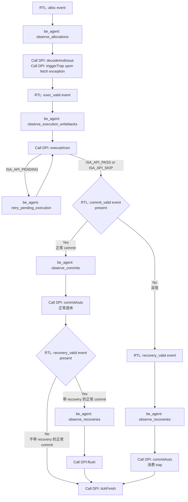

# BE agent 驱动 ISA model 的最小接口与运行流程

本文记录 BE agent 改变 ISA model 状态所需的接口；reference 查询接口不属于最小驱动集合。IsaApi.h 与 lib_FuncMultiCore.cpp 位于 ISA model 安装目录（ISA_API_INC/ISA_MODEL_INSTALL）。

## 最小 DPI 集合及调用链

每项调用链均为：be_agent.sv -> isa_dpi_pkg.sv DPI 声明 -> isa_dpi_wrapper.cc 转发 -> IsaApi.h 声明 -> lib_FuncMultiCore.cpp 实现。

| BE task/调用点 | DPI | 末端函数 | 作用 |
|---|---|---|---|
| observe_allocations | isa_dpi_decode_and_issue | funcMultiCore_decodeAndIssue | 建立 ROB entry 并解码/发射 |
| allocation，当 fetch_excp_vld | isa_dpi_trigger_trap | funcMultiCore_triggerTrap | 记录取指异常 |
| observe_execution_writebacks | isa_dpi_execute_insn | funcMultiCore_executeInsn | RTL 执行完成后推进模型 |
| retry_pending_execution | isa_dpi_execute_insn | funcMultiCore_executeInsn | ISA_API_PENDING 时重试  |
| observe_commits | isa_dpi_commit_auto |  funcMultiCore_commitAuto | commit 自动提交 |
| observe_recoveries，当发生 exception | isa_dpi_commit_auto |  funcMultiCore_commitAuto | recovery 阶段消费 faulting entry/trap |
| observe_recoveries 非 exception | isa_dpi_flush | funcMultiCore_flush | 清除 squash tag 之后的年轻 ROB 项 |
| run 每个下降沿末尾 | isa_dpi_tick_finish | funcMultiCore_tickFinish | 周期 housekeeping/终端轮询 |

proc_mem_req/proc_mem_load/store_commit 虽有声明但当前 be_agent 未调用。初始化 create/load/finalize 不属于单条指令链。get_insn_metadata、get_insn_rd_value、get_next_pc_of_insn、get_execute_metadata、get_commit_auto_trap_info 等 reference 查询接口刻意排除。

## 单条指令 flow

RTL 在上升沿更新观察接口；BE agent 在随后下降沿采样。run() 顺序为 pending retry -> execution writeback -> commit -> recovery -> allocation，最后 tick_finish。正常指令依次经历 decodeAndIssue、executeInsn（可能 retry）、commitAuto。取指异常在 allocation 调 triggerTrap；执行异常由 executeInsn 产生。misprediction recovery 时已 commitAuto 消费；exception recovery 时若尚未 commit 消费 faulting entry 则调 commitAuto。

## 关键文件汇总

- tb/agents/be/be_agent.sv：六个 task 与 run。
- dpi/isa_dpi_pkg.sv：上述 isa_dpi_* 的 import "DPI-C" 声明。
- dpi/isa_dpi_wrapper.cc：DPI 函数及到 funcMultiCore_* 的转发。
- ISA model IsaApi.h：API 声明与 ISA_API_* 返回码；lib_FuncMultiCore.cpp：实际状态机实现。
