# 驱动 ISA model 的最小 DPI 集合与调用流程

本文记录驱动 ISA model 状态所需的 DPI；ISA model 的 reference 值查询 DPI 不属于最小驱动集合。IsaApi.h 与 lib_FuncMultiCore.cpp 位于 ISA model 安装目录（ISA_API_INC/ISA_MODEL_INSTALL）。

## 最小 DPI 集合及调用链

### FE

每项调用链均为：fe_driver.sv -> isa_dpi_pkg.sv DPI 声明 -> isa_dpi_wrapper.cc 转发 -> IsaApi.h 声明 -> lib_FuncMultiCore.cpp 实现。

| FE task/调用点 | DPI | 末端函数 | 作用 |
|---|---|---|---|
| initialize_model | isa_dpi_create(core_num, rob_size) | funcMultiCore_create | 创建共享 ISA model 实例 |
| initialize_model | isa_dpi_load_config(yaml) | funcMultiCore_loadConfigFile | 加载平台、内存和设备配置 |
| initialize_model | isa_dpi_load_elf(elf) | funcMultiCore_loadElf | 装载 ELF 指令/数据并建立入口信息 |
| initialize_model | isa_dpi_add_arg(arg) | funcMultiCore_addArg | 增加目标程序 argv；当前传入 ELF 路径 |
| initialize_model | isa_dpi_finalize_config() | funcMultiCore_finalizeConfig | 完成配置，使取指和运行 API 可用 |
| initialize_model、redirect 后 | isa_dpi_get_spec_pc(core_id) | funcMultiCore_getCoreSpecPc | 获取 FE 下一次取指使用的 speculative PC |
| fetch_instruction | isa_dpi_fetch_mem_bank_virt(core, pc, len, buf, trap) | funcMultiCore_fetchMemBankVirt | 按虚拟地址读取指令字节并返回 fetch trap；32-bit 指令分两次读取 2 bytes |
| run 主循环 | isa_dpi_is_to_exit() | funcMultiCore_isToExit | 查询 ISA model 是否请求结束 |
| finish_model | isa_dpi_destroy() | funcMultiCore_destroy | 释放共享 ISA model 实例 |

### BE

每项调用链均为：be_agent.sv -> isa_dpi_pkg.sv DPI 声明 -> isa_dpi_wrapper.cc 转发 -> IsaApi.h 声明 -> lib_FuncMultiCore.cpp 实现。

| BE task/调用点 | DPI | 末端函数 | 作用 |
|---|---|---|---|
| observe_allocations | isa_dpi_decode_and_issue | funcMultiCore_decodeAndIssue | 建立 ROB entry 并解码/发射 |
| allocation，当 fetch_excp_vld | isa_dpi_trigger_trap | funcMultiCore_triggerTrap | 记录取指异常 |
| observe_execution_writebacks | isa_dpi_execute_insn | funcMultiCore_executeInsn | RTL 执行完成后推进模型 |
| retry_pending_execution | isa_dpi_execute_insn | funcMultiCore_executeInsn | ISA_API_PENDING 时重试  |
| observe_commits | isa_dpi_commit_auto |  funcMultiCore_commitAuto | commit 自动提交 |
| observe_recoveries，当发生 exception | isa_dpi_commit_auto |  funcMultiCore_commitAuto | recovery 阶段消费 faulting entry/trap |
| observe_recoveries 非 exception | isa_dpi_flush | funcMultiCore_flush | 清除 squash tag 之后的年轻 ROB 项 |
| run 每个下降沿末尾 | isa_dpi_tick_finish | funcMultiCore_tickFinish | 周期 housekeeping/终端轮询 |
| run 主循环 | isa_dpi_is_to_exit() | funcMultiCore_isToExit | 查询 ISA model 是否请求结束 |

### Cache

每项调用链均为：cache_agent.sv -> isa_dpi_pkg.sv DPI 声明 -> isa_dpi_wrapper.cc 转发 -> IsaApi.h 声明 -> lib_FuncMultiCore.cpp 实现。

| Cache task/调用点 | DPI | 末端函数 | 作用 |
|---|---|---|---|
| `execute_pending()` | `isa_dpi_execute_insn(core, rob)` | `funcMultiCore_executeInsn` | 执行 LSU 指令；返回 `ISA_API_PENDING` 时后续 cache phase 重试。 |
| `service_memory_ops()`，load/LR/AMO/SC 读侧 | `isa_dpi_proc_mem_load(core, rob)` | `funcMultiCore_procMemLoad` | 处理 load、LR、AMO、SC 的模型内存读操作。 |
| `service_memory_ops()`，`proc_mem_load` 返回 `SKIP` 或 misc 侧 | `isa_dpi_proc_mem_req(core, rob)` | `funcMultiCore_procMemReq` | 处理无读侧写请求、CBO 及其他组合内存操作。 |
| `service_memory_ops()`，读操作完成后 | `isa_dpi_get_insn_rd_value(core, rob)` | `funcMultiCore_getInsnRdValue` | 获取 load/LR/AMO 的 rd 结果，并返回给 RTL。 |
| `commit_store()` | `isa_dpi_store_commit(core)` | `funcMultiCore_storeCommit` | 按 store buffer 顺序提交最老 store，更新 model 内存/设备状态。 |
| `commit_store()`，store 成功后 | `isa_dpi_clear_mem_reserve(core)` | `funcMultiCore_clearMemReserve` | 清除 LR/SC reservation，维持原子内存语义。 |
| `translate_exception()` | `isa_dpi_get_priv(core)` | `funcMultiCore_getPriv` | 获取当前 privilege，作为 `translate_pte` 的输入。 |
| `translate_exception()` | `isa_dpi_translate_pte(core, vaddr, priv, ...)` | `funcMultiCore_translatePte` | 执行地址翻译并取得 page fault/access fault 信息。 |
| `enqueue_exception()` | `isa_dpi_has_trap(core, rob)` | `funcMultiCore_hasTrap` | 判断 model 是否已经记录该 ROB entry 的 trap，避免重复注入。 |
| `enqueue_exception()`，model 尚未记录 trap 时 | `isa_dpi_trigger_trap(core, rob, trap, tval)` | `funcMultiCore_triggerTrap` | 将 cache/LSU 发现的访存异常注入 model ROB entry。 |
| run 主循环 | isa_dpi_is_to_exit() | funcMultiCore_isToExit | 查询 ISA model 是否请求结束 |

## ISA model 驱动的完整 flow

```mermaid
flowchart TD
  START([START]) --> FE_AGENT
  START([START]) --> BE_AGENT
  START([START]) --> CACHE_AGENT

  subgraph FE_AGENT[FE agent]
    FE_INIT[task: initialize_model<br/>create/load_config/load_elf/add_arg/finalize_config]
    FE_INIT1[Call DPI: isa_dpi_create<br/>Call DPI: isa_dpi_load_config<br/>Call DPI: isa_dpi_load_elf<br/>Call DPI: isa_dpi_add_arg<br/>Call DPI: isa_dpi_finalize_config]
    FE_PC[Call DPI: isa_dpi_get_spec_pc]
    FE_FETCH[task: fetch_instruction]
    FE_FETCH1[Call DPI: isa_dpi_fetch_mem_bank_virt]
    FE_QUEUE[task: drive_pending<br/>FE-BE valid payload]
    FE_REDIRECT[task: apply_redirect]
    FE_EXIT{Call DPI: isa_dpi_is_to_exit?}
    FE_FINISH[task: finish_model]
    FE_FINISH1[Call DPI: isa_dpi_destroy]
    FE_INIT --> FE_INIT1 --> FE_PC -->|Initial PC| FE_FETCH --> FE_FETCH1 --> FE_QUEUE
    FE_REDIRECT -->|Redirect PC| FE_FETCH
    FE_EXIT -->|Yes, model exit observed| FE_FINISH --> FE_FINISH1
  end

  subgraph BE_AGENT[BE agent]
  A[RTL: alloc event] --> B[task: observe_allocations]
  B --> C[Call DPI: isa_dpi_decode_and_issue</br>Call DPI: isa_dpi_trigger_trap upon fetch exception]
  C --> D[RTL: exec_valid event]
  D --> E[task: observe_execution_writebacks]
  E --> F[Call DPI: isa_dpi_execute_insn]
  F -->|ISA_API_PENDING| R[task: retry_pending_execution]
  R --> F
  F ---------->|ISA_API_PASS or ISA_API_SKIP| H{RTL: commit_valid event<br/>present}
  H -->|Yes<br/>正常 commit| I[task: observe_commits]
  I --> J[Call DPI: isa_dpi_commit_auto<br/>正常退休]
  J --> K{RTL: recovery_valid event<br/>present}
  K -->|Yes<br/>带 recovery 的正常 commit| K1[task: observe_recoveries]
  K1 --> K2[Call DPI: isa_dpi_flush]
  H -->|No<br/>异常| L1[RTL: recovery_valid event]
  L1 --> L[task: observe_recoveries]
  L --> N[Call DPI: isa_dpi_commit_uto<br/>消费 trap]
  K -->|No<br/>不带 recovery 的正常 commit| Z
  K2 --> Z[Call DPI: isa_dpi_tick_finish]
  N --> Z
  Z --> BE_EXIT{Call DPI: isa_dpi_is_to_exit?}
  end

  subgraph CACHE_AGENT[Cache agent]
    CACHE_ISSUE[BE-LSU issue handshake]
    CACHE_EXEC[task: execute_pending]
    CACHE_EXEC1[Call DPI: isa_dpi_execute_insn<br/>loop if ISA_API_PENDING]
    CACHE_MEM[task: service_memory_ops]
    CACHE_ISREAD{read_side?}
    CACHE_MEMLOAD[Call DPI: isa_dpi_proc_mem_load<br/>loop if ISA_API_PENDING<br/>AMO/SC not at store head]
    CACHE_MEMREQ1[Call DPI: isa_dpi_proc_mem_req]
    CACHE_GETRESULT[Call DPI: isa_dpi_get_insn_rd_value]
    CACHE_ISSTOREAMO{store_side?}
    CACHE_AMOSTOREOK{Authorized and<br/>at store head?<br/>loop if No}
    CACHE_ISSTORE{store_side?}
    CACHE_STOREOK{Authorized and<br/>at store head?<br/>loop if No}
    CACHE_MEMREQ2[Call DPI: isa_dpi_proc_mem_req<br/>loop if ISA_API_PENDING]
    CACHE_STORE[task: commit_store]
    CACHE_STORE1[Call DPI: isa_dpi_store_commit]
    CACHE_STORE2[Call DPI: isa_dpi_clear_mem_reserve]
    CACHE_OUT[task: drive_outputs<br/>BE-LSU writeback, bypass payload]
    CACHE_EXC[task: translate_exception]
    CACHE_EXC1[Call DPI: isa_dpi_get_priv + isa_dpi_translate_pte]
    CACHE_TRAP[task: enqueue_exception]
    CACHE_TRAP1{Call DPI: isa_dpi_has_trap}
    CACHE_TRAP2[Call DPI: isa_dpi_trigger_trap]
    CACHE_EXIT{Call DPI: isa_dpi_is_to_exit?}
    CACHE_ISSUE --> CACHE_EXEC --> CACHE_EXEC1
    CACHE_EXEC1 ---->|ISA_API_PASS| CACHE_MEM
    CACHE_EXEC1 --------->|ISA_API_FAIL| CACHE_EXC --> CACHE_EXC1 --> CACHE_TRAP --> CACHE_TRAP1 -->|Yes| CACHE_TRAP2 --> CACHE_OUT
    CACHE_OUT --> CACHE_EXIT

    CACHE_MEM --> CACHE_ISREAD -->|No| CACHE_ISSTORE

    CACHE_ISREAD -->|Yes| CACHE_MEMLOAD -->|ISA_API_SKIP| CACHE_MEMREQ1
    CACHE_MEMLOAD -->|ISA_API_PASS| CACHE_GETRESULT
    CACHE_MEMREQ1 -->|ISA_API_PASS| CACHE_GETRESULT
    CACHE_GETRESULT --> CACHE_ISSTOREAMO
    CACHE_MEMREQ1 -->|ISA_API_PENDING<br/>AMO/SC not at store head| CACHE_MEMLOAD
    CACHE_ISSTOREAMO -->|Yes<br/>AMO/SC| CACHE_AMOSTOREOK
    CACHE_AMOSTOREOK -->|Yes| CACHE_STORE
    CACHE_ISSTOREAMO -->|No<br/>Load/LR| CACHE_OUT
    CACHE_MEMLOAD -->|ISA_API_FAIL| CACHE_EXC
    CACHE_MEMREQ1 -->|ISA_API_FAIL| CACHE_EXC

    CACHE_ISSTORE -->|Yes<br/>普通 store| CACHE_STOREOK
    CACHE_STOREOK -->|Yes| CACHE_STORE

    CACHE_ISSTORE -->|No<br/>FENCE/FENCE.i| CACHE_MEMREQ2
    CACHE_MEMREQ2 ----->|ISA_API_PASS<br/>ISA_API_SKIP| CACHE_OUT
    CACHE_MEMREQ2 ----->|ISA_API_FAIL| CACHE_EXC

    CACHE_STORE --> CACHE_STORE1 ----->|ISA_API_PASS| CACHE_STORE2 -------> CACHE_OUT
    CACHE_STORE1 ----->|Not ISA_API_PASS| CACHE_EXC

  end

  FE_HANDSHAKE{FE-BE ready/valid handshake?}
  CACHE_HANDSHAKE{BE-LSU valid/ready handshake?}
  BE_FE_REDIRECT[BE-FE redirect]


  FE_QUEUE --> FE_HANDSHAKE
  FE_HANDSHAKE -->|Yes 且<br/>不是 EOF 且无取指异常| FE_FETCH
  FE_HANDSHAKE -->|Yes| A
  C --> CACHE_ISSUE
  CACHE_OUT --> CACHE_HANDSHAKE -->|Yes| H
  CACHE_EXIT -->|Yes| END([End])
  BE_EXIT -->|Yes| END
  K -->|Yes<br/>带 recovery 的正常 commit| BE_FE_REDIRECT
  L1 -->|异常| BE_FE_REDIRECT
  BE_FE_REDIRECT --> FE_REDIRECT
  Z --> FE_EXIT
  FE_FINISH1 --> END
```

## 关键文件汇总

- verification/orbe_bt_env/tb/modified_agents/be/be_agent.sv：六个 task 与 run。
- verification/orbe_bt_env/tb/modified_agents/cache/cache_agent.sv：五个 task 与 run。
- verification/orbe_bt_env/tb/modified_agents/fe/fe_driver.sv：三个 task 与 run。
- verification/orbe_bt_env/dpi/isa_dpi_pkg.sv：上述 isa_dpi_* 的 import "DPI-C" 声明。
- verification/orbe_bt_env/dpi/isa_dpi_wrapper.cc：DPI 函数及到 funcMultiCore_* 的转发。
- ISA model IsaApi.h：API 声明与 ISA_API_* 返回码；lib_FuncMultiCore.cpp：实际状态机实现。
