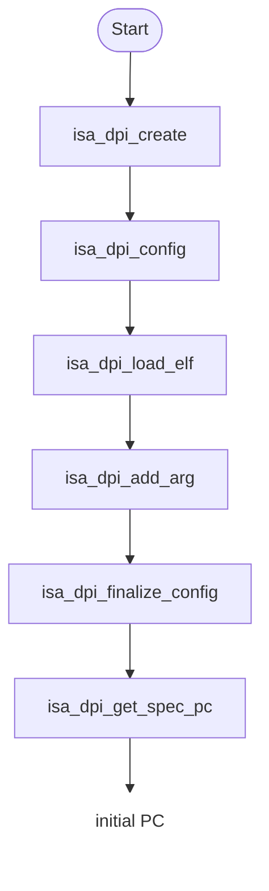
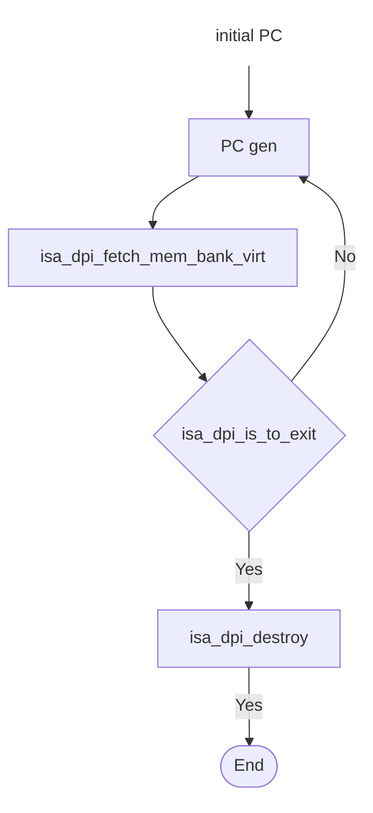
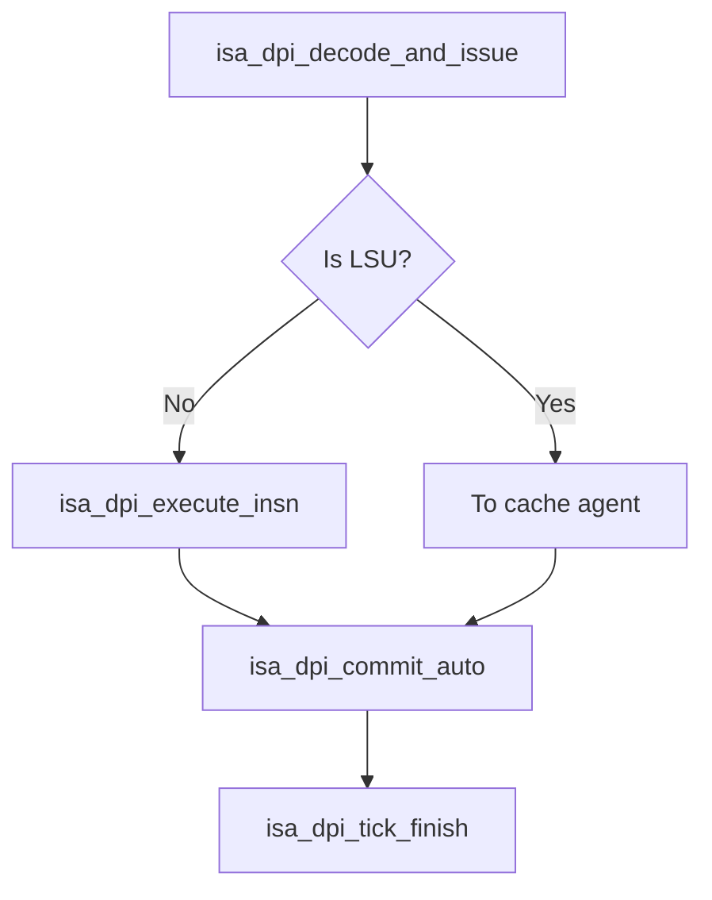
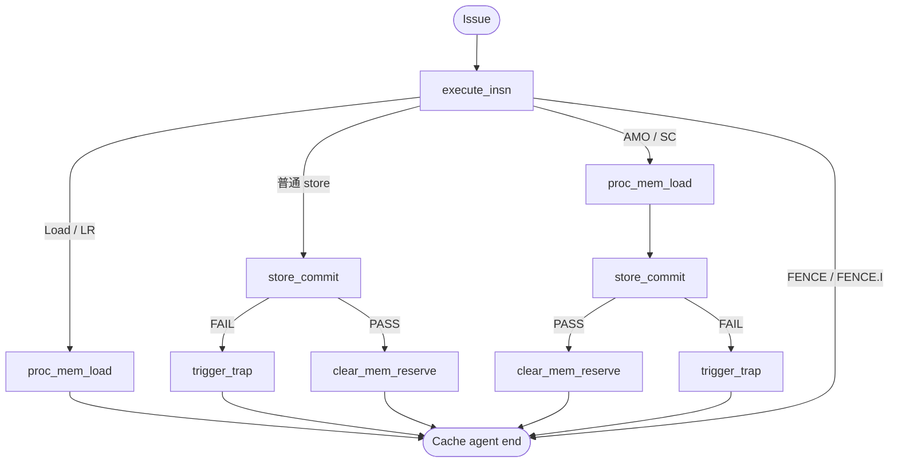

# 驱动 ISA model 的最小 DPI 集合与调用流程

本文记录驱动 ISA model 状态所需的 DPI；ISA model 的 reference 值查询 DPI 不属于最小驱动集合。IsaApi.h 与 lib_FuncMultiCore.cpp 位于 ISA model 安装目录（ISA_API_INC/ISA_MODEL_INSTALL）。

## ISA model 驱动的完整 flow

### Init Agent

### FE Agent

### BE Agent

### Cache Agent

## 最小 DPI 集合及调用链

每项调用链均为：isa_dpi_pkg.sv DPI 声明 -> isa_dpi_wrapper.cc 转发 -> IsaApi.h 声明 -> lib_FuncMultiCore.cpp 实现。

### Init agent

| DPI | ISA model 函数 | 作用 |
|---|---|---|
| `isa_dpi_create(core_num, rob_size)` | `funcMultiCore_create` | 创建共享 ISA model 实例 |
| `isa_dpi_load_config(yaml)` | `funcMultiCore_loadConfigFile` | 加载平台、内存和设备配置 |
| `isa_dpi_load_elf(elf)` | `funcMultiCore_loadElf` | 装载 ELF 指令/数据并建立入口信息 |
| `isa_dpi_add_arg(arg)` | `funcMultiCore_addArg` | 增加目标程序 argv；当前传入 ELF 路径 |
| `isa_dpi_finalize_config()` | `funcMultiCore_finalizeConfig` | 完成配置，使取指和运行 API 可用 |
| `isa_dpi_get_spec_pc(core_id)` | `funcMultiCore_getCoreSpecPc` | 获取 FE 下一次取指使用的 speculative PC |

### FE agent

| DPI | ISA model 函数 | 作用 |
|---|---|---|
| `isa_dpi_fetch_mem_bank_virt(core, pc, len, buf, trap)` | `funcMultiCore_fetchMemBankVirt` | 按虚拟地址读取指令字节并返回 fetch trap；32-bit 指令分两次读取 2 bytes |
| `isa_dpi_is_to_exit()` | `funcMultiCore_isToExit` | 查询 ISA model 是否请求结束 |
| `isa_dpi_destroy()` | `funcMultiCore_destroy` | 释放共享 ISA model 实例 |

### BE agent

| DPI | ISA model 函数 | 作用 |
|---|---|---|
| `isa_dpi_decode_and_issue(core, rob, pc, encoding, force_rvc)` | `funcMultiCore_decodeAndIssue` | 建立 ROB entry 并解码/发射 |
| `isa_dpi_execute_insn(core, rob)` | `funcMultiCore_executeInsn` | RTL 执行完成后推进模型 |
| `isa_dpi_commit_auto(core, rob)` | `funcMultiCore_commitAuto` | commit 自动提交 |
| `isa_dpi_tick_finish(1'b1)` | `funcMultiCore_tickFinish` | 周期 housekeeping/终端轮询 |

### Cache agent

| DPI | ISA model 函数 | 作用 |
|---|---|---|
| `isa_dpi_execute_insn(core, rob)` | `funcMultiCore_executeInsn` | 执行 LSU 指令；返回 `ISA_API_PENDING` 时后续 cache phase 重试。 |
| `isa_dpi_proc_mem_load(core, rob)` | `funcMultiCore_procMemLoad` | 处理 load、LR、AMO、SC 的模型内存读操作。 |
| `isa_dpi_store_commit(core)` | `funcMultiCore_storeCommit` | 按 store buffer 顺序提交最老 store，更新 model 内存/设备状态。 |
| `isa_dpi_clear_mem_reserve(core)` | `funcMultiCore_clearMemReserve` | 清除 LR/SC reservation，维持原子内存语义。 |
| `isa_dpi_trigger_trap(core, rob, trap, tval)` | `funcMultiCore_triggerTrap` | 将 cache/LSU 发现的访存异常注入 model ROB entry。 |

## 关键文件汇总

- verification/orbe_bt_env/dpi/isa_dpi_pkg.sv：上述 isa_dpi_* 的 import "DPI-C" 声明。
- verification/orbe_bt_env/dpi/isa_dpi_wrapper.cc：DPI 函数及到 funcMultiCore_* 的转发。
- ISA model IsaApi.h：API 声明与 ISA_API_* 返回码；lib_FuncMultiCore.cpp：实际状态机实现。
