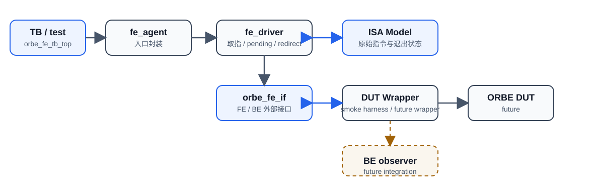

# ORBE FE Agent Design Plan

> 这是 FE Agent 的设计方案，用来先把职责、连接关系和验收重点定下来。

## 1. 设计目标

FE Agent 的任务：把 ISA Model 里的原始指令流，按照 Freeze 的 BE_To_FE 接口送到 DUT 侧。

它只关心 FE 能直接看到的行为：

- 原始指令是否按程序顺序送出。
- lane 0 / lane 1 是否保持前缀顺序。
- stall 时未接收的指令是否能保持住。
- redirect 到来后是否从新 PC 重新开始取指。
- 真实取指 fault 是否通过 exception entry 交付，并在其后停止产生 younger entry。

FE Agent 不负责后端内部语义验证。它不做 decode/issue/commit/flush/pflush，也不管 ROB/tag allocation、LSU、cache、store drain 这些内部路径。

## 1.1 Design Assumptions / 设计假设

本设计基于以下接口和职责边界假设：

- ORBE FE/BE 外部指令接口是 2 lane。
- lane 0 是 older instruction，lane 1 是 younger instruction。
- FE Agent 发送 raw instruction payload。
- FE 不发送 backend decode 结果、FU 路由、源/目的寄存器元数据、execution sub-op。
- RVC 保留原始 16-bit encoding，放在 `inst_bits[15:0]`，`inst_bits[31:16]` 清零，并用 `is_compressed=1` 标记。
- FE Agent 本阶段只把 ISA Model 用作 instruction memory 和阶段收尾状态来源。
- FE Agent 不推进 backend lifecycle，不调用 `decode_and_issue`、`execute_insn`、`commit_auto`、`flush`、`flush_all`。

## 1.2 Design Decisions / 关键设计决策

| 设计选择 | 原因 |
| --- | --- |
| FE 不 decode | ORBE FE/BE 边界传 raw instruction 和前端元数据，decode/ROB/tag/execution 语义属于 BE 或后续 BE observer。 |
| Redirect 清空 old pending | 未 fire 的 pending entry 可能属于错误推测路径，继续发送会污染 BE allocation 顺序并造成 model/DUT 控制流失锚。 |
| 区分 zero-fill EOF 与 fetch fault | ELF 末尾的 `16'h0000` 零填充按 EOF 处理；ISA Model 报告的真实 instruction-fetch fault 则生成 `fetch_excp_vld=1` 的异常 entry，交给 BE 处理，FE 不负责 `rob_idx` 或 trap DPI 生命周期。 |
| FE-only smoke 不证明 backend correctness | 它只验证 FE 可见接口行为，不证明 ROB/LSU/cache/tohost 等后端闭环。 |

## 1.3 FE 侧调用的 DPI

`fe_driver` 需要直接调用 ISA Model 的只读/取指类 DPI，用来生成 raw instruction stream，并在阶段结束时判断模型状态。

### 启动与收尾

- `isa_dpi_create(1, ROB_SIZE)`：创建单核共享模型。
- `isa_dpi_load_config(...)`：加载平台配置。
- `isa_dpi_load_elf(...)`：装载 ELF。
- `isa_dpi_add_arg(...)`：把测试入口参数交给模型。
- `isa_dpi_finalize_config()`：完成配置并允许后续取指。
- `isa_dpi_get_spec_pc(0)`：取得入口 PC 和 redirect 后的新起点。
- `isa_dpi_is_to_exit()`：检查模型是否已经进入退出状态。
- `isa_dpi_is_good()`：在退出后判断结果是否通过。
- `isa_dpi_destroy()`：收尾并释放共享模型。

### 取指

- `isa_dpi_fetch_mem_bank_virt(0, pc, 2, ...)`：读取当前 PC 的 2 字节。
- 若当前指令是 32-bit，再读取 `pc + 2` 的 2 字节拼成完整指令。
- `16'h0000` 零填充表示 EOF；真实取指 fault 生成一个异常 entry。异常 entry 交付后，FE 停止产生更年轻的 entry，等待 BE redirect。

### 本阶段不调用

- `isa_dpi_decode_and_issue`
- `isa_dpi_execute_insn`
- `isa_dpi_commit_auto`
- `isa_dpi_flush`
- `isa_dpi_flush_all`
- `isa_dpi_tick_finish`

这些调用属于后续完整 DUT / BE observer 集成后的职责，不属于 FE Agent 当前设计边界。

## 2. 组件关系



```text
TB / test
  -> fe_agent
      -> fe_driver <-> ISA Model
                   |
                   v
              orbe_fe_if <-> DUT Wrapper <-> ORBE DUT
                                 |
                                 v
                          BE observer (future)
```

如果你的预览器不渲染 SVG，请直接看下面这段文本兜底图。

## 3. 各部分职责

`fe_agent` 是入口壳子，负责接收配置、创建 driver、统一 run/shutdown/finish 的调用。

`fe_driver` 是真正干活的地方，负责：

- 初始化和查询 ISA Model。
- 读取 ELF 对应的指令字节。
- 维护 pending 队列和 next_pc。
- 生成两条按顺序排列的 FE lane。
- 处理 ready、RVC、fetch EOF、fetch exception、保持和 redirect。
- 做日志和基本错误报告。

`orbe_fe_if` 只承载 FE 和 DUT Wrapper 之间的外部事务。FE Agent 不需要知道 Wrapper 的模块名或内部结构，只需要认这几个信号。

`DUT Wrapper` 是 FE 侧的对接对象。当前冒烟测试阶段，它只需要把 ready 和 redirect 返回给 FE Agent。后面如果接入真正的 ORBE DUT，再把 DUT 自己的控制事件接进去。

`BE observer` 不是 FE Agent 的内部依赖。它属于后续完整验证环境里的观测和联调组件，FE Agent 不直接调用它。

`ISA Model` 是 FE 取指的语义来源。FE Agent 从它拿入口 PC 和指令字节，并在阶段结束时做收尾判断。

## 4. FE Agent 的工作流程

1. `fe_agent` 启动后创建 `fe_driver`。
2. `fe_driver` 读取配置，装载 ISA Model 和 ELF。
3. 从入口 PC 开始预取指令，填充 pending 队列。
4. 每个周期把当前 pending group 驱动到 `orbe_fe_if`。
5. 根据 DUT Wrapper 返回的 ready 决定哪些 lane fire。
6. 对未 fire 的 lane 做保持和压缩，把更年轻的指令往前挪。
7. 观察到 redirect 后，清空旧路径 pending，并从新的 redirect PC 重启。
8. 遇到 EOF 时停止产生新 entry；遇到 fetch exception 时交付异常 entry 后停止产生更年轻的 entry，等待 BE redirect 或进入收尾阶段。

### 4.1 Protocol Semantics / 协议语义

FE/BE 指令交付按 2 lane 前缀顺序工作：lane 0 是 older instruction，lane 1 是 younger instruction。

fire 规则如下：

```text
fire[0] = valid[0] && ready[0]
fire[1] = valid[1] && ready[1] && fire[0]
```

lane 1 不能越过 lane 0 独立 fire。也就是说，只有 lane 0 在同一拍成功交付时，lane 1 才允许在这一拍交付。

ready stall 时 payload 必须稳定。这里的 payload 稳定指同一条未接收 instruction 的 `pc`、`inst_bits`、`is_compressed`、`pred_taken`、`pred_target_pc`、`fetch_excp_vld`、`exception_cause`、`exception_tval` 不能被新 instruction 覆盖，直到该 entry fire 或 redirect 到来。

如果 lane 0 fire 但 lane 1 没有 fire，原 lane 1 entry 在 compaction 后移动到 lane 0，下一拍继续作为 oldest pending entry 对外展示。

redirect 与 fire 同拍时 redirect 优先。redirect 发生时旧 pending 直接丢弃，不把旧路径 payload 当作有效交付结果。

### 4.2 Redirect 设计伪代码

```text
on_posedge_clk():
    if be_fe_redirect_valid:
        redirect_pc_saved = be_fe_redirect_pld.redirect_pc
        pending.clear()
        fetch_eof = false
        fetch_stop_after_fault = false
        drive_idle()
        refill_from_redirect_next_cycle = true
        return

    if refill_from_redirect_next_cycle:
        next_pc = redirect_pc_saved
        refill_pending()
        refill_from_redirect_next_cycle = false

    drive_pending()
    fire[0] = valid[0] && ready[0]
    fire[1] = valid[1] && ready[1] && fire[0]

    remove_fired_entries(fire)
    compact_unfired_entries_to_lane0()
    refill_pending()
```

### 4.3 Fetch EOF 和 exception 策略

当前 FE Agent 采用 fetch-to-EOF 策略，同时区分零填充 EOF 和真实 fetch fault。EOF 或异常停止状态只阻止产生新的 pending entry，不清除已经存在的 pending entry；只有 redirect 会清空 old pending。

采用该策略的原因和边界如下：

- ELF executable bytes 后面常见 `16'h0000` 零填充；`16'h0000` 不是合法 RISC-V 指令，不应作为非法指令送入 DUT。
- `isa_dpi_fetch_mem_bank_virt` 返回非 PASS 时可能携带真实 trap 信息；该信息在本阶段转换为 FE-to-BE exception payload，而不是一律当作 EOF。
- 如果 32-bit instruction 的 high halfword 取指失败，不发送 partial instruction；发送一个以原始指令起始 PC 标记的异常 entry，`exception_tval=pc+2`。
- 当前阶段支持的同步 instruction-fetch cause 为 `INSN_ADDR_MISSALIGN=0x0`、`INSN_ACCESS_FAULT=0x1` 和 `INSN_PAGE_FAULT=0xc`。`NO_TRAP=0x3f` 不是异常，带 bit 63 的 interrupt cause 也不通过 fetch exception 字段传递；其他 cause 需另行冻结后再支持。
- 异常 entry 的 `pc` 是逻辑指令起始地址；`inst_bits=32'h0000_0013`，`is_compressed=0`，`pred_taken=0`，`pred_target_pc=pc`。该合法 RV64 NOP 仅作为 raw instruction 字段的占位值，`fetch_excp_vld=1` 才是异常语义，BE 可据此创建/识别对应 entry 后自行调用 trap DPI。
- `exception_cause` 使用上述 `TrapType` 同步异常号的低 5 bit；`exception_tval` 是实际失败的 instruction-fetch 虚拟地址：低 halfword fault 为 `pc`，32-bit instruction 的 high halfword fault 为 `pc+2`。
- 异常 entry 被 fire 后，FE 不继续产生 younger entry；异常 entry 未 fire 时仍须遵守 ready/valid 和 payload stability。
- 正常 entry 的 `fetch_excp_vld`、`exception_cause`、`exception_tval` 继续保持为 0。
- redirect 时清除 `fetch_eof`，并从 `redirect_pc` 重新开始取指。
- redirect 同时清除异常停止状态，从 `redirect_pc` 重新开始取指。

取指和 refill 的设计伪代码如下：

```text
fetch_one(pc):
    low = fetch_mem_bank_virt(pc, 2)

    if low.rc != PASS:
        entry.pc = pc
        entry.inst_bits = 32'h0000_0013
        entry.is_compressed = false
        entry.pred_taken = false
        entry.pred_target_pc = pc
        entry.fetch_excp_vld = true
        entry.exception_cause = supported_fetch_cause(low.trap_type)
        entry.exception_tval = pc
        fetch_stop_after_fault = true
        return entry

    low_halfword = low.data

    if low_halfword == 16'h0000:
        fetch_eof = true
        return NO_ENTRY

    if low_halfword[1:0] != 2'b11:
        entry.pc = pc
        entry.inst_bits = {16'h0000, low_halfword}
        entry.is_compressed = true
        entry.pred_taken = false
        entry.pred_target_pc = pc + 2
        entry.fetch_excp_vld = false
        entry.exception_cause = 0
        entry.exception_tval = 0
        next_pc = pc + 2
        return entry

    high = fetch_mem_bank_virt(pc + 2, 2)

    if high.rc != PASS:
        entry.pc = pc
        entry.inst_bits = 32'h0000_0013
        entry.is_compressed = false
        entry.pred_taken = false
        entry.pred_target_pc = pc
        entry.fetch_excp_vld = true
        entry.exception_cause = supported_fetch_cause(high.trap_type)
        entry.exception_tval = pc + 2
        fetch_stop_after_fault = true
        return entry

    entry.pc = pc
    entry.inst_bits = {high.data, low_halfword}
    entry.is_compressed = false
    entry.pred_taken = false
    entry.pred_target_pc = pc + 4
    entry.fetch_excp_vld = false
    entry.exception_cause = 0
    entry.exception_tval = 0
    next_pc = pc + 4
    return entry

refill_pending():
    while pending_count < 2 and fetch_eof == false and fetch_stop_after_fault == false:
        entry = fetch_one(next_pc)

        if entry == NO_ENTRY:
            break

        pending.push(entry)

        if entry.fetch_excp_vld:
            break
```

`fetch_one()` 对无法映射到当前支持集合的 trap cause 报告协议错误，不把未知 cause 静默转换为 EOF 或 cause 0。异常 entry 本身不调用 `isa_dpi_trigger_trap()`；BE/Wrapper 在完成自身 entry/`rob_idx` 管理后负责把 `exception_cause` 和 `exception_tval` 转换为 ISA Model 的 `trap_type` 和 `tvalue`。

## 5. FE Agent 要验证什么

这份设计里，FE Agent 主要验证的是外部接口行为，不是后端功能正确性。

要验证的重点有：

- raw instruction 是否被正确送出。
- compressed instruction 是否按原始半字节表示保留。
- lane 0 / lane 1 是否严格按程序顺序工作。
- lane 1 不能越过 lane 0 独立 fire。
- ready 低时，未接收指令是否会稳定保留。
- redirect 到来时，旧路径是否会被清掉并从新 PC 重启。
- 零填充或取指结束时，是否停止继续产生新 entry。
- 真实取指失败时，是否发送格式正确的 exception entry，并在其后停止产生 younger entry。

不在这份设计里验证的内容有：

- BE 内部 ROB/tag 分配是否正确。
- decode/issue/commit/flush/pflush 是否正确。
- LSU 和 cache 是否正确。
- 完整的 tohost PASS/FAIL 闭环。

## 6. 当前 冒烟测试 方案

在最小 smoke 环境里，DUT Wrapper 只要能给 FE Agent 提供两类响应就够了：

- `be_fe_instr_ready`
- `be_fe_redirect_valid` / `be_fe_redirect_pld`

FE Agent 自己负责取指、保持、压缩和重取。Wrapper 不需要替 FE Agent 调整 fire 规则，也不需要去理解 FE 内部 pending 队列。
