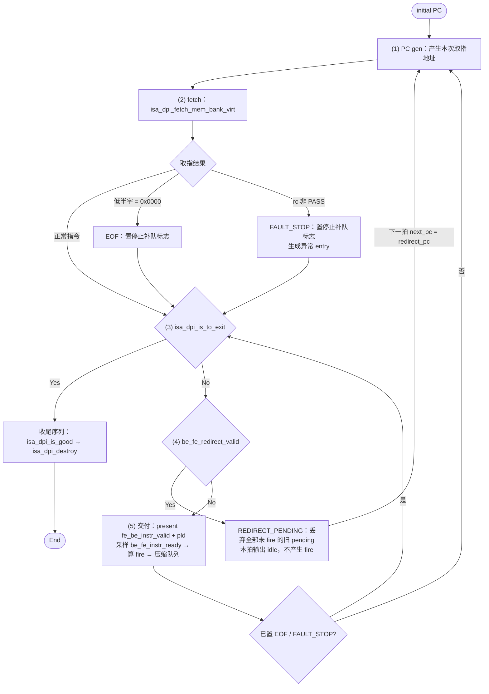
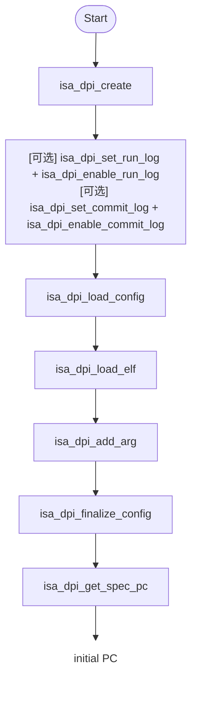

# ORBE FE Agent 实现文档

> 本文按 module 文档骨架 [`module_v4.md`](flows/spec-authoring/templates/module_v4.md) 组织。
> 相对骨架的改写只有三处，先在此声明，后文不再重复：
> 1. 允许使用 Markdown 表格；
> 2. `FSM` 下增加 `调用序列` 节（骨架无对应章节）；
> 3. 只写结论，不写推导过程。

**Module**：`FE Agent`
**类型**：协议适配器 / 调用定序器
**基本 property**：

1. 只做两件事：按固定顺序调用 ISA Model DPI；维护 `orbe_fe_if` 上的事件时序。
2. 不持有架构状态；architectural state 的唯一 owner 是 ISA Model。
3. 不解释指令语义：不做 decode、不执行、不提交、不判断分支方向。
4. 事件与 payload 必须与真实 FE 一致；对齐的是事件词汇与 payload schema，不是延迟或流水线形状。
5. 本阶段不追求时序精确，见 §5.5。

## 1. Submodule

1. `ISA_Model`：经 DPI 调用访问，非端口连线。其内部状态、存储与跨边界行为不在本层描述。

本文只记录 Agent 自身发出的调用及其调用点；全环境 DPI 的汇总清单不在本文维护。

## 2. FSM

### 2.1 State

| State | 语义 |
| --- | --- |
| `RESET` | 复位期间，输出静止 |
| `RUN` | 正常运行：取指与交付 |
| `EOF` | 取到零填充，停止产生新 entry；已有 pending 继续交付 |
| `FAULT_STOP` | 取指 fault 已产生异常 entry，停止产生更年轻的 entry |
| `REDIRECT_PENDING` | 已采样到 redirect，本拍丢弃旧 pending 并输出 idle |
| `EXIT` | 模型请求退出，停止输出并收尾 |

### 2.2 State Transition & Condition Name

| # | Current → Next | Event |
| --- | --- | --- |
| 1 | `ANY → RESET` | `rst_n = 0` |
| 2 | `RESET → RUN` | `rst_n = 1` |
| 3 | `RUN → EOF` | 取到零填充（低半字 `= 16'h0000`） |
| 4 | `RUN → FAULT_STOP` | 取指返回 `rc ≠ PASS` 且 cause 合法 |
| 5 | `RUN / EOF / FAULT_STOP → REDIRECT_PENDING` | `be_fe_redirect_valid` |
| 6 | `REDIRECT_PENDING → RUN` | 下一拍（`next_pc = redirect_pc`，并清除 `EOF` / `FAULT_STOP`） |
| 7 | `RUN / EOF / FAULT_STOP / REDIRECT_PENDING → EXIT` | `isa_dpi_is_to_exit` 为真 |

`EOF` 与 `FAULT_STOP` 都不清空已有 pending，只有 redirect 清除。

### 2.3 Detailed Condition Description

> 骨架中本节按 event 逐条定义 fire；本文改写为按 State 组织，给出每个 State 的期间行为、调用的 DPI 与退出条件。判定顺序与优先级见本节末。

主循环总图：一个迭代 = 一次取指 + 一次判定 + 一次交付。



图注：

- `PC gen` 不是 DPI 步骤，是取指游标逻辑。地址来源三选一：首次为 `initial PC`；redirect 生效拍为 `redirect_pc`；其余为上次取指推进后的 `next_pc`。
- `fetch` 在图中为一个节点；实际按 2 字节粒度读：先读 `pc` 处 2 字节，若低半字指示 32-bit 指令，再读 `pc+2` 处 2 字节。RVC 只读一次。
- 置停止标志后跳过 `PC gen` 与 `fetch`，迭代退化为「退出判定 → redirect 判定 → 交付」。
- 本拍取指发生在退出判定之前；因此退出成立那一拍不再交付本拍取得的 entry。

**`RESET`**

- 期间行为：`fe_be_instr_valid = 0`，payload 全 0。
- DPI 调用：无。
- 退出：`rst_n = 1`。

**`RUN`**

- 进入动作（恰好一次）：执行前置序列（§2.4.1）。
- 期间行为：每拍执行主循环。
- DPI 调用：`isa_dpi_fetch_mem_bank_virt(core, pc, 2, buf, trap)`。作用：按虚拟地址读取取指字节并返回 fetch trap；不推进模型、不执行、不提交，是纯 lookup。
- 退出：
  - 低半字 `= 16'h0000` → `EOF`；
  - 取指返回 `rc ≠ PASS` → `FAULT_STOP`；
  - 采样到 `be_fe_redirect_valid` → `REDIRECT_PENDING`；
  - `isa_dpi_is_to_exit` 为真 → `EXIT`。

**`EOF`**

- 语义：零填充不是合法指令，按结束处理。
- 期间行为：停止产生新 entry；已有 pending 继续交付；仍执行退出判定与 redirect 判定。
- DPI 调用：无。
- 退出：`be_fe_redirect_valid`（清除该标记并回到 `RUN`）。

**`FAULT_STOP`**

- 进入条件：取指返回 `rc ≠ PASS`，且 `trap` 属于支持集合 `{INSN_ADDR_MISSALIGN, INSN_ACCESS_FAULT, INSN_PAGE_FAULT}`；其余值报错终止。
- 异常 entry 的字段：`inst_bits = 32'h0000_0013`、`is_compressed = 0`、`pred_taken = 0`、`pred_target_pc = pc`、`fetch_excp_vld = 1`、`exception_cause` 取 cause 低 5 bit、`exception_tval` 为实际失败的取指虚拟地址（低半字 fault 为 `pc`，32-bit 指令高半字 fault 为 `pc+2`）。
- 期间行为：停止产生更年轻的 entry；该异常 entry 与更老的 entry 一起交付；仍执行退出判定与 redirect 判定。
- DPI 调用：无。异常信息全部来自 `isa_dpi_fetch_mem_bank_virt` 的返回。
- 退出：`be_fe_redirect_valid`（清除该标记并回到 `RUN`）。

**`REDIRECT_PENDING`**

- 进入条件：任一活动态采样到 `be_fe_redirect_valid`。
- 期间行为：丢弃全部未 fire 的旧 pending；本拍输出 idle，不参与握手，不产生 fire。
- DPI 调用：无。
- 退出：下一拍进入 `RUN`，`next_pc = redirect_pc`，并清除 `EOF` / `FAULT_STOP`。

**`EXIT`**

- 进入条件：`isa_dpi_is_to_exit` 为真。
- 期间行为：停止输出；执行收尾序列（§2.4.2）。
- DPI 调用：`isa_dpi_is_good`、`isa_dpi_destroy`。
- 退出：仿真结束。

**判定顺序与优先级**

每拍判定顺序固定：

```
(2) fetch → (3) is_to_exit → (4) be_fe_redirect_valid → (5) 交付
```

优先级：

```
is_to_exit  >  be_fe_redirect_valid  >  普通交付
```

推论：

- 退出采样拍与 redirect 采样拍都不产生 fire。
- 置停止标志（`EOF` / `FAULT_STOP`）后跳过 fetch，但退出判定与 redirect 判定继续。

### 2.4 调用序列

> 骨架无对应章节。「调用序列」= 顺序固定、不重入、不占时间、不构成 State 的调用串。Agent 中共两段。

#### 2.4.1 前置序列

在 `RUN` 进入时执行，恰好一次。



| 步 | DPI | 作用 | 入参 | 返回码 | 失败处理 |
| ---: | --- | --- | --- | --- | --- |
| 1 | `isa_dpi_create` | 创建模型实例 | `core_num = 1`、`rob_size = 16`（模型 ROB 容量，与 DUT 发射宽度无关） | `PASS` / `FAIL` | 非 `PASS` 终止 |
| 2 | `isa_dpi_set_run_log` + `isa_dpi_enable_run_log` | 设置并打开 run log | 路径、`ISA_API_LOG_GLOBAL` | `void` | — |
| 3 | `isa_dpi_set_commit_log` + `isa_dpi_enable_commit_log` | 设置并打开 commit log | 路径、`ISA_API_LOG_GLOBAL` | `void` | — |
| 4 | `isa_dpi_load_config` | 加载平台、内存、设备配置 | YAML 路径 | `PASS` / `FAIL` | 非 `PASS` 终止 |
| 5 | `isa_dpi_load_elf` | 装载 ELF 指令/数据并建立入口信息 | ELF 路径 | `PASS` / `FAIL` | 非 `PASS` 终止 |
| 6 | `isa_dpi_add_arg` | 向目标程序传 argv，本阶段传 ELF 路径 | ELF 路径 | `void`，无返回码 | — |
| 7 | `isa_dpi_finalize_config` | 完成配置，此后取指 API 才可用 | 无 | `PASS` / `FAIL` | 非 `PASS` 终止 |
| 8 | `isa_dpi_get_spec_pc` | 取入口 PC | `model_core_id = 0` | 64-bit PC | — |

约束：

- 第 2、3 步为可选步骤，由 plusarg 触发；未触发时跳过。
- 顺序固定，不可重排、不可重入。
- 第 8 步的结果即 `initial PC`，是主循环 `PC gen` 的首次地址来源；该 DPI 在全生命周期内只调用一次。

#### 2.4.2 收尾序列

在 `EXIT` 期间执行，恰好一次。

| 步 | DPI | 作用 | 入参 | 返回码 |
| ---: | --- | --- | --- | --- |
| 1 | `isa_dpi_is_good` | 查询退出结果是否 PASS | 无 | `0` / `1` |
| 2 | `isa_dpi_destroy` | 释放模型实例 | 无 | `void`，无返回码 |

约束：`create` 与 `destroy` 必须配对；Agent 是共享模型的 `create` / `destroy` 唯一 owner。

## 3. Data structure

本节描述 Agent 的协议态存储。架构状态不存在 Agent 内。

### 3.1 State

1. `next_pc`：64 bit；取指游标，指令入队时推进。
2. `redirect_pc`：64 bit；redirect 目标，由 `be_fe_redirect_pld.redirect_pc` 采样。
3. `fetch_eof`：1 bit；置位表示 `EOF`。
4. `fetch_stop_after_fault`：1 bit；置位表示 `FAULT_STOP`。
5. `redirect_pending`：1 bit；置位表示 `REDIRECT_PENDING`。
6. `pending_valid[LANE]`：2 bit；待发队列占用位，index 0 为最老。
7. `RUN`：上述标志全 0 的默认态。`RESET` 由 `rst_n` 表示，`EXIT` 为终态，二者不存储。

### 3.2 Header

无。

### 3.3 Payload

1. `pending_info[LANE]`：来源于 `orbe_fe_instr_pld_t`。
   - `orbe_fe_instr_pld_t`：`pc[63:0]`、`inst_bits[31:0]`、`is_compressed`、`pred_taken`、`pred_target_pc[63:0]`、`fetch_excp_vld`、`exception_cause[4:0]`、`exception_tval[63:0]`。

## 4. Internal Connections

无。

## 5. Interface

### 5.1 In-event

1. `redirect`：Notify，单 lane。
   - Fire来源：`be_fe_redirect_valid`
   - Payload：`orbe_fe_redirect_pld_t`；当拍有效
   `orbe_fe_redirect_pld_t`：`redirect_pc[63:0]`、`interrupt_valid`、`trap_valid`
   - Constraint：
     - redirect 优先于普通交付；与交付同拍时该拍不产生 fire。
     - redirect 后重新输出的首条指令必须满足 `pc == redirect_pc`。
     - `interrupt_valid` / `trap_valid` 对 Agent 是信息性的；redirect 语义只由 `redirect_pc` 决定。

### 5.2 In Static Info

1. `be_fe_instr_ready[lane]`：1 bit × 2，`lane ∈ {0,1}`；当前拍 DUT 是否接收该 lane。用于计算交付 fire 与队列压缩；本身不是动作端点。
2. `clk`：时钟。
3. `rst_n`：低有效复位。

### 5.3 Out-event

1. `instr[lane]`：Transaction，`lane ∈ {0,1}`，2 lane。
   - Fire来源：定义点在 DUT 侧的 `be_fe_instr_ready[lane]`；Agent 不另行定义 fire。
   - Payload：`orbe_fe_instr_pld_t`；当拍有效
   `orbe_fe_instr_pld_t`：`pc[63:0]`、`inst_bits[31:0]`、`is_compressed`、`pred_taken`、`pred_target_pc[63:0]`、`fetch_excp_vld`、`exception_cause[4:0]`、`exception_tval[63:0]`
   - Constraint：
     - lane 0 为较老指令，lane 1 为较新指令；禁止「lane 0 未接收而 lane 1 单独接收」。
     - 未 fire 的 entry 的 payload 保持稳定，直到该 entry fire 或被 redirect 丢弃；下一次展示时压缩到 lane 0。

### 5.4 Out Static Info

无。

### 5.5 Interface Timing

占位，待补充。

复位期间 `fe_be_instr_valid = 0` 且 payload 全 0。
