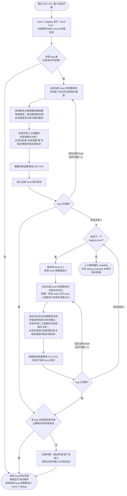

# RTL Debug Flow and Rule（草稿）

本文描述AI 基于 COSIM 验证环境对 DUT RTL 进行 bug 定位、修改和回归验证的通用流程。

## 1. 总体流程



主 Mermaid 图描述的是可扩展到多个 logging level 的 general case。当前实际流程为两个 level（`N = 2`），每个 level 最多执行 10 轮 debug 循环（`n = 10`）。从 Level 1 开始，完成 10 轮迭代后问题仍未消除则升级到 Level 2；Level 2 仍无法定位或消除问题时再转由人工接管。

当某一轮回归确认 bug 已消除时，不能直接结束修改，必须进一步判断根因：若确认是“文档正确但代码实现有误”，则记录证据并结束当前 bug 的修改；否则按文档问题处理（例如文档描述有误或存在歧义），修改相关文档并确认其与 RTL、验证环境和实际行为自洽，完成后才能结束当前 bug 的修改。

## 2. 目标

AI 在保留可复现证据的前提下，逐级增加观察信息，完成以下闭环：

1. 发现并精确描述未对齐现象；
2. 根据指令类型、[`RVA23_IMAFDC_Classification.xlsx`](../RVA23_IMAFDC_Classification.xlsx) 中的分类结果以及微架构文档提出可验证的根因判断；
3. 修改 DUT RTL，运行当前等级回归并验证判断；
4. 在 bug 消除或人工接管之间作出明确决策；后续增加 logging level 后，再增加相应的升级决策。

## 3. Logging level 定义

### 3.1 Level 1

Level 1 是当前启用的第一个 logging 等级，仅观察 commit 阶段的最小信息集，用于判断架构可见结果是否首先发生偏差。Level 1 的观察信号、采样规则和字段定义以 [`Observation_level_1.md`](../Observation/Observation_level_1.md) 为准，本文不重复复制其内容。

### 3.2 Level 2

Level 2 是当前已启用的第二个 logging level，用于在 Level 1 无法定位根因时概括观察关键接口和流水线事件。具体信号、采样和比较规则以 [`Observation_level_2.md`](../Observation/Observation_level_2.md) 为准。Level 2 覆盖：

- FE-BE 接口事件；
- Decode 结果；
- ISQ 事件；
- writeback 事件；
- CSR unit 输入/输出事件；
- BE-LSU 接口事件。

使用 Level 2 时，AI 只需概括检查上述观察信号，结合首个未对齐点判断问题路径；不要求逐字段复述该引用文档的全部内容。`Observation_level_2.md` 已定义哪些字段自动比较、哪些字段仅供 DUT 侧观察。

本文原有但尚未在当前 Level 2 实现的更细粒度内部信号观察，统一作为后续扩展方向保留，包括 CSR 相关信号（tval、mcause、mstatus、vaddr 等等）、redirect/异常恢复、dispatch/issue/wakeup、依赖与队列状态、FU/ROB 状态转移、LSU 内部请求响应及 store buffer 等。后续扩展仍应遵守按需启用观察面的原则，不得默认让所有测试打印全部内部信号。

### 3.3 暂定参数与待细化项

以下控制参数暂定用于当前草稿，后续可根据实际 debug 经验调整：

| 参数 | 当前规则 | 待补充内容 |
| --- | --- | --- |
| `N` | 当前为 2，启用 Level 1 和 Level 2 | 后续根据实践确认是否增加更深 level |
| 每级迭代上限 `n` | 暂定为 10；每个启用的 level 独立计数 | 根据实践确认是否需要按 level 分别配置 |
| Level 1/2 观察信号 | 分别以 [`Observation_level_1.md`](../Observation/Observation_level_1.md) 和 [`Observation_level_2.md`](../Observation/Observation_level_2.md) 为准 | 后续新增 level 时再定义观察信号 |
| 指令类型映射 | 引用 [`RVA23_IMAFDC_Classification.xlsx`](../RVA23_IMAFDC_Classification.xlsx)；通过 `Dispatch Target` 查找指令可能进入的 ISQ Group | 其他用于确定微架构路径的 header/字段待确定 |
| debug example | 用于无法自动解决时的知识沉淀 | 典型 mismatch、证据、判断和修复案例 |

## 4. 单个 Level 的标准子流程

每个 level 都必须执行以下步骤，不能只修改代码后直接宣布通过。

### 4.1 运行与比较

1. 使用当前 level 的 logging 配置运行测试或失败用例。
2. AI 比较该 level 的观察信号与 ISA_model 的对应结果。
3. 找到首个未对齐点，记录测试程序、指令类型、cycle、sequence id、相关 PC 以及比较对象。

### 4.2 分析与判定

AI 必须根据未对齐的指令类型，先在 [`RVA23_IMAFDC_Classification.xlsx`](../RVA23_IMAFDC_Classification.xlsx) 中找到对应指令，并通过 `Dispatch Target` 判断该指令可能进入的 ISQ Group：`G0`、`G1`、`G2`、`G3` 分别对应 `ISQ Group 0`、`ISQ Group 1`、`ISQ Group 2`、`ISQ Group 3`。随后再结合微架构文档检查对应路径中可能的问题点。其他用于确定 functional unit 或进一步细化微架构路径的 header/字段待确定。

分析结果必须整理为人可查看的判定记录，至少包含：

- 观察到的现象和首个未对齐点；
- 该指令按微架构文档应经过的路径；
- 当前怀疑的模块、状态或接口契约；
- 支持判断的 log、断言或比较证据；
- 当前判断的置信度和仍待排除的其他可能性；
- 本轮拟修改的文件、修改目的和预期影响。

判定结果是 debug 产物的一部分，不能只保留在 AI 的内部推理中。所有迭代的相关记录都得存在，不得覆盖。

### 4.3 修改与验证

1. AI 根据判定结果修改 DUT RTL；若发现接口契约或微架构描述错误，必须明确标记并同步更新对应文档，而不能仅改 RTL 内容。
2. 使用相同测试、相同构建条件和当前 level logging 重新运行回归。
3. 比较 bug 是否消除，并检查修复是否引入新的 mismatch、X/Z、协议违例或 assertion。
4. 记录修改前后结果、失败用例、证据摘要和当前迭代次数。

## 5. Level 升级规则

- 每个启用的 level 有独立迭代计数器，从进入该 level 时归零；当前 Level 1 的上限为 10 轮。
- 一轮迭代包括“观察/比较 → 分析/判定 → 修改 → 当前 level 回归测试”。
- 若 bug 在当前 level 的 10 轮迭代内消除，仍须执行“代码实现问题/文档问题”的根因判定：前者记录证据后结束当前 bug，后者修改文档并确认与代码自洽后才能结束。
- 当前 Level 1 完成第 10 轮后仍无法确定根因或消除 bug，保留 Level 1 的全部证据并升级到 Level 2。
- Level 2 达到 10 轮后仍无法确定根因或消除 bug，才转入人工接管；升级时验证环境将自动保留较低 level 的观察面作为上下文，并在日志中显式记录新增观察面。
- 如果某一轮结果显示问题来自验证环境、ISA model、golden model 或接口契约，而非 DUT RTL，必须详细记录并转人工处理。

## 6. 结束条件与人工接管

### 6.1 Debug 成功

满足以下条件时可结束当前 bug 的 AI debug：

- 当前失败现象已消除；
- 复现用例和规定回归集在 clean build 下通过；
- 没有未解释的 mismatch、X/Z、协议违例或 assertion；
- 修复原因、证据、修改内容和验证结果已形成可审查记录；
- 没有用临时 workaround 掩盖尚未解释的微架构或接口问题；
- 所有因文档描述错误、描述会产生歧义等文档问题所导致的 bug 在修复后，已完成对相关问题文档的修订。

### 6.2 当前 Level 2 完成 10 轮后仍失败

如果当前 Level 2 完成第 10 轮迭代后 bug 仍存在，AI 不得继续无边界修改代码或宣称通过。必须输出人工接管包，至少包含：

- 所有 level 的配置、迭代次数和升级原因；
- 每个 level 的首个未对齐点、判定结果和反复排除过的假设；
- 失败测试、复现命令、关键 log；
- 已尝试的 RTL/文档修改及其结果；
- 当前无法解释的现象和需要人工判定的问题。

人工后续工作是继续细化 AI debug workflow，补充针对该类问题的 debug example，并将确认后的分析路径、信号选择、判断规则和修复经验进行知识蒸馏。蒸馏后的规则应回写本文或其引用的规则/示例文档，供后续 debug 使用。

## 7. 记录与审查规则

每次 debug 至少维护以下记录：

- 当前 logging level、该 level 的信号配置和迭代次数；
- 首个未对齐点及其指令类型、PC、cycle、sequence id；
- 指令对应的微架构路径和判定结果；
- 修改文件、修改摘要、回归命令和结果；
- level 升级、人工接管或最终关闭的原因。

人工 review 重点检查：

- 判定是否引用了微架构文档中真实存在的路径和接口契约；
- 修改是否针对判定的根因，而不是只针对单个测试样例；
- 当前 level 的回归是否足以证明 bug 消除；
- 日志配置是否控制在必要范围内，且能够复现关键结论；
- 文档、RTL、验证环境和 debug 记录是否保持一致。

## 8. debug 回馈路径

在 `verification/orbe_bt_env/sim` 目录下新建文件夹，起名 `verilator_<run_name>_<timestamp>`。`<run_name>` 可以是具体的程序名（只运行单个程序时；如 `rv64ua-v-amoadd_d`）或程序集和集合名（运行多个程序时；如 `216—cases-regression`）。`<timestamp>` 格式为 yyyymmddhhmm，如 `202609101432`。文件夹结构如下：

```text
verilator_<run_name>_<timestamp>/
 ├── build/
 ├── log/
 |    ├── <run_name_1>/
 |    |    ├── isa_commit.log
 |    |    ├── isa_run.log
 |    |    ├── sim.log
 |    |    └── debug_analysis.md
 |    └── <run_name_2>/
 |         ├── isa_commit.log
 |         ├── isa_run.log
 |         ├── sim.log
 |         └── debug_analysis.md
 └── <run_name>_summary.log
```

`verilator_<run_name>_<timestamp>` 里包含 `log/` 文件夹（必要）、`build/` 文件夹（若有）和 `<run_name>_summary.log` 日志（仅运行程序集和时需要）。所有 build 产物都放到 `build/` 文件夹下。所有的日志和 debug 分析按程序组到以该程序名起名的文件夹（例如 `run_name_1`）下，且每个程序的文件夹都放到 `log/` 文件夹下。`<run_name>_summary.log` 汇总每个程序的运行情况，如 pass/fail。

`isa_commit.log` 是 isa model 的 commit 日志、`isa_run.log` 是 isa model 的运行日志、`sim.log` 是 testbench 的运行日志。debug 时必要的 debug 回馈（即可供人工查看的判定结果与分析）写到 `debug_analysis.md`
