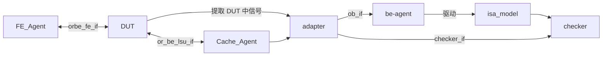

# DUT 验证架构流程

> 在 VS Code 中按 `Ctrl+K V` 打开侧边预览即可看到渲染后的图。

## 接口说明

| 接口名 | 方向 | 说明 |
|---|---|---|
| `orbe_fe_if` | FE_Agent ↔ DUT | 双向 |
| `or_be_lsu_if` | DUT ↔ Cache_Agent | 双向 |
| `ob_if` | adapter → be-agent | |
| `checker_if` | adapter → checker | |
| `驱动` | be-agent → isa_model | 具体接口名待定 |
