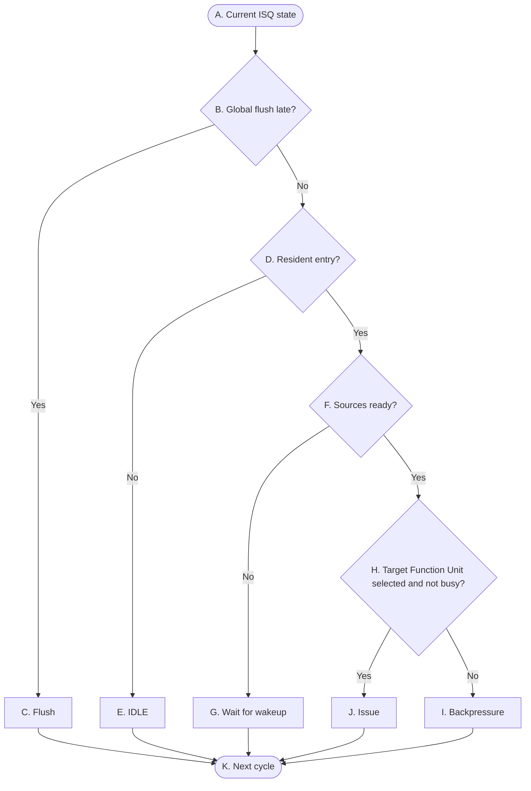

# OR_BE P2 Control Flow

## Reading conventions

- The diagram shows only the control-state skeleton. Signal meaning and state transitions are defined in the tables below.
- Decisions are combinational; resident-state changes take effect at the active edge and are visible in the next cycle.
- `global_flush_late` has priority over all P2 issue, capture, release, and refill behavior.

## P2 — Group-local issue control

The graph intentionally does not create separate branches for every wakeup-capture case. A Bypass hit is part of the source-readiness and resident-state controls described in the tables below. It may make a source ready for the current evaluation, or be captured at the active edge while the entry remains resident.

## 表 A — 转换条件（菱形）

菱形节点表示组合判断。每一行明确当前判断节点、判断信号及其两条状态转换路径。

| 节点 | 判断信号 | 归属模块 | 判断含义 |
|---|---|---|---|
| `B` | `global_flush_late` | `Flush_model` → `ISQ` | 本周期是否存在晚期 flush；优先级高于所有 P2 行为。 | 
| `D` | `ISQ当前entry是否非空` | `ISQ` | 是否持有此前 active edge 写入且仍驻留的 entry。 |
| `F` | `ISQ的rs都ready` | `ISQ` | resident entry 的全部 source 本周期是否可用，包括本周期 Bypass 命中。 |
| `H` | `FU是否busy` | `FU` → `ISQ` | ISQ 指向的 FU 本周期能否接收 entry。 |

## 表 B — 状态与动作（矩形 + 圆角）
| 节点 | State | 归属模块 | 本周期组合动作 | Description |
|---|---|---|---|---|
| `A` | Current State | `ISQ` | 无；本节点只是入口。 | 状态不变。 |
| `C` | Flush | `ISQ` | 本周期不产生 issue、wakeup capture、release、refill。 | flush=1 清除 resident entry，下一周期该 group的 ISQ 从空闲 ISQ 状态重新开始。 |
| `E` | IDLE | `ISQ` → `DSP` | 向 DSP 表示本组 slot 空闲，可作为 P1 dispatch 目标。 | 若 P1 在本周期接受新的 dispatch entry，该 entry 在 active edge 写入 ISQ，下一周期成为 resident entry；若没有接受新的 entry，slot 下一周期继续保持空闲。 |
| `G` | Wait for wakeup | `P3 Bypass CDB` → `data_select_mux2` | 不发起 issue；命中的 Bypass 数据经 mux2 选出，使未 ready 的 source 在当前周期可用于 resource wait_tag 与 Bypass CBD 中的 Bypass tag进行比较。 | 若本周期 entry 因为resource !ready 导致不能 issue，从Bypass CDB 命中的 source 在 active edge 被捕获并标记 rsx 为 ready，当前 entry 继续驻留；下一周期重新检查 source readiness。 |
| `I` | Backpressure | `ISQ` | 本周期不发起 issue，目标 FU 不接收当前 entry。 | 当前 entry 继续由 ISQ 持有，slot 不释放，ownership 不变；下一周期重新检查目标是否可以接收。 |
| `J` | Issue | `ISQ` → FU、`ISQ` → `DSP` | 目标 FU 在本周期接收当前 entry；ISQ issue 与 ISQ release 在同一控制动作中同步完成。 | active edge 释放当前 resident entry；如果 P1 同周期也接受了新的 entry，则新 entry 在同一 edge 写入该 slot，并在下一周期成为 resident entry；否则该 slot 下一周期为空闲。 |
| `K` | Next Cycle | - | - | - |