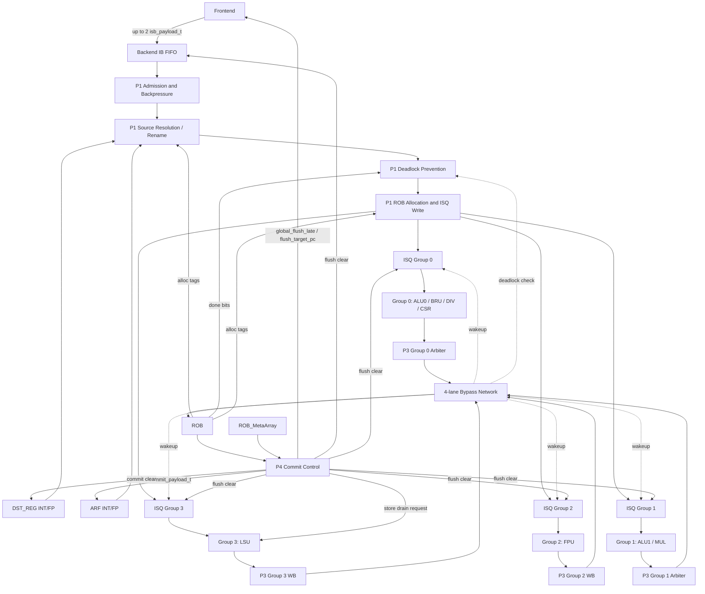

# Module: OR_BE Core Backend

## 1. Revision

| Revision | Change Note | Author | Date |
|---|---|---|---|
| V0.7 | Independent RTL re-audit fixes: Section 4 diagram ROB->P1D edge no longer carries alloc tags (now routed to P1R/P1W per RTL wiring); renamed `rob_metaarray_entry_t` to `sidearray_entry_t` in Section 8.1; Section 9.8 cross-reference now cites `DEFINITIVE_SPEC.md` Section 2.5 (commit) alongside 2.2.5 (allocation) | Claude / OR_BE team | 2026/07/08 |
| V0.6 | Documented empty-ROB interrupt deferral in Section 6.9 (no frontend-PC bypass), aligned with the normative rule added to `DEFINITIVE_SPEC.md` Section 5.2 | Claude / OR_BE team | 2026/07/06 |
| V0.5 | Noted the P4 `delay_younger_exception` CSR guard in Section 9.10, aligned with the RTL audit of the spec chain | Claude / OR_BE team | 2026/07/06 |
| V0.4 | Added `OR_BE_MAS.md` to the document split; fixed cross-references into `DEFINITIVE_SPEC.md` (5.4) and made `Interface_SPEC.md` references Part-qualified | Claude / OR_BE team | 2026/07/06 |
| V0.3 | Expanded Sub-Modules into a two-tier implementation-oriented description, with interface groups and state/lifecycle summaries for protocol-heavy blocks | Codex / OR_BE team | 2026/07/06 |
| V0.2 | Refined into a true HAS: high-level architecture, module responsibilities, and implementation-oriented summaries aligned to the canonical spec | Codex / OR_BE team | 2026/07/03 |
| V0.1 | Initial version for OR_BE backend RTL microarchitecture specification | Claude / OR_BE team | 2026/07/02 |

## 2. Contents

- [Module: OR_BE Core Backend](#module-or_be-core-backend)
  - [1. Revision](#1-revision)
  - [2. Contents](#2-contents)
  - [3. Overview](#3-overview)
    - [3.1 Document Role and Scope](#31-document-role-and-scope)
    - [3.2 Key Features](#32-key-features)
    - [3.3 Key Parameters](#33-key-parameters)
    - [3.4 Abbreviations](#34-abbreviations)
    - [3.5 Architectural Constraint Summary](#35-architectural-constraint-summary)
  - [4. Top-Level Block Diagram](#4-top-level-block-diagram)
  - [5. Pipeline Stages](#5-pipeline-stages)
  - [6. Architecture Flow](#6-architecture-flow)
    - [6.1 Instruction Admission and Dispatch Flow](#61-instruction-admission-and-dispatch-flow)
    - [6.2 Register Rename and Source Resolution Flow](#62-register-rename-and-source-resolution-flow)
    - [6.3 Issue and Operand Wakeup Flow](#63-issue-and-operand-wakeup-flow)
    - [6.4 Execute and Writeback Flow](#64-execute-and-writeback-flow)
    - [6.5 In-Order Commit Flow](#65-in-order-commit-flow)
    - [6.6 Branch Mispredict and Exception Recovery Flow](#66-branch-mispredict-and-exception-recovery-flow)
    - [6.7 Store Drain Flow](#67-store-drain-flow)
    - [6.8 CSR Serialization Flow](#68-csr-serialization-flow)
    - [6.9 Interrupt Handling Flow](#69-interrupt-handling-flow)
    - [6.10 Execution Timing / Latency Model](#610-execution-timing--latency-model)
  - [7. Pipeline Structure](#7-pipeline-structure)
    - [7.1 P0: Backend IB and Frontend Boundary](#71-p0-backend-ib-and-frontend-boundary)
    - [7.2 P1: Dispatch, Rename and Allocation](#72-p1-dispatch-rename-and-allocation)
    - [7.3 P2: Issue, Operand Select and Execute](#73-p2-issue-operand-select-and-execute)
    - [7.4 P3: Writeback, Bypass and Metadata Capture](#74-p3-writeback-bypass-and-metadata-capture)
    - [7.5 P4: Commit and Late Flush](#75-p4-commit-and-late-flush)
  - [8. Data Structure && Flow](#8-data-structure--flow)
    - [8.1 Data Structures](#81-data-structures)
    - [8.2 Instruction Data Path](#82-instruction-data-path)
    - [8.3 Register Dependency Data Path](#83-register-dependency-data-path)
    - [8.4 Bypass and Wakeup Data Path](#84-bypass-and-wakeup-data-path)
    - [8.5 Recovery Metadata Data Path](#85-recovery-metadata-data-path)
  - [9. Sub-Modules](#9-sub-modules)
    - [9.1 backend_top](#91-backend_top)
    - [9.2 typedefs / exe_subop_pkg](#92-typedefs--exe_subop_pkg)
    - [9.3 IB FIFO](#93-ib-fifo)
    - [9.4 P1 Dispatch, Rename and Allocation Modules](#94-p1-dispatch-rename-and-allocation-modules)
    - [9.5 ISQ](#95-isq)
    - [9.6 Functional Units](#96-functional-units)
    - [9.7 P3 Intra-Group Arbiter](#97-p3-intra-group-arbiter)
    - [9.8 ROB and ROB_MetaArray](#98-rob-and-rob_metaarray)
    - [9.9 ARF and DST_REG](#99-arf-and-dst_reg)
    - [9.10 P4 Commit Control](#910-p4-commit-control)
    - [9.11 CSR Control / CSR Unit](#911-csr-control--csr-unit)
    - [9.12 Fake LSU](#912-fake-lsu)
  - [10. Execution Group Organization](#10-execution-group-organization)
    - [10.1 Group 0: ALU0 / BRU / DIV / CSR](#101-group-0-alu0--bru--div--csr)
    - [10.2 Group 1: ALU1 / MUL](#102-group-1-alu1--mul)
    - [10.3 Group 2: FPU](#103-group-2-fpu)
    - [10.4 Group 3: LSU](#104-group-3-lsu)
    - [10.5 Organization Comparison](#105-organization-comparison)

## 3. Overview

OR_BE is the out-of-order execution backend of the Orca core. It accepts up to two decoded instructions per cycle from the frontend-side instruction buffer, resolves register dependencies against architectural state and rename state, allocates ROB identities, and dispatches accepted instructions into one of four execution groups. Inside the out-of-order domain, instructions wait in distributed issue queues until operands become available from architectural state or the global bypass network.

The backend is organized around a clean split between speculative execution and precise retirement. Functional units execute out of order, publish results on per-group writeback lanes, and wake younger consumers through bypass. Architectural state moves forward only at in-order commit. Branch recovery, exceptions, interrupts, CSR side effects, and store visibility are all resolved at the commit boundary.

The backend baseline is:

```text
2-wide in-order dispatch
  -> 4-group out-of-order issue / execute
  -> 4-wide out-of-order writeback
  -> 2-wide in-order commit
```

### 3.1 Document Role and Scope

This file is the **high-level architecture specification (HAS)** for OR_BE.

Its job is to capture:
- the backend's overall organization
- the purpose and ownership of each major stage and sub-module
- the key architectural constraints that shape the RTL
- the high-level data/control paths that a generator or implementer must preserve

This file intentionally does **not** try to be the single source of truth for every corner rule.

Document split:
- `DEFINITIVE_SPEC.md`: canonical behavioral rules and non-ambiguous microarchitectural contracts
- `Interface_SPEC.md`: exact signals, payload fields, widths, and handshake meaning
- `OR_data&control_flow.md`: detailed data-path, control-path, timing, and recovery flow explanation
- `OR_BE_MAS.md`: per-module implementation detail aligned to the current RTL: instance names, state elements, field layouts, execution order, retry/hold behavior, and cycle-level wave tables

When this HAS summarizes a rule, the canonical interpretation still comes from `DEFINITIVE_SPEC.md`.

### 3.2 Key Features

- Dual-issue in-order dispatch from the backend-owned instruction buffer into the out-of-order domain
- Four execution groups: Group 0 for ALU0/BRU/DIV/CSR, Group 1 for ALU1/MUL, Group 2 for FPU, Group 3 for LSU
- Tag-based dependency tracking with a 16-entry ROB and split INT/FP rename state
- Split INT and FP architectural state through separate ARF and DST_REG structures
- Single-entry distributed issue queue per execution group
- Four-lane bypass network from group writeback winners to all ISQs and P1 stall logic
- Out-of-order execution and writeback with in-order commit for precise architectural state
- Commit-time Late Flush recovery for branch mispredicts, synchronous exceptions, and interrupts
- Separate `ROB_MetaArray` for precise PC and recovery metadata, keeping the ROB data array compact
- CSR serialization model that prevents younger instructions from observing speculative CSR state
- Conservative store-drain protocol that prevents speculative stores from becoming architecturally visible

### 3.3 Key Parameters

| Parameter | Value | Description |
|---|---:|---|
| `XLEN` | 64 | Integer data path width |
| `FLEN` | 64 | Floating-point data path width |
| `ROB_DEPTH` | 16 | Number of ROB entries |
| `TAG_W` | 4 | ROB tag width |
| `REG_ADDR_W` | 5 | Register index width for 32 logical registers |
| `EXE_TYPE_W` | 2 | Execution group select width |
| `EXE_SUBOP_W` | 6 | Group-local sub-operation select width |
| Dispatch width | 2 | Up to two instructions accepted from IB per cycle |
| Writeback width | 4 | One result lane per execution group per cycle |
| Commit width | 2 | Up to two instructions retire in order per cycle |
| INT DST_REG | 32 x `{busy, tag}` | 4 read ports; persistent state implemented as DFF array |
| FP DST_REG | 32 x `{busy, tag}` | 3 read ports; FP destination allocation limited by dispatch policy |
| INT ARF | 32 x 64-bit | Integer architectural register file |
| FP ARF | 32 x 64-bit | Floating-point architectural register file |

### 3.4 Abbreviations

| Term | Meaning |
|---|---|
| ARF | Architectural Register File |
| BRU | Branch Resolution Unit |
| CSR | Control and Status Register |
| DST_REG | Destination Register Status Table / Rename Status Table |
| FU | Functional Unit |
| IB | Instruction Buffer |
| ISQ | Issue Queue |
| LSU | Load/Store Unit |
| OoO | Out-of-Order |
| ROB | Reorder Buffer |
| WB | Writeback |

Terminology note: this document uses **IB** as the architectural term for the frontend-to-backend instruction buffer. Some RTL payload and signal names still preserve the historical code naming `isb_*`.

### 3.5 Architectural Constraint Summary

The following constraints shape the backend and should be treated as design-level invariants:

- Dispatch is in order: `slot1` never bypasses a blocked `slot0`
- Commit is in order: `head1` never commits or flushes ahead of a blocked `head0`
- ROB is an ordering structure, not an operand-forwarding source
- Fast producer-to-consumer communication happens through the 4-lane bypass network
- The backend uses split INT/FP architectural state and split INT/FP rename state
- `ROB_MetaArray` holds precise PC and recovery metadata; ROB itself does not own that role
- CSR instructions serialize younger dispatch across their lifetime
- Stores do not become architecturally visible until the commit boundary authorizes and completes drain
- `Global_Flush_Late` is the backend recovery boundary for speculative state

## 4. Top-Level Block Diagram



## 5. Pipeline Stages

| Stage | Name | Main Function | Ownership |
|---|---|---|---|
| P0 | IB / frontend boundary | Buffer frontend payloads and expose up to two head instructions | Frontend/backend admission boundary |
| P1 | Dispatch / rename / allocation | Decide admission, resolve dependencies, allocate ROB tags, write ISQ | In-order control and rename boundary |
| P2 | Issue / execute | Select ready ISQ entries and launch FUs | Dynamic scheduling and execution |
| P3 | Writeback / bypass | Arbitrate same-group completions and publish results | Completion, wakeup, metadata capture |
| P4 | Commit / recovery | Retire ROB head entries and trigger precise recovery | Architectural state boundary |

## 6. Architecture Flow

### 6.1 Instruction Admission and Dispatch Flow

P0 exposes up to two oldest valid instructions from the backend IB to the P1 dispatch logic. Dispatch stays strictly in order: `slot0` is evaluated first, and `slot1` only proceeds when `slot0` is accepted. P1 then checks ROB availability, execution-group admission, and policy constraints before writing accepted work into the per-group ISQs.

At the HAS level, the important point is that the frontend/backend boundary is elastic, but the admission into the out-of-order domain is still governed by an in-order control discipline.

### 6.2 Register Rename and Source Resolution Flow

P1 resolves each source operand against split INT/FP rename state and split INT/FP architectural state. Ready operands are captured from the ARF at dispatch time; unresolved operands enter the ISQ as wait-tag dependencies. Same-cycle rename and same-cycle commit visibility exist so the backend does not depend on implementation-specific register-file read-after-write behavior.

The key architectural idea is that OR_BE tracks producers by ROB tag, not by speculative copies of architectural state.

### 6.3 Issue and Operand Wakeup Flow

Each execution group has a single-entry ISQ that snoops all bypass lanes. An entry may issue when its required operands are available, its selected FU can accept work, and no recovery event blocks launch. Wakeup is bypass-driven, allowing a dependent instruction to become ready as the producer completes.

The HAS-level takeaway is that dynamic scheduling is distributed and lightweight: one queue per group, one bypass lane per group, and tag-based wakeup rather than a centralized scheduler.

### 6.4 Execute and Writeback Flow

Within each group, `exe_subop` selects the local FU. Functional units execute independently and may complete in the same cycle. If multiple FUs in a group complete together, the group arbiter selects one writeback winner. That winner updates the ROB and drives the group's bypass lane.

This gives OR_BE a simple physical organization: scheduling is per-group, writeback is one lane per group, and cross-group communication happens through the shared bypass network.

### 6.5 In-Order Commit Flow

P4 observes ROB head entries in program order and is solely responsible for advancing architectural state. Commit updates ARF state, clears matching rename mappings, applies commit-time side effects such as CSR state update, and decides whether recovery must be triggered.

The architectural boundary is therefore explicit: speculation ends at P4, not earlier.

### 6.6 Branch Mispredict and Exception Recovery Flow

Branch mispredicts and synchronous exceptions are detected during execution, recorded during completion, and recovered only when the responsible instruction reaches the commit boundary. Precise redirect and trap metadata come from `ROB_MetaArray`, not from the ROB result array.

This separation is a defining structural choice of OR_BE: the ROB tracks ordering and retire-state, while `ROB_MetaArray` carries precise control-flow recovery context.

### 6.7 Store Drain Flow

Stores execute and become buffered before they become architecturally visible. When a store reaches the ROB head, P4 coordinates drain authorization with the LSU side. Only after drain completion can that store retire architecturally.

This conservative policy keeps precise recovery simple by avoiding speculative external memory visibility.

### 6.8 CSR Serialization Flow

CSR instructions act both as normal ROB producers and as serialization barriers. They may compute a temporary destination-register result during execution, but architectural CSR state changes are deferred until commit. While a CSR is in flight, younger dispatch remains blocked.

This keeps CSR state precise without introducing speculative CSR forwarding or renaming.

### 6.9 Interrupt Handling Flow

External interrupts are handled at the commit boundary only, after the same-cycle head commit/flush decision has been evaluated. Interrupt entry uses committed architectural state and the next architectural PC after any older same-cycle commits. If the backend is empty, the interrupt simply remains pending until the next instruction reaches the commit boundary; there is no frontend-PC bypass for interrupt entry.

From the HAS point of view, interrupts are part of the same precise retirement/recovery framework as other architectural redirects.

### 6.10 Execution Timing / Latency Model

This section captures the current RTL-visible execution timing model at a summary level. These are implementation-status notes, not the canonical source of behavioral legality rules.

| Path / FU | Current model | Notes |
|---|---|---|
| ALU / BRU | 1-cycle execute, registered writeback | `alu_simple.sv` produces `wb_payload` on the cycle after `en` |
| CSR | 1-cycle execute, registered writeback | `csr_unit.sv` writes back on the cycle after `en` |
| FPU | 1-cycle execute, registered writeback | current `fpu_simple.sv` model |
| MUL | 2-cycle latency to writeback | multi-cycle retry-capable unit |
| DIV | 3-cycle latency to writeback | multi-cycle retry-capable unit |
| LSU Load | 2-cycle execution path | AGU/address stage plus return stage in current model |
| LSU Store execute-to-buffered | 2-cycle execution path | reports completion after store buffering |
| Store drain | Configurable, default 5 cycles in current testbench | implementation model parameter, not architectural invariant |

## 7. Pipeline Structure

### 7.1 P0: Backend IB and Frontend Boundary

P0 owns the backend-side instruction buffer and isolates frontend delivery from backend stalls. It is the point where decoded frontend payloads become backend-visible work candidates.

### 7.2 P1: Dispatch, Rename and Allocation

P1 is the main combinational control boundary. It owns dispatch admission, source resolution, rename interpretation, ROB tag assignment, and ISQ payload formation. P1 does not retain long-lived instruction state; accepted instructions become ROB/ISQ entries, and rejected instructions remain in IB.

### 7.3 P2: Issue, Operand Select and Execute

P2 begins at the ISQ entries. It owns readiness evaluation, selected-FU gating, operand selection from stored data or bypass, and FU launch.

### 7.4 P3: Writeback, Bypass and Metadata Capture

P3 owns per-group completion arbitration, ROB result publication, bypass publication, and completion-time side metadata capture such as CSR pending state and flush metadata updates.

### 7.5 P4: Commit and Late Flush

P4 is the architectural commit and precise recovery controller. It owns in-order retirement, commit-side state updates, store-drain coordination, and generation of global recovery controls.

## 8. Data Structure && Flow

### 8.1 Data Structures

This HAS names the major payload and state structures by role. Exact field lists, widths, and handshake semantics belong in `Interface_SPEC.md`.

#### `isb_payload_t`

Frontend-to-backend instruction payload carrying decode results, source/destination register identities, immediate context, and branch prediction context.

#### `isq_payload_t`

Dispatch-to-issue payload carrying ROB identity, execution context, source readiness state, source wait tags, and any group-relevant execution metadata.

#### `result_payload_t`

Completion payload carrying result identity, value, and completion status needed for ROB writeback, bypass, and recovery metadata capture.

#### `commit_payload_t`

Commit-side payload carrying the architectural writeback information produced by P4.

#### `sidearray_entry_t`

Per-tag precise control-flow metadata used for flush recovery, trap PC/cause handling, and other commit-time precise-PC needs.

### 8.2 Instruction Data Path

```text
Frontend
  -> IB FIFO
  -> P1 admission / rename / allocation
  -> per-group ISQ
  -> FU execution
  -> ROB / bypass publication
  -> P4 commit
  -> ARF / CSR architectural state
```

### 8.3 Register Dependency Data Path

```text
Source register index
  -> INT/FP DST_REG lookup
  -> ready path: INT/FP ARF read
  -> not-ready path: producer wait tag
  -> ISQ wait state
  -> bypass wakeup
  -> P4 tag-matched DST_REG cleanup
```

The important architectural rule is that ROB is not a data-forwarding source; fast producer-to-consumer communication happens through bypass and commit-time visibility.

### 8.4 Bypass and Wakeup Data Path

```text
FU completion
  -> group arbitration
  -> bypass lane valid/tag/data
  -> all ISQs compare wait tags
  -> ready operands issue or latch wakeup
  -> P1 late-dispatch stall logic observes same-cycle overlap
```

### 8.5 Recovery Metadata Data Path

```text
P1 allocation
  -> ROB_MetaArray[tag].inst_pc initialized

Flush-causing completion
  -> ROB_MetaArray[tag] flush metadata updated

P4 selected recovery
  -> ROB_MetaArray[flush_tag] read
  -> redirect / trap state generated
```

## 9. Sub-Modules

This section uses two description depths:

- **Tier 1** modules receive a responsibility and interface-group summary. These blocks are primarily combinational, fixed-latency, or simple storage wrappers whose behavior is better specified by `Interface_SPEC.md`.
- **Tier 2** modules receive an expanded implementation-oriented summary: role, sub-structure, interface groups, state/lifecycle summary, key timing/protocol notes, and cross-references. A "state/lifecycle" summary may describe coordinated architectural state rather than a locally encoded FSM.

The expanded Tier 2 treatment is used only for modules whose retained state, recovery role, or handshake protocol materially affects precise architectural behavior.

### 9.1 backend_top

`backend_top.sv` is the integration shell for the backend. It instantiates the IB, P1 control modules, ISQs, FUs, ROB, `ROB_MetaArray`, ARF, DST_REG, CSR control, and P4 commit control.

Its interface groups are the frontend enqueue boundary, external FU/LSU/CSR connections, architectural recovery outputs, and store-drain sideband. It owns wiring and top-level steering only; ownership of protocol meaning remains in the leaf modules described below.

### 9.2 typedefs / exe_subop_pkg

`typedefs.sv` defines global parameters and cross-stage payload structures. `exe_subop_pkg.sv` defines group-local operation encodings and helper decode functions.

These files have no runtime state. The key architectural rule is that `exe_subop` is interpreted only after `exe_type` selects the execution group.

### 9.3 IB FIFO

The IB FIFO buffers frontend instructions before backend dispatch. It preserves order, exposes the oldest two entries to P1, accepts up to two frontend entries, and removes entries only when P1 reports accepted dispatch work.

Its interface groups are frontend enqueue, P1 dequeue/head observation, occupancy/backpressure, and late-flush clear. It does not own rename, ROB allocation, or execution-group policy.

### 9.4 P1 Dispatch, Rename and Allocation Modules

P1 is implemented as a set of Tier 1 combinational modules. The stage does not retain long-lived instruction state; accepted work moves into ROB/ISQ state, and rejected work remains in the IB.

#### `p1_admission_and_backpressure.sv`

Determines whether visible head instructions may enter the out-of-order domain in the current cycle.

Interface groups:
- IB-visible `slot0` / `slot1` payloads
- ROB availability and allocation credit
- ISQ occupancy plus same-cycle issue/refill visibility
- CSR serialization state
- per-slot dispatch permission, target group, and preliminary dequeue count

Key protocol notes:
- `slot1` is considered only when `slot0` is dispatchable.
- CSR dispatch is slot0-only, requires an empty ROB, and blocks slot1 in the same cycle.
- Shared integer ALU operations may steer to Group 0 or Group 1 according to available group capacity.
- FP dispatch observes the current one-FP-destination and FP-source-port dispatch limits.

#### `p1_source_resolution.sv`

Resolves sources into ready architectural values or producer-tag dependencies.

Interface groups:
- IB source register identities and source-use metadata
- INT/FP DST_REG lookup results
- INT/FP ARF read data
- slot0 same-cycle rename overlay for slot1 source resolution
- P4 commit payload overlay for same-cycle architectural visibility
- resolved ready/data/tag triples for P1 allocation and ISQ payload formation

Key protocol notes:
- Sources are resolved against the newest in-flight producer tag when the corresponding DST_REG entry is busy.
- Ready sources capture ARF or same-cycle commit-overlay data at dispatch time.
- Slot1 must observe slot0's same-cycle destination rename when both instructions dispatch together.

#### `p1_deadlock_prevention.sv`

Prevents consumers from entering the machine too late to observe required wakeup behavior. This block is still Tier 1 because it is pure combinational logic, but it has protocol-critical timing rules.

Interface groups:
- resolved source ready/tag state from P1 source resolution
- four-lane bypass bus from P3
- flat ROB done sidevector
- P4 same-cycle commit payloads
- LSU AGU early-wakeup exemption tag
- per-slot stall outputs

State / lifecycle summary:
- N/A. The module has no retained state or local FSM.

Key timing / protocol notes:
- **Condition A: bypass overlap.** If a waiting source tag is broadcasting on bypass in the current cycle, P1 stalls the consumer because a newly inserted ISQ entry would arrive too late to consume that one-cycle bypass pulse.
- **Condition B: data stuck in ROB.** If `ROB.done[wait_tag]` is already set and that exact tag is not committing in the same cycle, P1 stalls the consumer because ROB is not an operand-forwarding source.
- **Condition C: LSU early-wakeup exemption.** If the waiting tag matches `agu_early_tag`, the Condition A/B stall is suppressed so load-dependent consumers may enter the machine under the LSU predictive wakeup protocol.
- A same-cycle P4 commit of the matching tag suppresses Condition B because the commit overlay makes the architectural value visible to P1.
- The implementation does not count an abstract number of "late" cycles. It detects concrete timing windows: same-cycle bypass overlap and post-bypass pre-commit ROB residency.

#### `p1_rob_allocation_and_isq_write.sv`

Forms final dispatch payloads, drives ROB allocation intent, updates rename state, and writes accepted work into ISQs.

Interface groups:
- per-slot admission and stall decisions
- source-ready/data/tag results from P1 source resolution
- ROB allocation tags
- dispatch payload outputs to per-group ISQs
- destination allocation writes to INT/FP DST_REG
- CSR dispatch marking for CSR control
- `flush_late` kill input

Key protocol notes:
- `slot0_dispatch` is computed before `slot1_dispatch`; `slot1` never bypasses a blocked or stalled `slot0`.
- ROB allocation tags are assigned in program order: `slot0 = tail`, `slot1 = tail + 1`.
- Same-cycle late flush suppresses ROB allocation, DST_REG allocation, ISQ write, and IB dequeue.

### 9.5 ISQ

Each execution group has a single-entry ISQ. The ISQ stores one pending instruction, snoops all bypass lanes, persists operand wakeups, supports same-cycle refill after an older entry issues, and clears on recovery.

Its interface groups are P1 write, FU issue/busy, bypass wakeup, and late-flush clear. It does not perform age arbitration across entries because each group has only one entry.

### 9.6 Functional Units

#### ALU / BRU (`alu_simple.sv`)

Implements simple integer execution and control-flow resolution for Group 0. The current RTL is fixed-latency: it registers the result one cycle after `en`, reports no long-lived busy state, and clears its output on late flush.

#### MUL (`mul_simple.sv`)

**Role**

`mul_simple.sv` implements integer multiply-class operations for Group 1 and is a Tier 2 retry-capable FU. It must hold a completed result until the Group 1 P3 arbiter acknowledges that the result won the writeback lane.

**Sub-structure**

- combinational multiply datapath selected by `exe_subop`
- local countdown register for the current 2-cycle execution model
- retained result context: ROB tag, destination register metadata, and result data
- writeback payload generation while the retained result is waiting for acknowledgement
- late-flush clear path for all speculative local state

**Interface Groups**

- ISQ/FU launch: `en`, operands, `exe_subop`, destination metadata, self ROB tag
- P3 feedback: `ack` from the Group 1 arbiter
- output: `wb_payload` and `busy`
- recovery: `flush_late`

**State / Lifecycle Summary**

```text
Idle
  -> Execute countdown after en
  -> Writeback-hold when cnt reaches zero
  -> Idle only after P3 ack
  -> Idle immediately on late flush
```

**Key Timing / Protocol Notes**

- While in writeback-hold, `busy` remains asserted and the result is re-presented until `ack`.
- If `ALU1` and `MUL` complete in the same cycle, static Group 1 priority gives the writeback lane to `ALU1`; `MUL` retries later.
- The HAS does not promise fairness or anti-starvation for repeated same-group static-priority conflicts.
- `MUL busy` blocks only MUL-class launches, not ALU1 launches in the same execution group organization.

**Cross-reference**

Detailed writeback retry timing belongs in `OR_data&control_flow.md` Section 5. Exact payload fields and `ack` semantics belong in `Interface_SPEC.md`.

#### DIV (`div_simple.sv`)

**Role**

`div_simple.sv` implements integer divide/remainder-class operations for Group 0 and is a Tier 2 retry-capable FU. It must hold a completed result until the Group 0 P3 arbiter acknowledges that the result won the writeback lane.

**Sub-structure**

- combinational divide/remainder datapath selected by `exe_subop`
- local countdown register for the current 3-cycle execution model
- retained result context: ROB tag, destination register metadata, result data, exception flag, and exception cause
- writeback payload generation while the retained result is waiting for acknowledgement
- late-flush clear path for all speculative local state

**Interface Groups**

- ISQ/FU launch: `en`, operands, `exe_subop`, destination metadata, self ROB tag
- P3 feedback: `ack` from the Group 0 arbiter
- output: `wb_payload` and `busy`
- recovery: `flush_late`

**State / Lifecycle Summary**

```text
Idle
  -> Execute countdown after en
  -> Writeback-hold when cnt reaches zero
  -> Idle only after P3 ack
  -> Idle immediately on late flush
```

**Key Timing / Protocol Notes**

- While in writeback-hold, `busy` remains asserted and the result is re-presented until `ack`.
- If higher-priority Group 0 results complete in the same cycle, static priority selects `ALU0`, then `BRU`, then `CSR`, before `DIV`; `DIV` retries later.
- The HAS does not promise fairness or anti-starvation for repeated same-group static-priority conflicts.
- Divide-by-zero exception modeling is carried as normal result metadata and becomes precise only at P4 commit.
- `DIV busy` blocks only DIV-class launches, not ALU0/BRU/CSR launches in the same execution group organization.

**Cross-reference**

Detailed writeback retry timing belongs in `OR_data&control_flow.md` Section 5. Exact payload fields and `ack` semantics belong in `Interface_SPEC.md`.

#### FPU (`fpu_simple.sv`)

Implements floating-point execution for Group 2. The current RTL model is fixed-latency with registered writeback, no retry handshake, and no long-lived FU busy state.

#### CSR (`csr_unit.sv`, `csr_control.sv`)

CSR execution and CSR architectural side effects are described in Section 9.11. The short version is that `csr_unit.sv` computes the temporary destination-register result and side-effect candidate, while `csr_control.sv` tracks serialization and commit-time pending state.

#### LSU (`fake_lsu.sv`)

The backend-visible LSU behavior model is described in Section 9.12. The short version is that loads return through the normal result path, while stores first enter a store buffer and become architecturally visible only after P4-authorized drain.

### 9.7 P3 Intra-Group Arbiter

`p3_intra_group_arbiter.sv` selects one writeback winner when multiple FUs in a group complete in the same cycle. It is a Tier 1 combinational arbiter: it has no retained state and no fairness counter.

Static priorities:
- Group 0: `ALU0 > BRU > CSR > DIV`
- Group 1: `ALU1 > MUL`
- Group 2: FPU only
- Group 3: LSU only

Interface groups:
- FU completion payloads entering P3
- one winner payload per execution group
- acknowledgement signals for same-group retry-capable or ack-aware producers
- bypass and ROB writeback consumers downstream of the selected group payloads

Key protocol notes:
- Only the winning payload for each group is published to ROB and bypass.
- The arbiter itself does not provide anti-starvation guarantees.
- FUs that require retry after losing arbitration must retain their result locally until their ack is asserted.

### 9.8 ROB and ROB_MetaArray

#### ROB (`rob.sv`)

**Role**

The ROB is the backend ordering structure. It tracks in-flight instruction validity, completion, result data, retire-side metadata, store-drain status, and the in-order commit window. It is explicitly not an operand-forwarding source.

**Sub-structure**

- 16-entry ring indexed by 4-bit ROB tags
- `head`, `tail`, and `full_flag` pointer state
- per-entry valid/done bits and retire metadata
- per-entry store state: buffered, drain-requested, drain-done
- flat `rob_done_bits` sidevector for P1 deadlock-prevention checks
- combinational `head0` / `head1` exposure for P4

**Interface Groups**

- P1 allocation: accepted-slot count, store classification, allocated tags, free-space status
- P3 writeback: four group result payloads plus store-buffered indication
- P4 commit: head observation and commit acknowledgement
- P4 recovery: pointer reset and `flush_head_adv`
- LSU store drain completion: done tag and optional exception indication
- P1 deadlock prevention: flat done sidevector

Primary responsibilities:
- allocate tags in program order
- accept per-group completion results
- expose head state to P4
- provide done-status visibility for dispatch stall logic
- advance or reset pointers under commit/recovery control

**State / Lifecycle Summary**

```text
Free entry
  -> Allocated / not done
  -> Done after P3 writeback
  -> For stores: buffered -> drain requested -> drain done
  -> Retired by P4 commit_ack

Any live younger state
  -> discarded by late-flush pointer reset
```

**Key Timing / Protocol Notes**

- `alloc_tag_0 = tail` and `alloc_tag_1 = tail + 1`; the tail advances only for actually accepted dispatch slots.
- P4 may retire zero, one, or two head entries, but `head1` never retires ahead of a blocked `head0`.
- A store at the head does not commit until its `store_done` state is set by the LSU drain-completion path.
- On late flush, ROB pointers reset to `head + flush_head_adv`, preserving any older same-cycle commits and discarding younger speculative entries.
- `rob_done_bits` are visible as a sidevector so P1 can detect data stuck in ROB without consuming ROB data read ports.

**Cross-reference**

ROB allocation/commit contracts are canonical in `DEFINITIVE_SPEC.md` Sections 2.2.5 and 2.5 and `OR_data&control_flow.md` Sections 3.5, 5.2, and 6. Exact fields are in `Interface_SPEC.md`.

#### ROB_MetaArray (`rob_sidearray.sv`)

`ROB_MetaArray` stores precise per-tag control-flow recovery metadata, including instruction PC and flush/trap context. Earlier documents used the name "ROB SideArray"; the architectural role is now described consistently as `ROB_MetaArray`.

Interface groups:
- P1 allocation initializes `inst_pc` and clears stale flush-valid state for newly allocated tags
- P3 writeback captures branch-mispredict and synchronous-exception metadata by result tag
- LSU store-drain exception capture writes exception metadata for the completed store tag
- P4 reads `flush_meta` by selected `flush_tag`
- late flush can bulk-clear valid metadata

Key protocol notes:
- ROB does not store precise PC metadata; `ROB_MetaArray[tag]` owns it.
- A tag's metadata entry is overwritten at allocation, so stale recovery metadata cannot survive tag reuse.
- Different groups may update different live tags in the same cycle because ROB tags are unique.

### 9.9 ARF and DST_REG

#### ARF (`arf.sv`)

The ARF stores committed architectural register values. OR_BE uses split INT and FP architectural files, read by P1 and written only by P4 commit payloads.

The ARF does not store speculative values. Same-cycle commit visibility for P1 is handled explicitly by P1 source-resolution overlay logic instead of relying on implementation-specific register-file read/write ordering.

#### DST_REG (`dst_reg.sv`)

DST_REG records whether a logical register has an in-flight producer and which ROB tag owns the newest speculative value. It is rename-status state, not speculative data storage.

Interface groups are P1 allocation writes, P1 source lookup reads, P4 tag-matched commit cleanup, and late-flush `clear_all_busy`. A commit clears a mapping only if the committing tag still matches the recorded producer tag, preserving younger WAW rename mappings.

### 9.10 P4 Commit Control

**Role**

`p4_commit_control.sv` is the precise retirement and recovery controller. It is the architectural boundary for register state, CSR side effects, store visibility, synchronous recovery, MRET redirects, and external interrupt entry.

**Sub-structure**

- head qualification logic for `head0` and `head1`
- normal commit-count selection
- CSR readiness and CSR retire/write control
- FP retire side-effect aggregation
- store-drain request qualification
- recovery event selector for exception, branch mispredict, MRET, and interrupt
- cleanup-signal generation for ROB, ISQ/FU busy state, CSR trackers, and `ROB_MetaArray`

Primary responsibilities:
- inspect ROB heads in program order
- decide normal commit count
- coordinate store-drain qualification
- apply commit-side state updates
- select recovery events
- generate `global_flush_late`, redirect, pointer-reset, and cleanup controls

**Interface Groups**

- ROB head inputs: `head_ptr`, `head_plus_1`, `head0`, `head1`
- commit outputs: `commit_ack` and two `commit_payload_t` slots
- CSR tracker inputs and retire/write outputs
- FP retire side-effect output to CSR state
- external interrupt inputs and interrupt classification output
- store-drain request output to LSU
- recovery outputs: `global_flush_late`, `flush_head_adv`, `flush_tag`, `flush_kind`, and cleanup controls

**State / Lifecycle Summary**

P4 is primarily combinational in the current RTL, but it coordinates several architectural lifecycles:

```text
ROB head not done
  -> wait

ROB head done, normal instruction
  -> commit payload -> ARF/DST cleanup -> ROB retire

ROB head store instruction complete and buffered, drain incomplete
  -> P4 drain request -> wait for LSU store_done -> commit

ROB head branch mispredict or MRET
  -> commit the redirecting instruction -> late flush younger work

ROB head synchronous exception
  -> no commit for the excepting instruction -> late flush/trap entry

External interrupt at a ready boundary
  -> optional older same-cycle commit -> late flush/trap entry
```

**Key Timing / Protocol Notes**

- `head1` cannot commit, flush, or request drain ahead of a blocked `head0`.
- A `head1` exception behind a committing `head0` CSR is deferred one cycle; only the CSR commits in that cycle (`delay_younger_exception` guard).
- Store drain request is not a commit. The store remains at the ROB head until the LSU returns store-done status.
- If a late flush is selected, P4 cancels any same-cycle store-drain request and emits cleanup controls in the same cycle as `global_flush_late`.
- `flush_head_adv` encodes how many older instructions are preserved before younger speculative state is discarded.
- Branch mispredict and MRET retire the redirecting instruction before flushing younger work; synchronous exceptions do not retire the excepting instruction.
- External interrupts are evaluated only at commit-ready boundaries and use committed CSR interrupt-enable state.

**Cross-reference**

Detailed recovery and store-drain timing belongs in `OR_data&control_flow.md` Sections 6-8. Exact recovery, commit, CSR, and store-drain signals belong in `Interface_SPEC.md`.

### 9.11 CSR Control / CSR Unit

**Role**

CSR handling is split between `csr_control.sv` and `csr_unit.sv`. Together they implement CSR execution, CSR serialization, pending side-effect capture, commit-time CSR architectural updates, trap-entry updates, MRET updates, the basic `mcycle` / `minstret` counters, and FP retire side effects.

**Sub-structure**

- `csr_control.sv`
  - in-flight CSR tracker: `csr_inflight_valid/tag`
  - pending CSR write buffer: `csr_pend_valid/tag/addr/wdata`
  - clear path for normal CSR retire and late flush
- `csr_unit.sv`
  - CSR file state such as `mstatus`, `mepc`, `mcause`, `mtvec`, `mie`, `mip`, `fcsr` fields, and the basic `mcycle` / `minstret` counters
  - CSR read/modify/write execution datapath
  - registered CSR result payload for the destination-register path
  - commit/trap/MRET/FP-retire architectural update paths

**Interface Groups**

- P1 dispatch serialization: CSR accept tag sets `csr_inflight_*`
- P3 completion capture: winning CSR result may allocate `csr_pend_*`
- P4 commit: CSR retire clears trackers and optionally applies `csr_pend_*` to the CSR file
- P4 recovery: exception/interrupt/MRET controls update trap/return CSR state
- P1 admission: `csr_inflight_valid` blocks younger dispatch
- global recovery: `clear_csr_trackers` removes speculative CSR tracking on late flush

**State / Lifecycle Summary**

This is a coordinated lifecycle, not a single local FSM:

```text
No CSR in flight
  -> P1 accepts one slot0 CSR when ROB is empty
  -> csr_inflight_valid/tag set
  -> CSR executes and writes temporary rd result through normal ROB path
  -> if it has a legal write side effect, P3 capture sets csr_pend_*
  -> P4 normal CSR commit applies pending write if needed
  -> csr_inflight and csr_pend clear

Any in-flight CSR
  -> late flush clears CSR trackers without CSR-file rollback
```

**Key Timing / Protocol Notes**

- A CSR may dispatch only from `slot0`, only when the ROB is empty, and only when no CSR is already in flight.
- Younger instructions may not dispatch while `csr_inflight_valid` is set.
- CSR execution may produce a temporary destination-register result early, but the architectural CSR file is updated only at P4 commit.
- `csr_pend_*` is allocated only for a CSR result that has `csr_write_enable=1` and no exception.
- If a CSR commits with `csr_write_enable=1`, the pending buffer must match the committing CSR tag.
- Flushed CSR work needs no CSR-file rollback because speculative CSR side effects are never applied before commit.

**Cross-reference**

CSR behavioral rules are canonical in `DEFINITIVE_SPEC.md` Section 5.4 and `OR_data&control_flow.md` Section 8.4. Exact CSR tracker and pending-buffer fields are in `Interface_SPEC.md` Part II Section 4A.

### 9.12 Fake LSU

**Role**

`fake_lsu.sv` provides the backend-facing LSU/L1D behavior model used for backend verification. It models load return, store buffering, store-to-load forwarding, optional load backpressure, predictive load wakeup, and P4-authorized store drain. It is not a production LSQ/TLB/cache implementation.

**Sub-structure**

- request/AGU stage for address generation and access exception detection
- return/writeback stage for load data or store-buffered completion
- store buffer entries with valid, tag, address, data, size, exception, draining, and drain-count state
- youngest-store match logic for store-to-load forwarding
- optional load backpressure model
- AGU early-wakeup output for P1 deadlock-prevention exemption
- drain controller for P4 store-drain requests and store-done responses

**Interface Groups**

- Group 3 issue/request: `req_valid`, `req_payload`, and `lsu_busy`
- result path: `lsu_wb` plus `lsu_store_buffered`
- P1 deadlock-prevention assist: `agu_early_tag_valid/tag`
- P4 store drain: `store_drain_req_valid/tag`
- ROB/P4 store completion: `store_done_valid/tag/exception/cause`
- configuration/debug: load-backpressure cycles, store-drain cycles, and STB debug outputs

**State / Lifecycle Summary**

```text
Load request
  -> AGU/address check
  -> optional store-to-load forwarding or memory read
  -> normal writeback/bypass result

Store request
  -> AGU/address check
  -> allocate store buffer entry
  -> report store-buffered completion to ROB
  -> wait at commit boundary
  -> P4 drain request
  -> draining countdown
  -> store_done response
  -> ROB commit or precise store exception
```

**Key Timing / Protocol Notes**

- Stores become buffered before they are architecturally visible.
- P4 may request drain only after the store is at the precise ROB commit boundary and already buffered.
- A drain request does not advance ROB commit by itself; it starts the external visibility step and the store commits only after `store_done`.
- Store buffer entries remain available for forwarding while drain is in progress.
- Store drain latency does not by itself backpressure unrelated loads.
- `agu_early_tag` allows selected load consumers to avoid the P1 "data stuck in ROB" stall under the predictive wakeup model.
- On late flush, speculative LSU pipeline state is cleared and store buffer entries associated with discarded speculative tags are removed; already-running committed drain state is preserved by the current model.
- If P4 requests drain for a tag not found in the store buffer, the current model reports a store-done exception rather than silently committing.

**Cross-reference**

Detailed LSU data/control flow belongs in `OR_data&control_flow.md` Section 7. Exact result payload, store-drain, and load-wakeup signals belong in `Interface_SPEC.md` Part II Sections 3, 5A, and 7.

## 10. Execution Group Organization

### 10.1 Group 0: ALU0 / BRU / DIV / CSR

Group 0 handles PC-sensitive, control-sensitive, and system-sensitive execution, plus one integer ALU path.

Members:
- ALU0: integer arithmetic/logical operations
- BRU: branch and jump resolution
- DIV: multi-cycle division
- CSR: CSR read/write execution and pending side-effect generation

### 10.2 Group 1: ALU1 / MUL

Group 1 provides additional integer throughput for simple ALU and multiply-class operations.

Members:
- ALU1: simple integer ALU operations
- MUL: multiply-class operations

### 10.3 Group 2: FPU

Group 2 is dedicated to floating-point execution. It has its own ISQ and writeback lane. FP rename and commit remain constrained by the split FP architectural/rename resource budget.

### 10.4 Group 3: LSU

Group 3 handles memory execution through the backend-visible LSU model.

Key properties:
- loads return through normal writeback and bypass
- stores are buffered before commit-side drain
- store drain completion is required before architectural store retirement
- load/store ordering behavior is intentionally conservative

### 10.5 Organization Comparison

| Group | Main Purpose | FU Members | Writeback Lane | Notes |
|---|---|---|---|---|
| Group 0 | Control-sensitive integer and system operations | ALU0, BRU, DIV, CSR | Lane 0 | PC/branch/CSR/division path; static arbitration required |
| Group 1 | Additional integer throughput | ALU1, MUL | Lane 1 | Simple ALU plus multiply throughput |
| Group 2 | Floating-point execution | FPU | Lane 2 | Dedicated FP lane |
| Group 3 | Memory execution | LSU | Lane 3 | Conservative memory ordering and store-drain protocol |
