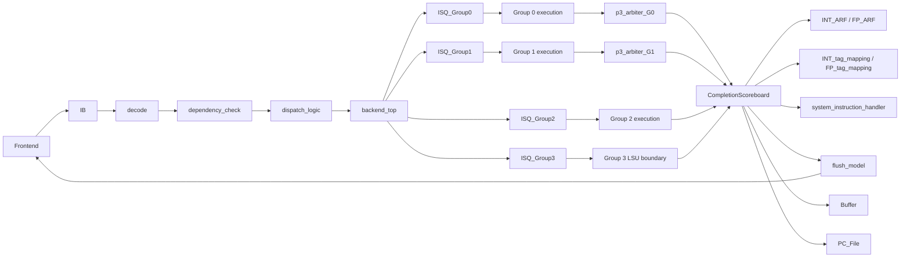

# Module: OR_BE Core Backend v3

## 1. Revision

| Revision | Change Note                                                                                                                                                                                                                                                 | Author              | Date       |
| -------- | ----------------------------------------------------------------------------------------------------------------------------------------------------------------------------------------------------------------------------------------------------------- | ------------------- | ---------- |
| V3.0     | Rebased the HAS on the v3 microarchitecture contract. Replaced the historical P1 implementation split and metadata presentation with public-module composition; added ISA support, payload boundaries, Static Info/Event ownership, and current P0-P4 flow. | Codex / OR_BE team  | 2026/08/31 |
| V0.7     | Independent RTL re-audit of allocation, completion metadata, and commit-side cross references                                                                                                                                                               | Claude / OR_BE team | 2026/07/08 |
| V0.6     | Documented empty-backend interrupt deferral and precise retirement behavior                                                                                                                                                                                 | Claude / OR_BE team | 2026/07/06 |
| V0.5     | Documented the P4 CSR serialization guard                                                                                                                                                                                                                   | Claude / OR_BE team | 2026/07/06 |
| V0.4     | Expanded the architecture document split and cross-reference rules                                                                                                                                                                                          | Claude / OR_BE team | 2026/07/06 |
| V0.3     | Expanded Sub-Modules into a two-tier implementation-oriented description, with interface groups and state/lifecycle summaries for protocol-heavy blocks                                                                                                     | Codex / OR_BE team  | 2026/07/06 |
| V0.2     | Refined into a true HAS: high-level architecture, module responsibilities, and implementation-oriented summaries aligned to the canonical spec                                                                                                              | Codex / OR_BE team  | 2026/07/03 |
| V0.1     | Initial version for OR_BE backend RTL microarchitecture specification                                                                                                                                                                                       | Claude / OR_BE team | 2026/07/02 |

## 2. Contents

- [Module: OR_BE Core Backend v3](#module-or_be-core-backend-v3)
  - [1. Revision](#1-revision)
  - [2. Contents](#2-contents)
  - [3. Overview](#3-overview)
    - [3.1 Document Role and Scope](#31-document-role-and-scope)
    - [3.2 Key Features](#32-key-features)
    - [3.3 Key Parameters](#33-key-parameters)
    - [3.4 Abbreviations](#34-abbreviations)
    - [3.5 Architectural Constraint Summary](#35-architectural-constraint-summary)
    - [3.6 ISA Support](#36-isa-support)
      - [3.6.1 RV64I](#361-rv64i)
      - [3.6.2 M Extension](#362-m-extension)
      - [3.6.3 A Extension](#363-a-extension)
      - [3.6.4 C Extension](#364-c-extension)
      - [3.6.5 F/D Extensions](#365-fd-extensions)
      - [3.6.6 SYSTEM and CSR](#366-system-and-csr)
      - [3.6.7 Illegal Instruction Rules](#367-illegal-instruction-rules)
  - [4. Top-Level Block Diagram](#4-top-level-block-diagram)
  - [5. Pipeline Stages](#5-pipeline-stages)
  - [6. Architecture Flow](#6-architecture-flow)
    - [6.1 Instruction Admission and Dispatch Flow](#61-instruction-admission-and-dispatch-flow)
    - [6.2 Register Rename and Source Resolution Flow](#62-register-rename-and-source-resolution-flow)
    - [6.3 Issue and Operand Wakeup Flow](#63-issue-and-operand-wakeup-flow)
    - [6.4 Execute and Writeback Flow](#64-execute-and-writeback-flow)
    - [6.5 In-Order Commit Flow](#65-in-order-commit-flow)
    - [6.6 Branch Mispredict and Exception Recovery Flow](#66-branch-mispredict-and-exception-recovery-flow)
    - [6.7 Store Drain Flow](#67-store-drain-flow)
    - [6.8 CSR Serialization Flow](#68-csr-serialization-flow)
    - [6.9 Interrupt Handling Flow](#69-interrupt-handling-flow)
    - [6.10 Execution Timing / Latency Model](#610-execution-timing--latency-model)
    - [6.11 ISA Decode and Dispatch Control](#611-isa-decode-and-dispatch-control)
    - [6.12 Payload and Schema Boundaries](#612-payload-and-schema-boundaries)
  - [7. Pipeline Structure](#7-pipeline-structure)
    - [7.1 P0: Backend IB and Frontend Boundary](#71-p0-backend-ib-and-frontend-boundary)
    - [7.2 P1: Dispatch, Rename and Allocation](#72-p1-dispatch-rename-and-allocation)
    - [7.3 P2: Issue, Operand Select and Execute](#73-p2-issue-operand-select-and-execute)
    - [7.4 P3: Writeback, Bypass and Metadata Capture](#74-p3-writeback-bypass-and-metadata-capture)
    - [7.5 P4: Commit and Late Flush](#75-p4-commit-and-late-flush)
  - [8. Data Structure && Flow](#8-data-structure--flow)
    - [8.1 Data Structures](#81-data-structures)
    - [8.2 Instruction Data Path](#82-instruction-data-path)
    - [8.3 Register Dependency Data Path](#83-register-dependency-data-path)
    - [8.4 Bypass and Wakeup Data Path](#84-bypass-and-wakeup-data-path)
    - [8.5 Recovery Metadata Data Path](#85-recovery-metadata-data-path)
    - [8.6 ISA Control Data Path](#86-isa-control-data-path)
    - [8.7 Static Info and Event Boundary](#87-static-info-and-event-boundary)
  - [9. Public Modules and Shared Packages](#9-public-modules-and-shared-packages)
    - [9.1 `backend_top`](#91-backend_top)
    - [9.2 ISA and Type Packages](#92-isa-and-type-packages)
    - [9.3 `IB`](#93-ib)
    - [9.4 P1 Decode, Dependency and Dispatch](#94-p1-decode-dependency-and-dispatch)
    - [9.5 `ISQ_Group0..3`](#95-isq_group03)
    - [9.6 Functional Units and LSU](#96-functional-units-and-lsu)
    - [9.7 P3 Completion Arbitration](#97-p3-completion-arbitration)
    - [9.8 `CompletionScoreboard`, `Buffer`, `PC_File`](#98-completionscoreboard-buffer-pc_file)
    - [9.9 `SerialInstructionTracker`](#99-serialinstructiontracker)
    - [9.10 `flush_model`](#910-flush_model)
    - [9.11 `system_instruction_handler`](#911-system_instruction_handler)
    - [9.12 HAS Scope](#912-has-scope)
  - [10. Execution Group Organization](#10-execution-group-organization)
    - [10.1 Group 0: ALU / BRU / CSR / DIV](#101-group-0-alu--bru--csr--div)
    - [10.2 Group 1: ALU / MUL](#102-group-1-alu--mul)
    - [10.3 Group 2: FPU](#103-group-2-fpu)
    - [10.4 Group 3: LSU Boundary](#104-group-3-lsu-boundary)
    - [10.5 Organization Comparison](#105-organization-comparison)

## 3. Overview

OR_BE is the out-of-order execution backend of the Orca core. It accepts up to two frontend instruction payloads per cycle, resolves register dependencies against architectural state and rename state, allocates completion tags, and dispatches accepted instructions into one of four execution groups. Inside the out-of-order domain, instructions wait in distributed issue queues until operands become available from architectural state or the global bypass network.

The backend is organized around a clean split between speculative execution and precise retirement. Functional units execute out of order, publish results on per-group writeback lanes, and wake younger consumers through bypass. Architectural state moves forward only at in-order commit. Branch recovery, exceptions, interrupts, CSR side effects, and store visibility are all resolved at the commit boundary.

The backend baseline is:

```text
2-wide in-order dispatch
  -> 4-group out-of-order issue / execute
  -> 4-wide out-of-order writeback
  -> 2-wide in-order commit
```

### 3.1 Document Role and Scope

This file is the high-level architecture specification (HAS) for the v3 OR_BE
backend. It fixes the backend-wide organization that is shared by all module
documents: supported ISA classes, stage ownership, public-module connections,
payload movement, and the architectural ordering/recovery rules.

The HAS is read together with the v3 specification set:

- `microarchitecture_v3.md` defines Event, Static Info, data-path, and control-path terms.
- `module_v3.md` is the mandatory per-module document skeleton.
- `module_composition_v3.md` defines module visibility and promotion rules.
- `integration-layer_v3.md` defines the public-module topology and composition ownership.
- Each public module document defines its local state, Event fire, payload, and Interface.

This document does not duplicate per-module fire equations or local storage
layouts. A HAS statement never overrides the owner module's Interface. RTL in
`work/rtl/rtl_v1` is the current implementation consistency reference; the v3
documents are the intended forward specification source. The no-Markdown-table
rule applies to individual `module_v3` documents; this HAS retains V0.7's
tables for parameters, stages, timing, and group comparison.

### 3.2 Key Features

- Two ordered candidate slots cross the FE-to-IB boundary each cycle. `slot1` is never admitted ahead of `slot0`.
- `IB` is an 8-entry, 2-lane instruction FIFO. It keeps frontend delivery elastic and presents up to two ordered instructions to Decode.
- Decode, dependency resolution, rename-state lookup, and dispatch admission are P1 combinational work. Their results are Static Info until a receiving storage owner captures an Event.
- Four independent one-entry issue queues hold work for G0, G1, G2, and G3. A group can accept a replacement at the same boundary where its resident entry issues.
- G0 serves integer ALU/branch, CSR, and divide; G1 serves integer ALU and multiply; G2 serves floating-point; G3 is the LSU boundary.
- A 16-tag completion/retirement domain supplies allocation identity, completion capture, four bypass lanes, and two-wide in-order retirement.
- INT and FP architectural state are separate in `INT_ARF` / `FP_ARF`; pending producers are tracked by `INT_tag_mapping` / `FP_tag_mapping`.
- Completion is out of order; architectural register, CSR, privilege, and memory-visible effects are applied only at the P4 commit boundary.
- A single commit-selected recovery action produces redirect, trap-state updates, and cancellation of younger speculative work through `flush_model`.
- Serial CSR/system work, store drain, and interrupt entry are all controlled at the same precise retirement boundary.

### 3.3 Key Parameters

| Parameter | Value | Description |
|---|---:|---|
| `XLEN` | 64 | Integer data path width |
| `FLEN` | 64 | Floating-point data path width |
| `ROB_DEPTH` | 16 | Completion-tag entry count |
| `TAG_W` | 4 | Completion tag width |
| `REG_ADDR_W` | 5 | Register index width for 32 logical registers |
| `NUM_LANES` | 4 | Execution-group and completion-lane count |
| `FU_GROUP_W` | 2 | FU index inside a selected execution group |
| `EXE_SUBOP_W` | 24 | Unified execution sub-operation encoding width |
| `FULL_DECODE_W` | 17 | Full decode control encoding width |
| `IB_DEPTH` | 8 | `IB` FIFO entry count |
| `IB_PTR_W` | 4 | `IB` pointer width: loop bit plus 3-bit entry index |
| Dispatch width | 2 | Up to two instructions accepted from IB per cycle |
| Writeback width | 4 | One result lane per execution group per cycle |
| Commit width | 2 | Up to two instructions retire in order per cycle |
| `INT_tag_mapping` | 32 x `{busy, tag}` | Integer pending-producer state; four read views across two slots |
| `FP_tag_mapping` | 32 x `{busy, tag}` | Floating-point pending-producer state; three shared read views selected across the two slots |
| `INT_ARF` | 32 x 64-bit | Integer architectural register file |
| `FP_ARF` | 32 x 64-bit | Floating-point architectural register file |

### 3.4 Abbreviations

| Term | Meaning |
|---|---|
| ARF | Architectural Register File |
| BRU | Branch Resolution Unit |
| CSR | Control and Status Register |
| Tag mapping | Per-architectural-register `{busy, tag}` pending-producer map |
| FU | Functional Unit |
| IB | Instruction Buffer |
| ISQ | Issue Queue |
| LSU | Load/Store Unit |
| OoO | Out-of-Order |
| CompletionScoreboard | Tag-ordered completion, allocation, commit, and recovery controller |
| WB | Writeback |

Terminology note: this document uses **IB** as the architectural term for the frontend-to-backend instruction buffer. Payload schemas and boundary names are defined by the individual module documents.

### 3.5 Architectural Constraint Summary

- Instruction admission and retirement preserve program order at their respective boundaries.
- Dynamic execution is distributed across four independent issue groups; retirement remains centralized and in order.
- Operand dependencies are tracked separately for integer and floating-point architectural state.
- Architectural state is updated only at retirement; speculative execution does not directly update committed state.
- Public modules own their local state and behavior. The top-level module only composes public contracts.
- Store execution, store authorization, and store retirement are separate stages.
- Recovery cancels younger speculative work without altering committed architectural state.
- Serial and privileged operations establish the ordering required by precise retirement.

### 3.6 ISA Support

The current RTL decode and execution classifiers support the following ISA families. Extension legality is controlled by `ENABLE_A`, `ENABLE_C`, `ENABLE_FD`, `ENABLE_U`, and `ENABLE_S` in `or_be_config_pkg`.

### 3.6.1 RV64I

- Integer register arithmetic: `ADD`, `SUB`, `SLL`, `SLT`, `SLTU`, `XOR`, `SRL`, `SRA`, `OR`, `AND`.
- Integer immediate arithmetic: `ADDI`, `SLTI`, `SLTIU`, `XORI`, `ORI`, `ANDI`, `SLLI`, `SRLI`, `SRAI`.
- Word operations: `ADDW`, `SUBW`, `SLLW`, `SRLW`, `SRAW`, and their immediate forms.
- Upper and PC-relative operations: `LUI`, `AUIPC`.
- Control flow: `JAL`, `JALR`, `BEQ`, `BNE`, `BLT`, `BGE`, `BLTU`, `BGEU`.
- Integer memory: `LB`, `LH`, `LW`, `LD`, `LBU`, `LHU`, `LWU`, `SB`, `SH`, `SW`, `SD`.
- Ordering: `FENCE`, `FENCE.I`.

### 3.6.2 M Extension

`MUL`, `MULH`, `MULHU`, `MULHSU`, `MULW`, `DIV`, `DIVU`, `REM`, `REMU`, `DIVW`, `DIVUW`, `REMW`, and `REMUW`.

### 3.6.3 A Extension

`LR.W`, `LR.D`, `SC.W`, `SC.D`, and AMO swap/add/xor/and/or/min/max/minu/maxu in `.W` and `.D` forms.

### 3.6.4 C Extension

Supported compressed families include arithmetic/immediate (`C.ADDI4SPN`, `C.ADDI16SP`, `C.ADDI`, `C.NOP`, `C.LI`, `C.LUI`, `C.ADDIW`, `C.SLLI`, `C.SRLI`, `C.SRAI`, `C.ANDI`), register arithmetic (`C.MV`, `C.ADD`, `C.SUB`, `C.AND`, `C.OR`, `C.XOR`, `C.ADDW`, `C.SUBW`), control flow (`C.J`, `C.JR`, `C.JALR`, `C.BEQZ`, `C.BNEZ`), and compressed load/store forms.

### 3.6.5 F/D Extensions

Supported floating-point families are:

- Arithmetic: `FADD`, `FSUB`, `FMUL`, `FDIV`, `FSQRT` in S/D forms.
- Fused multiply-add: `FMADD`, `FMSUB`, `FNMSUB`, `FNMADD` in S/D forms.
- Sign, min/max, compare, and classify: `FSGNJ`, `FSGNJN`, `FSGNJX`, `FMIN`, `FMAX`, `FEQ`, `FLT`, `FLE`, `FCLASS` in S/D forms.
- Move and convert: `FMV`, `FCVT` between `W/WU/L/LU` and `S/D`, plus `S<->D` conversion.
- Memory: `FLW`, `FLD`, `FSW`, `FSD`.

Dynamic rounding mode is resolved before dispatch and carried with the floating-point operation. The floating-point state must be enabled and reserved rounding modes are illegal.

### 3.6.6 SYSTEM and CSR

Supported system families are `CSRRW`, `CSRRS`, `CSRRC` and immediate forms, `ECALL`, `EBREAK`, `WFI`, `MRET`, `SRET`, and `SFENCE.VMA`. CSR architectural writes are applied only at the commit boundary.

### 3.6.7 Illegal Instruction Rules

RVC expansion failure, disabled extension use, unsupported sub-operation, reserved rounding mode, privilege violation, and fetch exception enter the illegal completion/recovery path. Illegal work is made completable through the G0 path and does not issue as a normal FU operation.

## 4. Top-Level Block Diagram



`backend_top` owns only composition and schema-preserving projections. Decode owns instruction interpretation; ISQ groups own entry state and issue; FU/LSU own execution; P4 modules own retirement and recovery.

## 5. Pipeline Stages

| Stage | Name | Main Function | Ownership |
|---|---|---|---|
| P0 | IB / frontend boundary | `IB` retains frontend instructions and exposes the oldest entries | FIFO state and enqueue/dequeue boundary |
| P1 | Decode / dependency / dispatch | Decode produces ISA information; dependency, register-state, and dispatch modules produce source and admission decisions | In-order control, rename and allocation boundary |
| P2 | ISQ / issue / execute | `ISQ_Group0..3` select ready entries and launch FU/LSU issue Events | Distributed scheduling and execution |
| P3 | Completion / bypass | FU results pass through `p3_arbiter_G0/G1` or fixed G2/G3 lanes | Completion and wakeup boundary |
| P4 | Commit / recovery | `CompletionScoreboard`, `Buffer`, `PC_File`, `flush_model` and system handler retire and recover | Architectural state boundary |

## 6. Architecture Flow

### 6.1 Instruction Admission and Dispatch Flow

The FE-to-IB boundary accepts an ordered prefix of at most two instructions.
IB decouples frontend delivery from backend stalls and exposes the oldest
resident instructions to Decode. Decode, dependency resolution, and dispatch
then form an ordered admission decision. The second candidate is considered
only after the first has been admitted.

`backend_top` composes each admitted instruction into the selected execution
group. A group accepts at most one new instruction in a cycle, while different
groups may accept simultaneously. The detailed handshake and payload schema
are defined by the owning module documents.

### 6.2 Register Rename and Source Resolution Flow

Decode supplies operand use and register-class information. Dependency
resolution consults the corresponding architectural register file and rename
map, and incorporates same-cycle commit and completion information. Ready
operands are passed into the issue-group entry; unresolved operands wait for
their producing completion tag.

The integer register path provides two source reads per instruction slot. The
floating-point path provides three shared reads; dispatch prevents a pair that
would require two simultaneous floating-point read groups. A same-cycle
slot-0 producer is handled as an ordered dependency for slot 1. Destination
rename state is recorded at allocation and cleared by tag-matched retirement;
integer register zero is excluded from integer destination updates.

### 6.3 Issue and Operand Wakeup Flow

Each issue group contains one resident entry and performs its own readiness,
operand wakeup, and issue decision. An entry waits until all required operands
and the selected execution member are available. Completion broadcasts may
wake an entry for immediate issue or may update the entry for a later cycle.

The four groups schedule independently after admission. A recovery action
clears resident speculative work and prevents a new issue in that cycle.

### 6.4 Execute and Writeback Flow

The selected group routes work to its local execution member. Group 0 and
Group 1 have multiple execution members and arbitrate their completion
requests; Groups 2 and 3 have direct completion paths.

Completion is published on four lane positions. Each valid lane is consumed by
the completion/retirement controller and the result buffer, and normal result
data is also broadcast for operand wakeup. Group-specific side information,
such as CSR effects or memory exceptions, remains aligned with its completion.
A completion that loses local arbitration remains pending until a later grant.

### 6.5 In-Order Commit Flow

`CompletionScoreboard` is the sole retirement authority. It tracks the live
completion-tag interval, records out-of-order completion, and examines entries
only from the program-order head. It retires up to two contiguous completed
instructions per cycle.

Retirement updates the integer or floating-point architectural register file,
clears the matching rename entry, applies accumulated floating-point status,
and updates commit-side architectural handlers. The result buffer supplies
the value associated with each retiring tag. The current implementation
defers a second same-cycle floating-point retirement when the architectural
floating-point write resource is occupied.

### 6.6 Branch Mispredict and Exception Recovery Flow

Branches, synchronous exceptions, returns, and instruction-cache fences are
recorded with their completing instruction. Recovery is selected only when
that instruction reaches the retirement boundary. `flush_model` translates
the selected recovery into a frontend redirect, a global speculative-state
flush, and any required trap-state update.

The recovery target comes from the recorded branch target, architectural return
PC, the fence instruction's next PC, or the selected trap vector. Recovery
metadata is read by tag. Committed state is preserved; IB, issue entries,
execution pipelines, serial tracking, and staged CSR intent are discarded.

### 6.7 Store Drain Flow

Group 3 separates memory issue, store authorization, LSU terminal completion,
and retirement. The LSU bridge holds requests and authorization until the
external LSU accepts them, and converts load results or memory exceptions into
the common completion path.

The completion controller authorizes stores only when the older ordered prefix
is safe. A store already waiting in the issue group receives in-place
authorization; a store already accepted by the bridge receives a tagged
wakeup. Store visibility still requires terminal completion followed by
in-order retirement. Recovery cancels outstanding bridge work.

### 6.8 CSR Serialization Flow

CSR, return, fence, and atomic classes are serialized by P1 and the serial
tracker. A serialized instruction enters only when the retirement window is
empty and blocks younger admission until it retires or is discarded by
recovery.

CSR execution occurs in Group 0. The CSR unit computes the instruction result
and a pending architectural update. The system handler stages that update and
applies it only at matching retirement. A recovery clears the staged update;
architectural CSR, privilege, floating-point status, and counter state are
never changed speculatively.

### 6.9 Interrupt Handling Flow

The system handler derives interrupt eligibility from external interrupt
levels, delegation, current privilege, and architectural enable state. The
completion controller samples that decision only at a retirement boundary.

An interrupt does not bypass the backend. If the head is recoverable, it is
discarded at the interrupt boundary. A completed, non-exception store or atomic
operation must retire first; an already-authorized ordinary store also delays
interrupt entry. If no valid boundary is available, the interrupt remains
pending. The handler then records trap state and supplies the selected trap
vector through the normal recovery path.

### 6.10 Execution Timing / Latency Model

This is the current execution timing summary. Exact fire, hold, and cancel
rules belong to the owning module documents. External LSU response latency is
protocol-dependent.

| Producer path               | Earliest completion behavior                                  | Backpressure / hold rule                                                |
| --------------------------- | ------------------------------------------------------------- | ----------------------------------------------------------------------- |
| `alu_simple` ALU/BRU/system | registered completion one cycle after accepted issue          | holds completion until G0 arbiter grant                                 |
| `csr_unit`                  | registered completion one cycle after accepted issue          | holds completion/CSR sideband until G0 arbiter grant                    |
| `mul_simple`                | fixed delayed completion after the two-step local countdown   | remains busy and holds completion until G1 arbiter grant                |
| `div_simple`                | fixed delayed completion after the three-step local countdown | remains busy and holds completion until G0 arbiter grant                |
| `fpu_simple`                | registered lane-2 completion one cycle after issue            | one outstanding operation; lane-2 bypass derives from that result       |
| `g3_lsu_iface`              | on LSU terminal `done` or exception response                  | issue waits for LSU ready; terminal response is external-protocol timed |
| G0/G1 arbitration           | same-cycle selection of requester completion                  | a losing requester preserves its completion until a later grant         |

Recovery suppresses speculative producer actions for the recovery cycle and
clears their in-flight work. A timing change belongs to the owning execution
module and its completion consumers.

### 6.11 ISA Decode and Dispatch Control

`decode` is responsible for instruction interpretation, operand classification,
immediate formation, execution classification, memory attributes, serial
classification, and illegal-instruction classification. Compressed-instruction
handling is part of Decode's internal implementation and is invisible to the
rest of the backend.

`dependency_check` resolves the source operands against architectural and
speculative producer state. `dispatch_logic` combines the decoded instruction,
dependency state, resource availability, floating-point status, serial policy,
and recovery state to select admission and execution-group placement. The
receiving modules own allocation, rename, issue-queue capture, and serial-state
updates.

### 6.12 Payload and Schema Boundaries

The backend data contracts are divided into five architectural boundaries:

1. frontend instruction data enters and is retained by IB;
2. IB presents instruction data to Decode;
3. P1 forms execution work for one of the four issue groups;
4. execution groups publish completion data and wakeup information;
5. P4 consumes completion data for retirement and recovery.

The exact payload schema, width, cardinality, and timing are defined by the
owning module Interface. FIFO reads are continuous data views; dequeue changes
FIFO position and does not initiate a separate payload transfer.

## 7. Pipeline Structure

### 7.1 P0: Backend IB and Frontend Boundary

P0 is the frontend-facing instruction-buffer boundary. `IB` is an 8-entry,
2-lane FIFO that absorbs frontend backpressure and presents instructions in
program order to Decode. It owns only FIFO retention, ordering, and recovery
clearing; ISA interpretation, dependency resolution, and execution-group
selection belong to later stages.

### 7.2 P1: Dispatch, Rename and Allocation

P1 is the ordered preparation stage. Decode classifies instructions;
`dependency_check` resolves source availability; the ARFs and tag maps provide
architectural and rename state; `dispatch_logic` performs admission and
execution-group routing. `backend_top` composes the resulting public
contracts. Accepted work is captured by the completion/retirement domain,
rename state, serial tracker, and selected issue group. Rejected work remains
in IB for a later attempt.

### 7.3 P2: Issue, Operand Select and Execute

P2 is the distributed scheduling and execution stage. Each `ISQ_Group` holds
one instruction until its operands and execution member are ready, then
launches the operation. The four groups may issue independently, while each
group preserves its own resident entry until issue or recovery.

### 7.4 P3: Writeback, Bypass and Metadata Capture

P3 is the completion fan-in stage. Group 0 and Group 1 arbitrate competing
execution members; Groups 2 and 3 provide direct completion paths. Completion
data is delivered to the result buffer and retirement controller, while normal
results are broadcast for operand wakeup. Group-specific side effects remain
aligned with the completion that produced them.

### 7.5 P4: Commit and Late Flush

P4 is the architectural state boundary. `CompletionScoreboard` selects the
in-order retirement prefix and recovery point. `Buffer` and `PC_File` provide
retirement data and precise PC context. The ARFs, tag maps, serial tracker, and
system handler apply retirement-side updates. `flush_model` converts a selected
recovery into redirect, trap-state update, and cancellation of younger
speculative work.

## 8. Data Structure && Flow

### 8.1 Data Structures

The backend uses the following major storage structures:

- `IB`: ordered instruction FIFO storage and pointers.
- `ISQ_Group0..3`: one resident execution entry per group.
- `INT_ARF` / `FP_ARF`: committed integer and floating-point register state.
- `INT_tag_mapping` / `FP_tag_mapping`: pending producer state for architectural registers.
- `CompletionScoreboard`: completion, ordering, retirement, recovery, and store-authorization metadata.
- `Buffer`: result data indexed by completion tag.
- `PC_File`: instruction PC indexed by completion tag.
- `system_instruction_handler`: architectural CSR, privilege, interrupt, and floating-point control state.

Instruction, execution, completion, and recovery payloads are boundary
contracts between these structures. Their detailed field definitions belong to
the owning module documents.

### 8.2 Instruction Data Path

```text
Frontend
  -> IB
  -> decode
  -> dependency_check / ARF / tag mapping / dispatch_logic
  -> backend_top
  -> ISQ_Group0..3
  -> functional units or g3_lsu_iface
  -> completion and bypass paths
  -> Buffer / CompletionScoreboard
  -> architectural state and recovery handlers
```

Control decisions select and qualify these transfers; they do not introduce
additional architectural storage.

### 8.3 Register Dependency Data Path

```text
Decode register classification
  -> INT/FP tag mapping and ARF
  -> dependency resolution
  -> issue-group operand state
  -> completion wakeup
  -> architectural register update at commit
```

The completion controller supplies ordering information; operand data flows
through architectural reads, commit data, or completion bypass. Rename state
is cleared only for the producer that is retiring.

### 8.4 Bypass and Wakeup Data Path

```text
FU/LSU terminal completion
  -> G0/G1 arbiter or direct G2/G3 completion path
  -> all waiting issue groups and P1 dependency resolution
  -> operand wakeup or immediate issue
```

Normal result data is broadcast for wakeup. Exception completion is consumed by
the retirement/recovery path and does not become a normal operand value.

### 8.5 Recovery Metadata Data Path

```text
instruction allocation
  -> completion and PC metadata
completion
  -> retirement/recovery decision
recovery decision
  -> redirect, trap state, and speculative-state cancellation
```

Completion metadata and PC metadata remain associated with the same in-flight
instruction until retirement or recovery.

### 8.6 ISA Control Data Path

```text
instruction payload
  -> Decode classification
  -> dependency and register-state resolution
  -> dispatch group and execution selection
  -> issue-group execution context
  -> functional-unit operation and completion classification
```

ISA interpretation is completed before issue. Dispatch fixes the execution
group and all dynamic architectural control needed by that operation; the
execution unit consumes the resulting context and P4 consumes its completion
classification.

### 8.7 Static Info and Event Boundary

Static Info is the continuously available eligibility, status, routing, and
data-view information used by the next stage. Events are the discrete actions
that capture data, advance storage, launch execution, publish completion,
retire instructions, authorize stores, or initiate recovery.

The distinction is preserved at every public boundary. Composition may combine
Static Info to form an Event payload, but state ownership and Event fire remain
with the public module that performs the action.

## 9. Public Modules and Shared Packages

### 9.1 `backend_top`

`backend_top` is the integration boundary. It instantiates the public modules,
connects the stage contracts, performs top-level composition, and exposes the
frontend, LSU, and recovery boundaries. It owns no child storage or execution
policy.

### 9.2 ISA and Type Packages

`or_be_config_pkg` defines the ISA extension profile and machine parameters.
`or_be_types_pkg` defines shared widths and cross-stage schemas.
`fe_be_protocol_pkg` defines the frontend/backend payload contract. These
packages support the public modules and do not constitute additional pipeline
stages.

### 9.3 `IB`

`IB` is the 8-entry, 2-lane instruction FIFO at the FE/P1 boundary. It
retains frontend instructions in order, isolates frontend delivery from
backend stalls, and presents the oldest entries to Decode.

### 9.4 P1 Decode, Dependency and Dispatch

`decode` owns ISA interpretation and instruction classification.
`dependency_check` owns source dependency resolution.
`INT_ARF`/`FP_ARF` own architectural register state, and
`INT_tag_mapping`/`FP_tag_mapping` own pending-producer state.
`dispatch_logic` owns ordered admission and execution-group routing. Together
these modules define the P1 preparation boundary.

### 9.5 `ISQ_Group0..3`

Each ISQ is an independent one-entry issue queue. It retains one instruction,
tracks operand availability, and launches work to its execution group.

- `ISQ_Group0` serves integer control, CSR, and divide work.
- `ISQ_Group1` serves integer ALU and multiply work.
- `ISQ_Group2` serves floating-point work.
- `ISQ_Group3` serves memory and ordering work.

### 9.6 Functional Units and LSU

- `alu_simple` executes integer ALU, branch, and system operations.
- `csr_unit` executes CSR read/modify/write calculations.
- `mul_simple` executes integer multiply operations.
- `div_simple` executes integer divide and remainder operations.
- `fpu_simple` executes floating-point operations.
- `g3_lsu_iface` bridges Group 3 execution to the external LSU protocol.

Each FU owns its execution latency, completion hold and flush response. Architectural retirement is external.

### 9.7 P3 Completion Arbitration

`p3_arbiter_G0` and `p3_arbiter_G1` resolve competing completion requests in
their groups. Group 2 and Group 3 use direct completion paths. The four
completion lanes preserve result identity and recovery information while
feeding retirement, buffering, and operand wakeup.

### 9.8 `CompletionScoreboard`, `Buffer`, `PC_File`

- `CompletionScoreboard` owns completion ordering, allocation metadata,
  retirement selection, recovery selection, and store authorization.
- `Buffer` stores execution results for retirement.
- `PC_File` stores instruction PCs for retirement and recovery.

`CompletionScoreboard` is the sole owner of retirement ordering. `Buffer` and
`PC_File` do not decide commit or flush.

### 9.9 `SerialInstructionTracker`

Tracks the single serialized instruction admitted by P1 and releases it at
retirement or recovery.

### 9.10 `flush_model`

Converts the `CompletionScoreboard` recovery decision into frontend redirect,
trap-state update, and cancellation of younger speculative state. It does not
select the retirement decision.

### 9.11 `system_instruction_handler`

Owns architectural CSR and privilege state, interrupt pending/eligibility, trap-vector calculation, commit-time CSR application, MRET/SRET updates, FCSR/FS/FRM/FFLAGS state and trap state writes.

### 9.12 HAS Scope

This HAS lists only public modules and their system-level responsibilities.
Implementation decomposition and local signals are specified only by the
owning module document.

## 10. Execution Group Organization

The execution groups are four separate public scheduling and completion
contracts. Group membership is selected by Decode/Dispatch and becomes state
when an issue group captures an instruction. The groups do not share issue
entries and cannot reorder the P1 admission prefix; they execute independently
after capture.

### 10.1 Group 0: ALU / BRU / CSR / DIV

`ISQ_Group0` holds control-sensitive integer and system work. It feeds three
Group 0 execution members:

- the G0 `alu_simple` instance executes integer arithmetic/logical work,
  branch/jump resolution, and legal system operations;
- `csr_unit` calculates CSR read/modify/write results and produces a CSR
  commit sideband;
- `div_simple` executes RV64M divide and remainder operations.

All Group 0 completion requests enter `p3_arbiter_G0`, which publishes one
completion path. Lane 0 is also the path for CSR side effects and normal
operand wakeup.

### 10.2 Group 1: ALU / MUL

`ISQ_Group1` supplies the second integer execution path. Its `alu_simple`
instance handles simple integer arithmetic/logical work and `mul_simple`
handles RV64M multiply operations. This split permits independent integer
execution in Groups 0 and 1.

Both Group 1 requests enter `p3_arbiter_G1` and publish through lane 1. Group 1
uses the standard completion and normal-result wakeup path.

### 10.3 Group 2: FPU

`ISQ_Group2` and `fpu_simple` form the floating-point execution path. P1
resolves the operation's floating-point control before the instruction enters
the group, and the FPU executes from the captured group context.

`fpu_simple` has its own direct lane-2 completion and wakeup path. Floating-
point status is accumulated at P4; FP rename and architectural state remain in
the shared P1/P4 structures.

### 10.4 Group 3: LSU Boundary

`ISQ_Group3` schedules memory, atomic, and fence-routed work. It does not
contain an LSU implementation; `g3_lsu_iface` is the public bridge to the
external LSU request and terminal protocol.

Loads return through lane 3 and may wake dependent instructions. Stores are
authorized by P4, completed by the LSU, and retired in order. Memory exceptions
enter the common recovery path.

### 10.5 Organization Comparison

| Group | Public scheduler | Execution members | Completion boundary | ISA/control role |
|---|---|---|---|---|
| G0 | `ISQ_Group0` | G0 `alu_simple`, `csr_unit`, `div_simple` | `p3_arbiter_G0` -> lane 0 | integer ALU, branch/jump, system/CSR, divide/remainder |
| G1 | `ISQ_Group1` | G1 `alu_simple`, `mul_simple` | `p3_arbiter_G1` -> lane 1 | additional integer ALU and multiply |
| G2 | `ISQ_Group2` | `fpu_simple` | direct lane 2 | F/D arithmetic, conversion, compare, and FP flags |
| G3 | `ISQ_Group3` | `g3_lsu_iface` -> external LSU | direct lane 3 | loads, stores, atomics, and fence-routed work |


